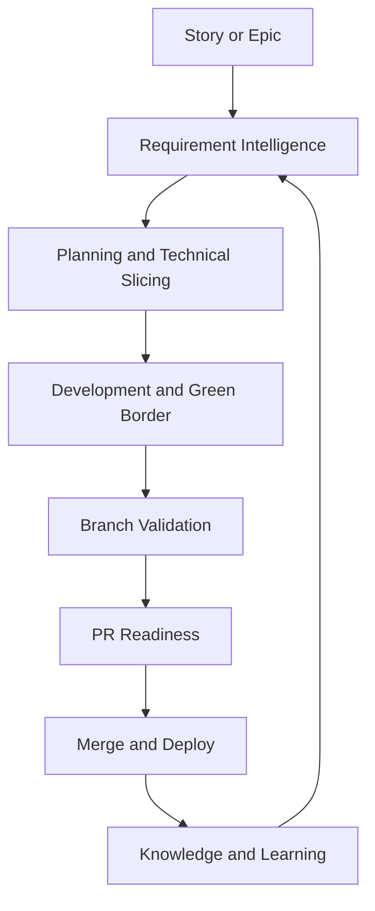

<p align="center">
  
</p>

# Mana

Mana is a production-oriented, agent-ready delivery framework for enterprise software delivery. It turns uneven requirements, late architecture decisions, weak tests, database risk, and overloaded reviews into a governed workflow of reusable skills, orchestrating agents, MCP integrations, profiles, templates, and operating guides.

## Current Status
Mana currently provides the framework structure, governance model, reusable
skill/agent definitions, profile metadata, artifact templates, workspace
management, Jira MCP wrapper, project bootstrap, and diagnostics.

`scripts/run-profile.sh` is intentionally conservative by default: it validates
Mana freshness and prints the configured profile. Add `--codex` or `--claude`
to route the rendered profile to that local runner. Mana still treats profiles,
agents, and skills as governed definitions; the selected runner interprets them
and writes artifacts into the active project workspace.

## Why This Framework Exists
Enterprise delivery churn usually starts before coding: stories are vague, cross-service contracts are implicit, database changes are reviewed late, and tests are selected by habit rather than risk. The framework reduces analysis, development, review, testing, database deployment, cross-service integration, and regression churn by making evidence explicit at each lifecycle gate.

## Conceptual Model
- **Skills** are atomic, reusable analysis units. They generate reports, plans, questions, and recommendations.
- **Agents** orchestrate skills into delivery phases such as story planning, green-border testing, branch validation, PR readiness, and learning.
- **MCP** is the governed integration layer for Jira, Git, Confluence, Jenkins, Liquibase, Postman/Newman, Playwright, logs, and architecture rules.
- **Profiles** define when agents and skills run, what blocks delivery, what warns, expected duration, and approval requirements.

## Runners: Codex, Junie, and Claude Code
Codex is used for repository-level planning, validation, documentation, branch analysis, PR readiness, and learning. Junie is used inside the IDE for local code implementation, test generation, local fixes, green-border execution, and fast developer feedback. Claude Code is used as a CLI runner for both repository-level analysis and local development support; it is the preferred runner for the `dev-assist` profile. Do not let any two runners modify the same branch at the same time.

## Quick Start
1. Review `docs/architecture/overview.md`.
2. Run `scripts/validate-repo.sh`.
3. Run `scripts/mana-doctor.sh`.
4. Link the framework into a target project with `scripts/bootstrap-project.sh --project-root /path/to/project`, or resolve/create the project-local workspace with `scripts/mana-workspace.sh init --root /path/to/project`.
5. Start a story with `profiles/story-start.yaml`.
6. Generate planning artifacts with `agents/story-implementation-planner/`.
7. Use `profiles/team-planning.yaml` or `profiles/story-ready-for-dev.yaml` when a Team Leader needs start/no-start and sequencing evidence.
8. Use `profiles/team-coaching-review.yaml` on any feature branch to identify recurring quality patterns per contributor and produce a confidential coaching report for the Team Leader.
9. Use `profiles/architecture-review.yaml` when an Architect needs ADR, NFR, boundary, drift, contract, or trust-boundary evidence.
10. Use `profiles/dev-assist.yaml` while implementing to get impact analysis, known pitfalls, concurrency risk, what-if change preview, and test gap planning before writing code.
11. Implement one technical task at a time in Junie using `.junie/profiles/technical-task-execution.md`.
12. Run a production pre-mortem with `profiles/jessica-fletcher.yaml`.
13. Run green-border checks with `profiles/pre-push.yaml`.
14. Validate the branch with `profiles/branch-ready.yaml`.
15. Use `profiles/requested-pr-review.yaml` to triage open PRs where you are a requested reviewer.
16. Use `profiles/am-release-ready.yaml` when an Application Manager needs release, continuity, rollback, and incident-risk evidence.
17. Generate the PR package with `profiles/pr-ready.yaml`.
18. Learn the framework interactively at any time with `profiles/tutorial.yaml` or by asking `scripts/run-profile.sh mana-help`.

## Repository Structure
```text
docs/       Architecture, workflow, deployment, problems, and examples.
skills/     Atomic reusable capabilities with SKILL.md files.
agents/     Orchestrators with AGENT.md, playbooks, schemas, and examples.
profiles/   Triggerable workflow profiles.
mcp/        Broker policy and tool-server definitions.
templates/  Markdown artifact templates.
scripts/    Validation and helper scripts.
hooks/      Local Git hook entrypoints.
.codex/     Codex usage guidance and profiles.
.junie/     Junie usage guidance and profiles.
```

## Link Into A Project
From a target application repository, run:

```bash
/path/to/mana/scripts/bootstrap-project.sh
```

This creates a small local `./mana` wrapper, `.mana/` links to the framework,
the project-local `.mana/` artifact workspace, and `AGENTS.md` and `CLAUDE.md`
in the project root so Codex and Claude Code load Mana instructions automatically
at session start. See `docs/deployment/project-link-bootstrap.md`.

For a complete Jira-free flow from epic input to PR readiness, see
`docs/examples/end-to-end-codex-flow.md`.

## Mana Project Workspace
Projects using this framework should create a `.mana/` directory at repository root. This is where Codex, Junie, agents, and skills store planning files, partial agent memory, skill outputs, decisions, test evidence, validation reports, PR material, developer handoff, and learning artifacts.

The framework does not initialize Git branches. It resolves an evidence workspace for the current branch, feature id, or canonical-branch session.

`.mana/global/` is the Service Context Layer. Agents and skills use it to keep decisions aligned with the service mission, architecture and engineering guards:

```text
.mana/global/
  service-mission.md
  architecture.md
  engineering-guards.md
  domain-glossary.md
  integration-map.md
  testing-policy.md
  database-policy.md
```

`engineering-guards.md` is the place for "must not do" rules. Violations should block or require explicit owner approval.

Feature branches use ticket or branch-derived workspaces:

```text
.mana/features/PROJ-24342/
```

Each story or feature workspace contains a canonical trace file:

```text
.mana/features/<JIRA-KEY>/agent-memory/story-trace.md
```

Agents use this file for concise reasoning summaries, assumptions, decisions,
approval gates, and handoffs for that specific Jira story. It is not a private
chain-of-thought log. See `docs/standards/story-trace-standard.md`.

Developer-confirmed implementation choices are tracked separately:

```text
.mana/features/<JIRA-KEY>/decisions/developer-choice-log.md
```

Use it for developer questions, developer answers, confirmed implementation
choices, rejected alternatives, owner acceptance, and follow-ups. See
`docs/standards/developer-choice-log-standard.md`.

Canonical branches such as `main`, `master`, `develop`, `dev`, `release/*`, and `hotfix/*` use session workspaces because the branch itself is not a single feature:

```text
.mana/sessions/2026-05-30T101500Z-main-repo-audit/
```

Routing rules:

- If `--feature` is provided, use `.mana/features/<feature-id>/`.
- Else if the branch contains a ticket pattern such as `PROJ-24342`, use `.mana/features/PROJ-24342/`.
- Else if the branch is canonical, use `.mana/sessions/<timestamp>-<branch>-<purpose>/`.
- Else slugify the branch name under `.mana/features/`.
- Shared durable knowledge belongs under `.mana/global/`.

See `docs/workflow/mana-workspace.md`.
See also `docs/workflow/service-context-layer.md`.

## Lifecycle Flow


## How To Install Or Use Skills
Skills are plain directories under `skills/`. Each `SKILL.md` declares inputs, outputs, allowed tools, preferred runner, owner role, risk level, and examples. Import only the skills needed by a profile or agent. Skills should analyze, report, and suggest; they should not perform broad autonomous changes.

## How To Run Agents
Agents are directories under `agents/`. Read `AGENT.md`, follow `playbook.md`, validate inputs against `inputs.schema.json`, and store outputs listed in `outputs.schema.json`. Agents compose skills and stop at human approval gates. Agent outputs should be routed into the active `.mana/<workspace>/` directory.

## Output Standard
All skills and agents follow `docs/standards/agent-skill-output-standard.md`.
Generated artifacts should use consistent Markdown sections, decision tables,
findings tables, evidence bullets, Mermaid diagrams by default, optional
PlantUML when requested, open-question tables, action checklists, and explicit
human approval sections.

Internal working notes should use compact "caveman" mode: terse fragments,
evidence-first notes, no long narrative, and no private chain-of-thought in
final artifacts. Use `templates/standard-agent-skill-report.template.md` when a
more specific artifact template does not exist.

## Example Workflows
- **Get help choosing the next step:** run `scripts/run-profile.sh mana-help` or ask for the `mana-help-agent`.
- **Learn the framework interactively:** run `scripts/run-profile.sh tutorial` to start a conversational walkthrough of profiles, agents, and skills tailored to your role and current delivery phase.
- **Review team code quality for coaching:** run `scripts/run-profile.sh team-coaching-review` on a feature branch to identify recurring quality patterns per contributor. The `team-coaching-report-agent` produces a confidential report for the Team Leader with a per-contributor growth analysis and a prioritised coaching action plan.
- **Start a story:** run the story-start profile to produce story context, impact map, technical breakdown, risk register, and green-border plan.
- **Work without Jira MCP:** create `.mana/features/<EPIC-ID>/context/epic-story-pack.md` from `templates/epic-story-pack.template.md` and use it as the requirement source.
- **Create workspace:** run `scripts/mana-workspace.sh init`; feature work goes under `.mana/features/<feature-id>/`, canonical branch work goes under `.mana/sessions/<timestamp>-<branch>-<purpose>/`.
- **Generate a plan:** use the Story Implementation Planner Agent and route open questions to BA/PO, Team Leader, Architect, or DBA.
- **Prepare Team Leader planning:** run `profiles/team-planning.yaml` to produce execution sequence, owner/dependency map, delivery risks, and review-load plan.
- **Check story readiness for development:** run `profiles/story-ready-for-dev.yaml` before assigning work to a developer.
- **Run architecture review:** use `profiles/architecture-review.yaml` for ADR, NFR, service-boundary, architecture-drift, trust-boundary, contract, and database-risk evidence.
- **Get development support before writing code:** use `profiles/dev-assist.yaml` to ask what-if questions about planned changes (`change-impact-preview`), identify concurrency risks, surface known pitfalls, characterize legacy code before refactoring, and plan unit and integration tests.
- **Implement a task in Junie:** open the approved technical task, restrict edits to the approved source-impact map, and run local tests after each change.
- **Run green border:** use the Green Border Test Agent to generate or run focused unit, integration, contract, regression, and legacy tests.
- **Generate pre-commit development notes:** use `profiles/pre-commit.yaml` and `pre-commit-documentation-agent` to create `pr/pre-commit-development-summary.md` and `pr/knowledge-transfer-brief.md`.
- **Run a production pre-mortem:** use `profiles/jessica-fletcher.yaml` or `jessica-fletcher-agent` before commit/push to ask why the branch would fail in production.
- **Validate branch:** run the Branch Validation Agent to detect plan drift, unplanned files, missing tests, unresolved risks, and unsafe DB changes.
- **Triage requested reviews:** use `profiles/requested-pr-review.yaml` to read open GitHub PRs where you are a requested reviewer, rank them by risk, and produce draft review findings. The agent may use authenticated `gh` for read-only evidence and must not post comments or reviews without approval.
- **Review one PR quickly:** run `scripts/run-profile.sh requested-pr-review --pr <number> --codex`. Add `--publish-high-risk-comments` only when you want one PR comment with blocker or high-criticality findings from that run.
- **Prepare AM release readiness:** use `profiles/am-release-ready.yaml` for release impact, continuity, incident-risk, rollback, support, and communication evidence.
- **Generate PR package:** run the PR Readiness Agent to create the PR description, reviewer focus, test evidence, risk report, and development summary.
- **Create developer handoff:** use `skills/developer-handoff` through PR Readiness to generate a developer-facing reading guide with diagrams, code references, short snippets, tests to read first, and intentional non-changes.
- **Challenge implementation choices:** use `skills/developer-decision-review` to ask targeted questions about non-obvious decisions, plan drift, missing rationale, protected-area changes, and risky trade-offs.

## Mana Freshness Check
Every profile/mode change through `scripts/run-profile.sh` runs
`scripts/mana-update-check.sh` before printing/executing the profile.

The check never updates files. It warns when the Mana checkout is dirty, has no
upstream, cannot reach the remote, or is behind/ahead of upstream. Configure it
with:

```bash
MANA_UPDATE_CHECK=off scripts/run-profile.sh pre-commit
MANA_UPDATE_CHECK=warn scripts/run-profile.sh jessica-fletcher
MANA_UPDATE_CHECK=strict scripts/run-profile.sh branch-ready
```

## Governance And Human Approval
AI supports, analyzes, documents, suggests, and validates. It does not replace accountability. BA/PO owns requirement clarity; Team Leader and Architect own technical decisions and approval; Developers own implementation and final correctness; DBA/Security owners approve high-risk database or trust-boundary findings.

## Security Considerations
Use MCP least privilege, environment separation, audit logs, data redaction, and explicit approval for destructive or external writes. Optional GitHub CLI access is read-only by default: agents may read PR metadata, changed files, diffs, checks, and reviewer requests, but must not approve, comment, merge, edit, label, or assign without explicit human approval. A requested PR review run may publish one `gh pr comment` only with a selected PR and an explicit publish flag, and only for blocker or high-criticality findings. Never expose secrets or production data in prompts, reports, or logs. Destructive database, repository, Jira, GitHub, or CI operations must be human-approved.

## Contribution Guide
Read `CONTRIBUTING.md`. New skills must be atomic, include required front matter, examples, decision rules, failure modes, MCP behavior, and human review gates. New agents must orchestrate existing skills rather than duplicate logic.
