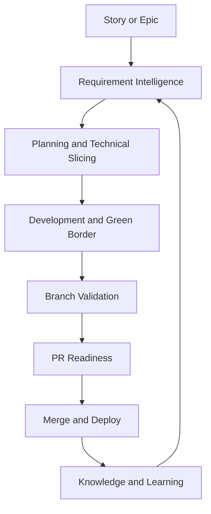

<p align="center">
  
</p>

# Mana

Mana is an evidence-driven delivery framework for enterprise software delivery.
It turns uneven requirements, late architecture decisions, weak tests, database
risk, and overloaded reviews into governed technical workflows with traceable
artifacts and explicit human approval gates.

Mana helps teams answer concrete delivery questions:

- Is this story clear, feasible, testable, and safe to start?
- Which source areas, contracts, database changes, and tests are in scope?
- Is this branch or PR consistent with the requested story?
- What evidence does a Team Leader, reviewer, Architect, or AM need before the
  next gate?

## Run This First
From the Mana repository:

```bash
scripts/validate-repo.sh
scripts/mana-doctor.sh
scripts/run-profile.sh mana-help
scripts/run-profile.sh story-start --render-only
```

`scripts/run-profile.sh <profile>` validates Mana freshness and renders the
profile. It does not execute the listed agents or skills by itself. Add a runner
flag only when you want local runner-backed execution:

```bash
scripts/run-profile.sh story-start --codex
scripts/run-profile.sh story-start --claude
```

To use Mana inside a target application repository:

```bash
/path/to/mana/scripts/bootstrap-project.sh --project-root /path/to/project
cd /path/to/project
./mana workspace status
./mana profile mana-help
./mana profile story-start --render-only
./mana profile story-start --codex
./mana dependency-evidence --collect
./mana evidence-index
```

The bootstrap creates a project-local `./mana` wrapper, `.mana/` evidence
workspace, links to framework definitions, and `AGENTS.md` / `CLAUDE.md` runner
instructions. Project artifacts stay under the target repository's `.mana/`
workspace.

## What Mana Is
- An evidence-driven delivery framework.
- A structured way to orchestrate AI-assisted technical workflows.
- A repository of profiles, agents, skills, standards, bootstrap scripts, MCP
  wrappers, templates, and workspace rules.
- A way to support human decisions with traceable requirement, code, test,
  architecture, release, and review evidence.

## What Mana Is Not
- A fully autonomous developer.
- A replacement for human review or owner accountability.
- A CI/CD platform.
- A Jira, GitHub, or service-management replacement.
- A system that should approve, merge, deploy, release, transition tickets, or
  publish externally without explicit human control.

## How The Pieces Relate
- **Profiles** are runnable workflow definitions. They name the trigger, runner,
  agents, skills, blocking conditions, warnings, duration, and approval rules.
- **Agents** orchestrate a phase such as story planning, branch validation, PR
  readiness, requested PR review, architecture review, or AM readiness.
- **Skills** are atomic reusable checks that produce reports, plans, questions,
  and recommendations.
- **MCP wrappers** provide governed integrations such as read-only Jira access.
- **Workspace rules** route generated artifacts into the project-local `.mana/`
  evidence workspace.
- **Runners** such as Codex or Claude interpret the rendered profile. Junie is
  used inside the IDE for local implementation support.

Codex is used for repository-level planning, validation, documentation, branch
analysis, PR readiness, and learning. Junie is used inside the IDE for local
code implementation, test generation, local fixes, green-border execution, and
fast developer feedback. Claude Code is used as a CLI runner for repository-level
analysis and local development support. Do not let two runners modify the same
branch at the same time.

## Role-Based Workflow Map
| Role | When | Mana workflow/profile | Output | Decision supported |
|---|---|---|---|---|
| Team Leader / Tech Lead | Before assigning or sequencing work | `story-ready-for-dev`, `team-planning`, `team-coaching-review` | Readiness report, execution sequence, delivery risks, review-load plan, coaching report | Start/no-start, task split, ownership, reviewer focus, coaching priorities |
| Developer | Before and during implementation | `story-start`, `dev-assist`, `pre-commit`, `.junie/profiles/technical-task-execution.md` | Story context, source impact map, implementation plan, test plan, development summary, handoff notes | What to build, what not to touch, which tests prove the change |
| Reviewer | When review is requested or PR package is needed | `requested-pr-review`, `pr-ready`, `branch-ready` | PR risk report, reviewer focus, defect findings, test evidence, PR package | Which PR to review first, which findings block, what evidence is missing |
| Architect | When design, boundary, NFR, trust, contract, or database risk is material | `architecture-review` | Architecture review report, ADR material, NFR and drift findings, approval questions | Approve, reject, or require mitigation for architectural trade-offs |
| AM / Release Owner | Before release or go/no-go discussion | `am-release-ready` | Release impact, continuity, incident-risk, rollback, support, communication evidence | Release readiness, operational mitigations, stakeholder communication |
| Delivery Manager / PM | During planning, dependency review, and delivery governance | `team-planning`, `story-ready-for-dev`, `mana-help` | Dependency map, delivery risk radar, open questions, readiness status | Scope clarity, escalation timing, delivery risk acceptance |

## Golden Path
This path shows how existing profiles fit together for a realistic enterprise
change. Mana produces evidence for humans; it must not automatically code,
approve, merge, release, transition Jira, or publish externally unless a profile
explicitly allows a narrow action and the human enables it.

| Step | Purpose | Profile or command | Expected output | Human decision supported | Mana must not do automatically |
|---|---|---|---|---|---|
| Jira story | Read the requested behavior and acceptance criteria | `./mana jira-mcp --get-issue PROJ-1234` when Jira is configured | Story JSON or reported access gap | Whether the available requirement evidence is enough | Update Jira, infer missing AC, expose credentials |
| Story evidence / readiness | Check feasibility, scope, testability, dependencies, and approvals | `./mana profile story-start --codex` or `./mana profile story-ready-for-dev --codex` | Story context, readiness findings, open questions, risk register | Start, clarify, split, or block the story | Invent requirements or mark owner approval as complete |
| Epic story pack | Cache epic and sibling story evidence as Markdown | `./mana jira-mcp --fetch-epic-story-pack PROJ-1234` | `.mana/features/<EPIC-ID>/evidence/jira/epic-story-pack.md` | Whether stories are partitioned, overlapping, missing slices, or ready for planning | Edit Jira, store credentials, or treat cached evidence as permanent truth |
| Local evidence index | Build a compact map of available evidence before deep analysis | `./mana evidence-index` after Jira, Sonar, dependency, test, validation, or PR evidence exists | `.mana/<workspace>/evidence/index.md` | Which evidence to inspect first and which gaps remain | Treat missing evidence as proof of safety |
| Source impact analysis | Identify likely code, tests, contracts, database areas, and protected zones | `story-start` output, `team-planning`, or `dev-assist` | Source impact map and inspection scope | What can be changed and what requires approval | Modify files outside the approved scope without asking |
| Developer assistance | Support bounded implementation work | `./mana profile dev-assist --codex` or Junie profile `.junie/profiles/technical-task-execution.md` | Change impact preview, pitfalls, test gaps, local task guidance | Whether the planned local change is still within scope | Run broad autonomous refactors |
| Branch validation | Compare branch evidence against story, plan, tests, and risks | `./mana profile branch-ready --codex` | Branch validation report, plan-drift findings, missing-test evidence | Whether the branch is ready for PR | Pick an ambiguous base branch silently |
| Dependency evidence | Record local dependency manifests, lockfiles, and existing scanner reports when dependency surfaces changed | `./mana dependency-evidence --collect` | `.mana/<workspace>/evidence/dependencies/dependency-summary.md` | Whether dependency/security follow-up is needed before review | Invent CVEs or replace project-approved security scanners |
| Requested PR review | Triage requested reviews or analyze one PR | `./mana profile requested-pr-review --pr <number> --codex` | PR risk summary, review focus, high-signal findings | What the reviewer should inspect or block | Approve, request changes, merge, label, or comment unless explicitly enabled |
| Architecture review if needed | Review ADR, NFR, service boundary, trust, contract, or database concerns | `./mana profile architecture-review --codex` | Architecture report, drift and approval questions | Whether specialist owner approval is required | Treat architecture approval as implicit |
| AM / release readiness | Translate technical change into release, rollback, continuity, and support evidence | `./mana profile am-release-ready --codex` | Release impact, incident-risk forecast, continuity and rollback findings | Go/no-go readiness and operational mitigations | Release, deploy, trigger CI, or accept operational risk |
| Developer handoff / PR package | Prepare review and handoff artifacts | `./mana profile pr-ready --codex` and optionally `./mana profile pre-commit --codex` | PR description, reviewer focus, test evidence, development summary, handoff notes | Whether the PR package is understandable and reviewable | Hide unresolved blockers or replace reviewer judgement |

## Current Status
Mana currently provides the framework structure, governance model, reusable
skill/agent definitions, profile metadata, artifact templates, workspace
management, Jira MCP wrapper, project bootstrap, and diagnostics.

## Why This Framework Exists
Enterprise delivery churn usually starts before coding: stories are vague,
cross-service contracts are implicit, database changes are reviewed late, and
tests are selected by habit rather than risk. The framework reduces analysis,
development, review, testing, database deployment, cross-service integration,
and regression churn by making evidence explicit at each lifecycle gate.

## Repository Structure
```text
docs/       Architecture, workflow, deployment, problems, and examples.
skills/     Atomic reusable capabilities with SKILL.md files.
agents/     Orchestrators with AGENT.md, playbooks, schemas, and examples.
profiles/   Triggerable workflow profiles.
mcp/        Broker policy and tool-server definitions.
templates/  Markdown artifact templates.
scripts/    Validation and helper scripts.
hooks/      Local Git hook entrypoints.
.codex/     Codex usage guidance and profiles.
.junie/     Junie usage guidance and profiles.
```

## Link Into A Project
From a target application repository, run:

```bash
/path/to/mana/scripts/bootstrap-project.sh
```

This creates a small local `./mana` wrapper, `.mana/` links to the framework,
the project-local `.mana/` artifact workspace, and `AGENTS.md` and `CLAUDE.md`
in the project root so Codex and Claude Code load Mana instructions automatically
at session start. See `docs/deployment/project-link-bootstrap.md`.

For a complete Jira-free flow from epic input to PR readiness, see
`docs/examples/end-to-end-codex-flow.md`.

## Mana Project Workspace
Projects using this framework should create a `.mana/` directory at repository
root. This is where Codex, Junie, agents, and skills store planning files,
partial agent memory, skill outputs, decisions, test evidence, validation
reports, PR material, developer handoff, and learning artifacts.

The framework does not initialize Git branches. It resolves an evidence
workspace for the current branch, feature id, or canonical-branch session.
Use `./mana evidence-index` after collecting Jira, Sonar, dependency, test,
validation, or PR artifacts so agents can read a compact index before
deep-loading only the evidence relevant to the current task.

`.mana/global/` is the Service Context Layer. Agents and skills use it to keep
decisions aligned with the service mission, architecture and engineering guards:

```text
.mana/global/
  service-mission.md
  architecture.md
  engineering-guards.md
  domain-glossary.md
  integration-map.md
  testing-policy.md
  database-policy.md
```

`engineering-guards.md` is the place for "must not do" rules. Violations should block or require explicit owner approval.

Feature branches use ticket or branch-derived workspaces:

```text
.mana/features/PROJ-24342/
```

Each story or feature workspace contains a canonical trace file:

```text
.mana/features/<FEATURE-ID>/agent-memory/story-trace.md
```

Agents use this file for concise reasoning summaries, assumptions, decisions,
approval gates, and handoffs for that specific Jira story. It is not a private
chain-of-thought log. See `docs/standards/story-trace-standard.md`.

Developer-confirmed implementation choices are tracked separately:

```text
.mana/features/<FEATURE-ID>/decisions/developer-choice-log.md
```

Use it for developer questions, developer answers, confirmed implementation
choices, rejected alternatives, owner acceptance, and follow-ups. See
`docs/standards/developer-choice-log-standard.md`.

Canonical branches such as `main`, `master`, `develop`, `dev`, `release/*`, and `hotfix/*` use session workspaces because the branch itself is not a single feature:

```text
.mana/sessions/2026-05-30T101500Z-main-repo-audit/
```

Routing rules:

- If `--feature` is provided, use `.mana/features/<feature-id>/`.
- Else if the branch contains a ticket pattern such as `PROJ-24342`, use `.mana/features/PROJ-24342/`.
- Else if the branch is canonical, use `.mana/sessions/<timestamp>-<branch>-<purpose>/`.
- Else slugify the branch name under `.mana/features/`.
- Shared durable knowledge belongs under `.mana/global/`.

See `docs/workflow/mana-workspace.md`.
See also `docs/workflow/service-context-layer.md`.

## Lifecycle Flow


## How To Install Or Use Skills
Skills are plain directories under `skills/`. Each `SKILL.md` declares inputs,
outputs, allowed tools, preferred runner, owner role, risk level, and examples.
Import only the skills needed by a profile or agent. Skills should analyze,
report, and suggest; they should not perform broad autonomous changes.

## How To Run Agents
Agents are directories under `agents/`. Read `AGENT.md`, follow `playbook.md`,
validate inputs against `inputs.schema.json`, and store outputs listed in
`outputs.schema.json`. Agents compose skills and stop at human approval gates.
Agent outputs should be routed into the active `.mana/<workspace>/` directory.

## Output Standard
All skills and agents follow `docs/standards/agent-skill-output-standard.md`.
Generated artifacts should use consistent Markdown sections, decision tables,
findings tables, evidence bullets, Mermaid diagrams by default, optional
PlantUML when requested, open-question tables, action checklists, and explicit
human approval sections.

When instructions overlap, Mana applies a fixed priority: current human
instruction, profile YAML, agent `AGENT.md`, agent `playbook.md`, loaded
`SKILL.md`, then global service context. Safety, external-write, and human
approval rules can only become stricter down that chain.

Profile runs should follow the same operating loop: identify the human decision,
resolve workspace and requirement/branch/PR context, inventory evidence,
classify risk domains, load only the needed skills, then report status,
findings, evidence, artifacts, and approvals.

Mana uses progressive loading to keep agent context small. A runner should read
the selected profile, selected agent, and selected playbook, then inspect
candidate skills with a load-light pass before deep-loading them. For Mana
skills, that means front matter plus the top operational sections: `Purpose`,
`When To Use It`, `When Not To Use It`, `Inputs`, `Outputs`, `Execution Logic`,
and `Decision Rules`. Deep-load full skill guidance, examples, or references
only when the skill is primary for the decision, the filtered evidence touches
that risk domain, or the lightweight pass is not enough.

Internal working notes should use compact "caveman" mode: terse fragments,
evidence-first notes, no long narrative, and no private chain-of-thought in
final artifacts.

Long-running profiles should also maintain a context budget: keep a short
working summary with objective, base branch or PR, issue keys, workspace path,
checked evidence, open hypotheses, discarded hypotheses, and next checks instead
of accumulating raw transcripts, full diffs, repeated file dumps, complete Jira
payloads, full PR threads, full skill files, or copied tool output. Use
`templates/standard-agent-skill-report.template.md` when a more specific
artifact template does not exist.

## Example Workflows
- **Get help choosing the next step:** run `scripts/run-profile.sh mana-help` or
  ask for the `mana-help-agent`.
- **Learn the framework interactively:** run `scripts/run-profile.sh tutorial`
  to start a conversational walkthrough of profiles, agents, and skills tailored
  to your role and current delivery phase.
- **Review team code quality for coaching:** run
  `scripts/run-profile.sh team-coaching-review` on a feature branch to identify
  recurring quality patterns per contributor. The
  `team-coaching-report-agent` produces a confidential report for the Team
  Leader with a per-contributor growth analysis and a prioritised coaching
  action plan.
- **Start a story:** run the story-start profile to produce story context,
  impact map, technical breakdown, risk register, and green-border plan.
- **Read Jira context from a branch:** configure `JIRA_URL` plus
  `JIRA_PERSONAL_TOKEN` for Jira Server/Data Center, or use
  `.mana/jira-mcp.env`. Profiles discover generic issue keys such as
  `PROJ-1234` from the branch, or accept `--jira-key <KEY>`.
- **Read one Jira story quickly:** in a linked project, run
  `./mana jira-mcp --get-issue PROJ-1234`. Use
  `./mana jira-mcp --check-access --issue PROJ-1234` only for credential or
  permission diagnostics.
- **Cache epic and sibling stories as Markdown:** in a linked project, run
  `./mana jira-mcp --fetch-epic-story-pack PROJ-1234`. Mana resolves the parent
  epic when Jira exposes one and writes
  `.mana/features/<EPIC-ID>/evidence/jira/epic-story-pack.md` for reuse by
  planning agents.
- **Review epic/story slicing:** use `profiles/team-planning.yaml` or
  `profiles/story-ready-for-dev.yaml` with `epic-story-partitioning` to check
  whether sibling stories overlap, miss epic goals, hide dependencies, or need
  splitting before assignment.
- **Configure local Sonar evidence:** keep only `SONAR_HOST_URL` and
  `SONAR_TOKEN` in the environment, then run `./mana sonar --init-config` and
  edit `.mana/global/sonar-project.properties`. Use `./mana sonar --check` to
  validate scanner/runtime/config readiness.
- **Run local Sonar before review:** after building the project, run
  `./mana sonar --analyze`. Mana writes scanner logs and summary under
  `.mana/<workspace>/evidence/sonar/` so review and validation agents can use
  the evidence without rerunning the scanner.
- **Estimate class change risk:** use `profiles/dev-assist.yaml` with
  `sonar-change-risk` before modifying a fragile class. The skill combines
  Sonar evidence, git churn, tests, story scope, and engineering guards to
  recommend a safe change strategy.
- **Use the story as evidence:** planning profiles use Jira story text and
  acceptance criteria to check feasibility, testability, scope, owners, and
  approvals. Review, validation, pre-mortem, and PR profiles compare branch/PR
  changes against the story and flag missing requested behavior, unrequested
  scope, contradicted acceptance criteria, and weak tests.
- **Work without Jira MCP:** create
  `.mana/features/<EPIC-ID>/context/epic-story-pack.md` from
  `templates/epic-story-pack.template.md` and use it as the requirement source.
- **Create workspace:** run `scripts/mana-workspace.sh init`; feature work goes
  under `.mana/features/<feature-id>/`, canonical branch work goes under
  `.mana/sessions/<timestamp>-<branch>-<purpose>/`.
- **Generate a plan:** use the Story Implementation Planner Agent and route open
  questions to BA/PO, Team Leader, Architect, or DBA.
- **Prepare Team Leader planning:** run `profiles/team-planning.yaml` to produce
  execution sequence, owner/dependency map, delivery risks, and review-load plan.
- **Check story readiness for development:** run
  `profiles/story-ready-for-dev.yaml` before assigning work to a developer.
- **Run architecture review:** use `profiles/architecture-review.yaml` for ADR,
  NFR, service-boundary, architecture-drift, trust-boundary, contract, and
  database-risk evidence.
- **Get development support before writing code:** use `profiles/dev-assist.yaml`
  to ask what-if questions about planned changes (`change-impact-preview`),
  identify concurrency risks, surface known pitfalls, characterize legacy code
  before refactoring, and plan unit and integration tests.
- **Implement a task in Junie:** open the approved technical task, restrict edits
  to the approved source-impact map, and run local tests after each change.
- **Run green border:** use the Green Border Test Agent to generate or run
  focused unit, integration, contract, regression, and legacy tests.
- **Generate pre-commit development notes:** use `profiles/pre-commit.yaml` and
  `pre-commit-documentation-agent` to create
  `pr/pre-commit-development-summary.md` and
  `pr/knowledge-transfer-brief.md`.
- **Run a production pre-mortem:** use `profiles/jessica-fletcher.yaml` or
  `jessica-fletcher-agent` before commit/push to ask why the branch would fail
  in production.
- **Validate branch:** run the Branch Validation Agent to detect plan drift,
  unplanned files, missing tests, unresolved risks, and unsafe DB changes.
- **Triage requested reviews:** use `profiles/requested-pr-review.yaml` to read
  open GitHub PRs where you are a requested reviewer, rank them by risk, and
  produce draft review findings. The agent may use authenticated `gh` for
  read-only evidence and must not post comments or reviews without approval.
- **Review one PR quickly:** run
  `scripts/run-profile.sh requested-pr-review --pr <number> --codex`. Add
  `--publish-high-risk-comments` only when you want one PR comment with blocker
  or high-criticality findings from that run.
- **Prepare AM release readiness:** use `profiles/am-release-ready.yaml` for
  release impact, continuity, incident-risk, rollback, support, and communication
  evidence.
- **Generate PR package:** run the PR Readiness Agent to create the PR
  description, reviewer focus, test evidence, risk report, and development
  summary.
- **Create developer handoff:** use `skills/developer-handoff` through PR
  Readiness to generate a developer-facing reading guide with diagrams, code
  references, short snippets, tests to read first, and intentional non-changes.
- **Challenge implementation choices:** use `skills/developer-decision-review`
  to ask targeted questions about non-obvious decisions, plan drift, missing
  rationale, protected-area changes, and risky trade-offs.

## Mana Freshness Check
Every profile/mode change through `scripts/run-profile.sh` runs
`scripts/mana-update-check.sh` before printing/executing the profile.

The check never updates files. It warns when the Mana checkout is dirty, has no
upstream, cannot reach the remote, or is behind/ahead of upstream. Configure it
with:

```bash
MANA_UPDATE_CHECK=off scripts/run-profile.sh pre-commit
MANA_UPDATE_CHECK=warn scripts/run-profile.sh jessica-fletcher
MANA_UPDATE_CHECK=strict scripts/run-profile.sh branch-ready
```

## Governance And Human Approval
AI supports, analyzes, documents, suggests, and validates. It does not replace
accountability. BA/PO owns requirement clarity; Team Leader and Architect own
technical decisions and approval; Developers own implementation and final
correctness; DBA/Security owners approve high-risk database or trust-boundary
findings.

## Security Considerations
Use MCP least privilege, environment separation, audit logs, data redaction, and
explicit approval for destructive or external writes. Jira MCP access is
read-only by default: agents may read issue context when issue keys are provided
or discovered from the branch, but must not expose tokens, transition issues,
add comments, or update tickets without explicit human approval. Optional GitHub
CLI access is read-only by default: agents may read PR metadata, changed files,
diffs, checks, and reviewer requests, but must not approve, comment, merge,
edit, label, or assign without explicit human approval. A requested PR review
run may publish one `gh pr comment` only with a selected PR and an explicit
publish flag, and only for blocker or high-criticality findings. Never expose
secrets or production data in prompts, reports, or logs. Destructive database,
repository, Jira, GitHub, or CI operations must be human-approved.

## Contribution Guide
Read `CONTRIBUTING.md`. New skills must be atomic, include required front
matter, examples, decision rules, failure modes, MCP behavior, and human review
gates. New agents must orchestrate existing skills rather than duplicate logic.
