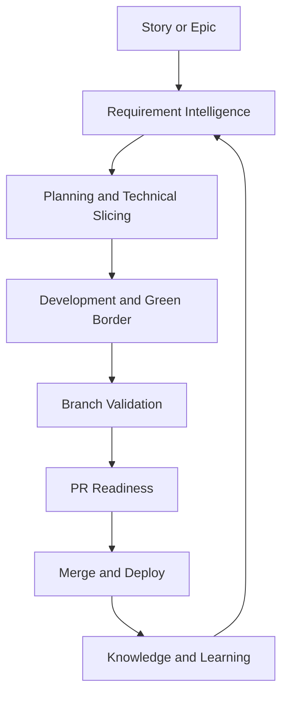

<p align="center">
  
</p>

# Mana

Mana includes deterministic, repository-local behavioural evaluations and a
static governance summary. See [Behavioural Evaluations](docs/workflow/behavioural-evals.md).

Mana is an evidence-driven delivery framework for enterprise software delivery.
It turns uneven requirements, late architecture decisions, weak tests, database
risk, and overloaded reviews into governed technical workflows with traceable
artifacts and explicit human approval gates.

Mana helps teams answer concrete delivery questions:

- Is this story clear, feasible, testable, and safe to start?
- Which source areas, contracts, database changes, and tests are in scope?
- Is this branch or PR consistent with the requested story?
- What evidence does a Team Leader, reviewer, Architect, or AM need before the
  next gate?

## Run This First
From the Mana repository:

```bash
scripts/validate-repo.sh
scripts/mana-doctor.sh
scripts/run-profile.sh mana-help
scripts/run-profile.sh story-start --render-only
```

Optional reusable personal guidance can be configured as a read-only User
Context Layer and materialized under `.mana/user-context/`. See
[User Context Layer](docs/workflow/user-context-layer.md). It remains distinct
from project Service Context in `.mana/global/`, is loaded progressively, and
never overrides repository evidence or project constraints.

`scripts/run-profile.sh <profile>` validates Mana freshness and renders the
profile. It does not execute the listed agents or skills by itself. Add a runner
flag only when you want local runner-backed execution:

```bash
scripts/run-profile.sh story-start --codex
scripts/run-profile.sh story-start --claude
scripts/run-profile.sh story-start --opencode
```

Codex runs start with a small root orchestrator model configured by
`MANA_CODEX_MODEL` or `--codex-model` (default: `gpt-5.4-mini`). The root model
handles routing, light evidence inventory, low-risk checks, delegation,
aggregation, and synthesis. Bounded high-risk work is delegated in the same run
to Mana Codex custom agents when available:

- `mana_explorer`: read-only evidence discovery on `gpt-5.6-terra` by default.
- `mana_full_specialist`: read-only architecture, security, database,
  concurrency, contract, production, and `model_tier: full` judgment on
  `gpt-5.6-sol` by default.
- `mana_worker`: serialized bounded writes on `gpt-5.6-terra` by default, only
  when a selected profile explicitly permits source modification.

Override them with `MANA_CODEX_EXPLORER_MODEL`, `MANA_CODEX_FULL_MODEL`,
`MANA_CODEX_WORKER_MODEL`, `--codex-explorer-model`, `--codex-full-model`, and
`--codex-worker-model`. Disable subagents with `MANA_CODEX_SUBAGENTS=false` or
`--no-codex-subagents`. Mana still returns `needs_model_escalation` as a
compatibility fallback when subagents are disabled, unavailable, fail, or leave
a high-risk judgment unsupported.

OpenCode uses the same Mana runtime shape with project-scoped agents under
`.opencode/agents/`: `mana_orchestrator` as the primary agent plus
`mana_explorer`, `mana_full_specialist`, and `mana_worker` as bounded
subagents. OpenCode model IDs use `provider/model` format; defaults are
`MANA_OPENCODE_MODEL=opencode/gpt-5.1-codex` and matching specialist variables
fall back to the root OpenCode model unless overridden. Use `--opencode-model`,
`--opencode-explorer-model`, `--opencode-full-model`, `--opencode-worker-model`,
or disable subagents with `MANA_OPENCODE_SUBAGENTS=false` /
`--no-opencode-subagents`.

Claude Code now uses the same project-scoped runtime shape under
`.claude/agents/`: `mana-orchestrator` is the `haiku` economy root by default,
`mana-explorer` and `mana-worker` default to `sonnet`, and
`mana-full-specialist` defaults to `opus`. Use `MANA_CLAUDE_MODEL`,
`MANA_CLAUDE_EXPLORER_MODEL`, `MANA_CLAUDE_FULL_MODEL`,
`MANA_CLAUDE_WORKER_MODEL`, or `--claude-model`, `--claude-explorer-model`,
`--claude-full-model`, and `--claude-worker-model` for a single run. Disable
delegation with `MANA_CLAUDE_SUBAGENTS=false` or `--no-claude-subagents`.
Bootstrap installs these files only in the target repository; it never changes
`~/.claude` or the local user installation.

To use Mana inside a target application repository:

```bash
/path/to/mana/scripts/bootstrap-project.sh --project-root /path/to/project
cd /path/to/project
./mana workspace status
./mana profile mana-help
./mana profile story-start --render-only
./mana profile story-start --codex
./mana profile story-start --opencode
./mana cast story-start --dry-run
./mana runtime sessions
./mana dependency-evidence --collect
./mana evidence-index
./mana verify --dry-run --explain
```

The bootstrap creates a project-local `./mana` wrapper, `.mana/` evidence
workspace, links to framework definitions, `AGENTS.md` / `CLAUDE.md` runner
instructions, Mana-managed `.codex/agents/mana-*.toml` agents for Codex,
`.claude/agents/mana-*.md` agents for Claude Code, and
`.opencode/agents/mana_*.md` agents for OpenCode delegation. Project artifacts
stay under the target repository's `.mana/` workspace.

For deterministic profile recommendation and the explicit execution boundary,
see [Mana Divination](docs/workflow/divination.md) and
[Mana Casting](docs/workflow/casting.md). The lifecycle is
`attunement → divination → casting → evidence → judgment`: divination is
read-only; casting validates then uses the existing runner; neither grants a
human approval.

Execution audit records are local-only and privacy-preserving; inspect them
with `mana runtime` as documented in [Mana Runtime Events](docs/workflow/runtime-events.md).

## What Mana Is
- An evidence-driven delivery framework.
- A structured way to orchestrate AI-assisted technical workflows.
- A repository of profiles, agents, skills, standards, bootstrap scripts, MCP
  wrappers, templates, and workspace rules.
- A way to support human decisions with traceable requirement, code, test,
  architecture, release, and review evidence.

## What Mana Is Not
- A fully autonomous developer.
- A replacement for human review or owner accountability.
- A CI/CD platform.
- A Jira, GitHub, or service-management replacement.
- A system that should approve, merge, deploy, release, transition tickets, or
  publish externally without explicit human control.

## How The Pieces Relate
- **Profiles** are runnable workflow definitions. They name the trigger, runner,
  agents, skills, blocking conditions, warnings, duration, and approval rules.
- **Agents** orchestrate a phase such as story planning, branch validation, PR
  readiness, requested PR review, architecture review, or AM readiness.
- **Skills** are atomic reusable checks that produce reports, plans, questions,
  and recommendations.
- **MCP wrappers** provide governed integrations such as read-only Jira access.
- **Workspace rules** route generated artifacts into the project-local `.mana/`
  evidence workspace.
- **Runners** such as Codex, Claude, or OpenCode interpret the rendered profile.
  Junie is used inside the IDE for local implementation support.
- **Codex runtime agents** are only execution capability classes. They are not
  Mana semantic agents and are not mapped one-to-one to Mana skills. The root
  orchestrator may spawn at most three direct child agents with depth one, and
  related skills are batched by risk domain instead of spawning one child per
  skill.
- **OpenCode runtime agents** mirror the same capability classes:
  `mana_orchestrator`, `mana_explorer`, `mana_full_specialist`, and
  `mana_worker`. They also must not be mapped one-to-one to Mana skills.
- **Claude Code runtime agents** mirror the same capability classes with
  hyphenated names: `mana-orchestrator`, `mana-explorer`,
  `mana-full-specialist`, and `mana-worker`. Claude Code subagents cannot
  recursively delegate because their local definitions do not grant `Agent`.

Codex is used for repository-level planning, validation, documentation, branch
analysis, PR readiness, and learning. Junie is used inside the IDE for local
code implementation, test generation, local fixes, green-border execution, and
fast developer feedback. Claude Code is used as a CLI runner for repository-level
analysis and local development support. OpenCode is used as a CLI runner with
project-scoped primary/subagent configuration. Do not let two runners modify the
same branch at the same time.

Codex subagents can increase total token usage. The intended optimization is to
reduce expensive-model scope and keep the root context compact, not to guarantee
lower total tokens.

## Role-Based Workflow Map
| Role | When | Mana workflow/profile | Output | Decision supported |
|---|---|---|---|---|
| Team Leader / Tech Lead | Before assigning or sequencing work | `story-ready-for-dev`, `team-planning`, `team-coaching-review` | Readiness report, story effort estimate, execution sequence, delivery risks, review-load plan, coaching report | Start/no-start, task split, sizing, ownership, reviewer focus, coaching priorities |
| Developer | Before and during implementation | `story-start`, `dev-assist`, `pre-commit`, `.junie/profiles/technical-task-execution.md` | Story context, source impact map, implementation plan, test plan, development summary, handoff notes | What to build, what not to touch, which tests prove the change |
| Reviewer | When review is requested or PR package is needed | `requested-pr-review`, `pr-ready`, `branch-ready` | PR risk report, reviewer focus, defect findings, test evidence, PR package | Which PR to review first, which findings block, what evidence is missing |
| Architect | When design, boundary, NFR, trust, contract, or database risk is material | `architecture-review` | Architecture review report, ADR material, NFR and drift findings, approval questions | Approve, reject, or require mitigation for architectural trade-offs |
| AM / Release Owner | Before release or go/no-go discussion | `am-release-ready` | Release impact, continuity, incident-risk, rollback, support, communication evidence | Release readiness, operational mitigations, stakeholder communication |
| Delivery Manager / PM | During planning, dependency review, and delivery governance | `team-planning`, `story-ready-for-dev`, `mana-help` | Dependency map, delivery risk radar, open questions, readiness status | Scope clarity, escalation timing, delivery risk acceptance |

## Golden Path
This path shows how existing profiles fit together for a realistic enterprise
change. Mana produces evidence for humans; it must not automatically code,
approve, merge, release, transition Jira, or publish externally unless a profile
explicitly allows a narrow action and the human enables it.

| Step | Purpose | Profile or command | Expected output | Human decision supported | Mana must not do automatically |
|---|---|---|---|---|---|
| Jira story | Read the requested behavior and acceptance criteria | `./mana jira-mcp --get-issue PROJ-1234` when Jira is configured | Story JSON or reported access gap | Whether the available requirement evidence is enough | Update Jira, infer missing AC, expose credentials |
| Story evidence / readiness | Check feasibility, scope, testability, dependencies, approvals, and estimate | `./mana profile story-start --codex` or `./mana profile story-ready-for-dev --codex` | Story context, readiness findings, base effort estimate, calibration status, open questions, risk register | Start, clarify, split, size, or block the story | Invent requirements, read delivery history without explicit consent, or mark owner approval as complete |
| Epic story pack | Cache epic and sibling story evidence as Markdown | `./mana jira-mcp --fetch-epic-story-pack PROJ-1234` | `.mana/features/<EPIC-ID>/evidence/jira/epic-story-pack.md` | Whether stories are partitioned, overlapping, missing slices, or ready for planning | Edit Jira, store credentials, or treat cached evidence as permanent truth |
| Local evidence index | Build a compact map of available evidence before deep analysis | `./mana evidence-index` after Jira, Sonar, dependency, test, validation, or PR evidence exists | `.mana/<workspace>/evidence/index.md` | Which evidence to inspect first and which gaps remain | Treat missing evidence as proof of safety |
| GUI test validation | Build and run approved Playwright scenarios against an isolated test target | `./mana profile gui-test-validation --codex` | Redacted context inventory, approved testbook, traces, screenshots, video, JUnit, run report, learning proposal | Whether a GUI flow passed and which reusable test improvement to accept | Browse production, expose secrets, use real payment data, or run unapproved scenarios |
| API test validation | Run approved Newman collections against an isolated test target | `./mana profile api-test-validation --codex` | Approved API testbook, JSON/JUnit evidence, run report, learning proposal | Whether an API scenario passed and which improvement to accept | Supply URLs, payloads, tokens, or run unapproved requests |
| Database read verification | Verify persisted test state with approved PostgreSQL read queries | `./mana profile database-read-verification --codex` | Approved query catalog, access-controlled log, run report, learning proposal | Whether expected test data is persisted | Access production, mutate data, expose connection strings, or run arbitrary SQL |
| Source impact analysis | Identify likely code, tests, contracts, database areas, and protected zones | `story-start` output, `team-planning`, or `dev-assist` | Source impact map and inspection scope | What can be changed and what requires approval | Modify files outside the approved scope without asking |
| Developer assistance | Support bounded implementation work | `./mana profile dev-assist --codex` or Junie profile `.junie/profiles/technical-task-execution.md` | Change impact preview, pitfalls, test gaps, local task guidance | Whether the planned local change is still within scope | Run broad autonomous refactors |
| Branch validation | Compare branch evidence against story, plan, tests, and risks | `./mana profile branch-ready --codex` | Branch validation report, plan-drift findings, missing-test evidence | Whether the branch is ready for PR | Pick an ambiguous base branch silently |
| Dependency evidence | Record local dependency manifests, lockfiles, and existing scanner reports when dependency surfaces changed | `./mana dependency-evidence --collect` | `.mana/<workspace>/evidence/dependencies/dependency-summary.md` | Whether dependency/security follow-up is needed before review | Invent CVEs or replace project-approved security scanners |
| Requested PR review | Triage requested reviews or analyze one PR | `./mana profile requested-pr-review --pr <number> --codex` | PR risk summary, review focus, high-signal findings | What the reviewer should inspect or block | Approve, request changes, merge, label, or comment unless explicitly enabled |
| Architecture review if needed | Review ADR, NFR, service boundary, trust, contract, or database concerns | `./mana profile architecture-review --codex` | Architecture report, drift and approval questions | Whether specialist owner approval is required | Treat architecture approval as implicit |
| AM / release readiness | Translate technical change into release, rollback, continuity, and support evidence | `./mana profile am-release-ready --codex` | Release impact, incident-risk forecast, continuity and rollback findings | Go/no-go readiness and operational mitigations | Release, deploy, trigger CI, or accept operational risk |
| Developer handoff / PR package | Prepare review and handoff artifacts | `./mana profile pr-ready --codex` and optionally `./mana profile pre-commit --codex` | PR description, reviewer focus, test evidence, development summary, handoff notes | Whether the PR package is understandable and reviewable | Hide unresolved blockers or replace reviewer judgement |

## Current Status
Mana currently provides the framework structure, governance model, reusable
skill/agent definitions, profile metadata, artifact templates, workspace
management, Jira MCP wrapper, project bootstrap, and diagnostics.

## Why This Framework Exists
Enterprise delivery churn usually starts before coding: stories are vague,
cross-service contracts are implicit, database changes are reviewed late, and
tests are selected by habit rather than risk. The framework reduces analysis,
development, review, testing, database deployment, cross-service integration,
and regression churn by making evidence explicit at each lifecycle gate.

## Repository Structure
```text
docs/       Architecture, workflow, deployment, problems, and examples.
skills/     Atomic reusable capabilities with SKILL.md files.
agents/     Orchestrators with AGENT.md, playbooks, schemas, and examples.
profiles/   Triggerable workflow profiles.
mcp/        Broker policy and tool-server definitions.
templates/  Markdown artifact templates.
scripts/    Validation and helper scripts.
hooks/      Local Git hook entrypoints.
.codex/     Codex usage guidance and profiles.
.junie/     Junie usage guidance and profiles.
```

## Link Into A Project
From a target application repository, run:

```bash
/path/to/mana/scripts/bootstrap-project.sh
```

This creates a small local `./mana` wrapper, `.mana/` links to the framework,
the project-local `.mana/` artifact workspace, `AGENTS.md` and `CLAUDE.md` in
the project root, and `.opencode/agents/` so Codex, Claude Code, and OpenCode
load Mana instructions automatically at session start. See
`docs/deployment/project-link-bootstrap.md`.

For a complete Jira-free flow from epic input to PR readiness, see
`docs/examples/end-to-end-codex-flow.md`.

## Mana Project Workspace
Projects using this framework keep a `.mana/` directory at repository root.
This is where runners, agents, and skills store planning files, agent memory,
skill outputs, decisions, test evidence, validation reports, PR material, and
learning artifacts.

- `.mana/global/` is the Service Context Layer: service mission, architecture,
  engineering guards, glossary, integration map, and testing/database policy.
  `engineering-guards.md` holds the "must not do" rules; violations block or
  require explicit owner approval.
- Feature work goes under `.mana/features/<FEATURE-ID>/`, with a canonical
  `agent-memory/story-trace.md` per story
  (`docs/standards/story-trace-standard.md`) and a
  `decisions/developer-choice-log.md` for developer-confirmed choices
  (`docs/standards/developer-choice-log-standard.md`).
- Canonical branches (`main`, `develop`, `release/*`, …) use session
  workspaces under `.mana/sessions/`.

Workspace resolution and routing rules are defined in
`docs/workflow/mana-workspace.md`; the Service Context Layer is described in
`docs/workflow/service-context-layer.md`. Use `./mana evidence-index` after
collecting Jira, Sonar, dependency, test, validation, or PR artifacts so
agents read a compact index before deep-loading evidence.

## Deterministic Verification Skills

`./mana verify` selects applicable verification-capable normal Mana skills,
runs only fixed Mana adapters or approved structured project actions, and writes
versioned evidence under the active `.mana` workspace. It makes zero model
calls. Verification results are evidence; existing reviewers and accountable
humans create findings and judgment. Use `./mana verify --list` to inspect
available skills or `./mana verify --dry-run --explain` to inspect exact checks,
trust origins, effects, limits, and blockers without writing state. See
[`docs/workflow/verification-skills.md`](docs/workflow/verification-skills.md).

## Bounded evidence-driven repair

`./mana repair` can consume a canonical failed Verification Result v2,
grant one exact shell-file path to one existing provider runner, stage the
current working tree in a disposable copy, compute and validate the candidate
delta, import only an accepted exact-file content change, protect the live
baseline and verification surface, rerun the same structured concern against
the live repository, and publish `RESOLVED`, `UNCHANGED`, `REGRESSED`, or
`UNKNOWN` evidence. V1
automatic eligibility is limited to `shell-syntax-verification/bash_syntax`.
The default and `--once` remain one attempt. An explicit `--max-iterations 2`
permits one final attempt only when the first result proves strict-subset partial
progress. There is no provider retry, third attempt, auto-revert, commit, push,
learning, or automatic repair from `mana verify`.

```bash
./mana repair --from <result.json> --check <check-id> \
  --allow-path scripts/example.sh --runner codex --once --dry-run --explain

./mana repair --from <result.json> --check <check-id> \
  --allow-path scripts/example.sh --runner codex --max-iterations 2
```

`RESOLVED` means only that the targeted concern disappeared under comparable
evidence; it does not mean ready to merge, correct, or production-safe. See
[`docs/standards/bounded-repair.md`](docs/standards/bounded-repair.md).

The provider does not directly edit the live repository through the normal
bounded-repair path. This `faulty-contained` disposable-workspace mode protects
against accidental or faulty provider writes, but it is not an OS security
boundary against a deliberately malicious same-UID process. It provides no
host-filesystem, process, credential, or network isolation.

## Divination: deterministic profile recommendation

`./mana divination "<delivery intent>"` is a read-only, deterministic aid for
choosing a Mana profile before any runner is invoked. It loads existing profile
YAML, profile skills, skill metadata, repository-owned domain aliases, and
available Service Context. It never runs a profile, agent, skill, tool, hook,
or external command, and it never writes under `.mana/`.

```bash
./mana divination "Add a field to a Kafka contract and persist it in Oracle using Liquibase"
./mana divination "Review the migration" --explain
printf '%s\n' "Plan a contract change" | ./mana divination --json
```

See `docs/workflow/divination.md` for scoring inputs and limitations. A
recommendation is not execution: review the evidence and gates first.

## Lifecycle Flow

```mermaid
flowchart TD
    Story[Story or Epic] --> Req[Requirement Intelligence]
    Req --> Plan[Planning and Technical Slicing]
    Plan --> Dev[Development and Green Border]
    Dev --> Validate[Branch Validation]
    Validate --> PR[PR Readiness]
    PR --> Merge[Merge and Deploy]
    Merge --> Learn[Knowledge and Learning]
    Learn --> Req
```

## How To Install Or Use Skills
Skills are plain directories under `skills/`. Each `SKILL.md` declares inputs,
outputs, allowed tools, preferred runner, owner role, risk level, stack
applicability, and examples. The `stack` front matter field names the
technology or tooling the target project must use for the skill to apply
(for example `java`, `liquibase`, `sonar`) or `any`; runners and the profile
selector use it to discard non-applicable skills without deep-loading them.
Import only the skills needed by a profile or agent. Skills should analyze,
report, and suggest; they should not perform broad autonomous changes.

## How To Run Agents
Agents are directories under `agents/`. Read `AGENT.md`, follow `playbook.md`,
validate inputs against `inputs.schema.json`, and store outputs listed in
`outputs.schema.json`. Agents compose skills and stop at human approval gates.
Agent outputs should be routed into the active `.mana/<workspace>/` directory.

## Output Standard
All skills and agents follow `docs/standards/agent-skill-output-standard.md`.
It defines the required artifact sections, the fixed instruction priority
(human instruction → profile YAML → `AGENT.md` → `playbook.md` → `SKILL.md` →
global service context, with safety and approval rules only getting stricter
down the chain), the operating loop for profile runs, progressive skill
loading, compact "caveman" working notes, and the context budget for
long-running profiles. Use
`templates/standard-agent-skill-report.template.md` when a more specific
artifact template does not exist.

## Workflow Cookbook
Task-oriented recipes — which profile, skill, or command to use for a given
situation (story intake, Jira evidence, Sonar, dev assist, branch validation,
PR review, release readiness, coaching, freshness check) — live in
`docs/workflow/cookbook.md`. A few common entry points:

- **Not sure what to run:** `scripts/run-profile.sh mana-help`, or
  `scripts/run-profile.sh tutorial` for an interactive walkthrough.
- **Start a story:** `./mana profile story-start --codex` (or `--claude`).
- **Validate a branch before PR:** `./mana profile branch-ready --codex`.
- **Review a PR you were asked to review:**
  `scripts/run-profile.sh requested-pr-review --pr <number> --codex`.

## Governance And Human Approval
AI supports, analyzes, documents, suggests, and validates. It does not replace
accountability. BA/PO owns requirement clarity; Team Leader and Architect own
technical decisions and approval; Developers own implementation and final
correctness; DBA/Security owners approve high-risk database or trust-boundary
findings.

## Security Considerations
Use MCP least privilege, environment separation, audit logs, data redaction, and
explicit approval for destructive or external writes. Jira MCP access is
read-only by default: agents may read issue context when issue keys are provided
or discovered from the branch, but must not expose tokens, transition issues,
add comments, or update tickets without explicit human approval. Optional GitHub
CLI access is read-only by default: agents may read PR metadata, changed files,
diffs, checks, and reviewer requests, but must not approve, comment, merge,
edit, label, or assign without explicit human approval. A requested PR review
run may publish one `gh pr comment` only with a selected PR and an explicit
publish flag, and only for blocker or high-criticality findings. Never expose
secrets or production data in prompts, reports, or logs. Destructive database,
repository, Jira, GitHub, or CI operations must be human-approved.

## Contribution Guide
Read `CONTRIBUTING.md`. New skills must be atomic, include required front
matter, examples, decision rules, failure modes, MCP behavior, and human review
gates. New agents must orchestrate existing skills rather than duplicate logic.
For bounded evidence discovery, use `mana explore "<question>"`; it is
read-only and stops after at most three retrieval cycles. Runtime observations
can be inspected as governed, project-local learning candidates with
`mana learning candidates`; candidates are never automatically promoted. See
[controlled explorer retrieval](docs/workflow/controlled-explorer-retrieval.md)
and [governed learning signals](docs/workflow/governed-learning-signals.md).
