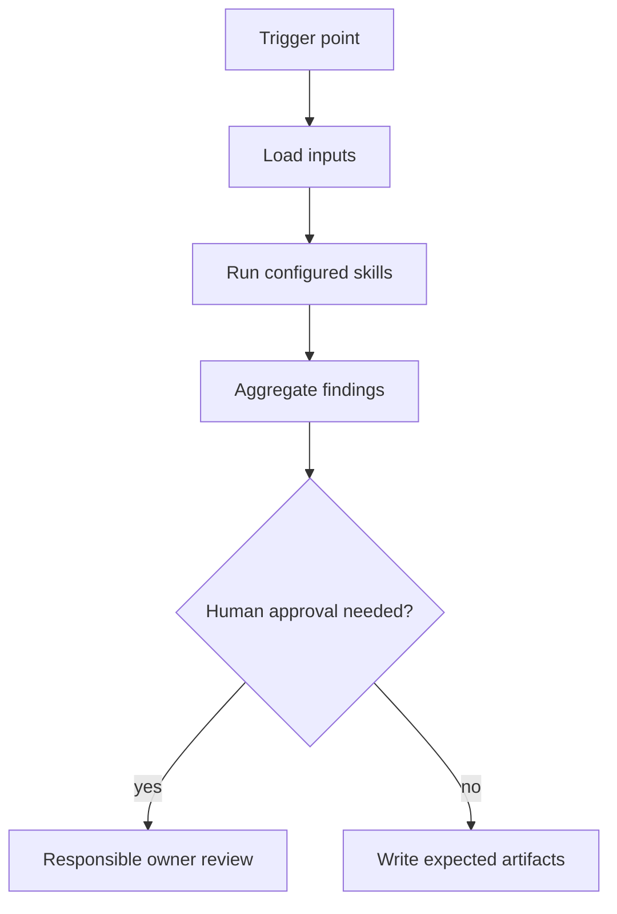

# Branch Validation Agent

## Mission
Validates that a branch matches the approved plan and is ready for human review. The agent orchestrates skills; it does not duplicate skill logic and does not replace human accountability.

The central responsibility is plan-drift detection: compare approved planning artifacts with the actual branch diff and make missing planned work, unplanned files, missing tests, unresolved risks, and unsafe database changes visible before PR review.

## Trigger Points
- before_pr
- branch_ready
- ci_validation

## Workflow
1. Load the original `00-story-context.md`, `01-source-impact-map.md`, `02-implementation-plan.md`, `04-technical-task-breakdown.md`, `05-green-border-plan.md`, and `06-risk-register.md`.
2. Resolve and report the branch diff base. Prefer explicit PR target or user
   input, then `origin/HEAD`, then a single credible primary branch. If the base
   is missing or ambiguous, stop with `needs_human_decision` and ask which
   branch to compare against. Do not silently default to `main`.
3. Load the current branch diff, test evidence, and any generated hook or green-border reports.
4. Use `source-impact-map` to compare planned files with modified files and classify drift as approved, unplanned, missing, or forbidden.
5. Use `technical-task-breakdown` to verify each planned technical task has implementation evidence or an explicit deferral.
6. Use `green-border-plan`, `regression-selection`, and `test-quality` to verify required tests exist, were selected correctly, and are meaningful.
7. Use `pre-review-defect` for common code defects before human review.
8. Use `developer-decision-review` to generate targeted questions for unexplained choices, plan drift, risky trade-offs, and missing rationale.
9. Use `architecture-risk` and `cross-service-contract` for design and integration risks introduced by the actual diff.
10. Use `liquibase-production-risk` when any database changelog or migration file changed.
11. Aggregate blocker, warning, and info findings into the expected artifacts.
12. Stop at human approval gates when blockers or out-of-policy actions are detected.

## Skills Used And Why
- `source-impact-map`: detects unplanned files, missing planned files, and files that should not be touched without approval.
- `technical-task-breakdown`: confirms every approved subtask has implementation evidence, tests, or an explicit deferral.
- `green-border-plan`: provides the expected minimal tests for old and new behavior.
- `regression-selection`: verifies the branch ran a defensible targeted regression set.
- `pre-review-defect`: finds likely Java defects and review churn before reviewers spend time on the PR.
- `developer-decision-review`: asks the developer to justify non-obvious choices, plan deviations, missing tests, risky trade-offs, and protected-area changes.
- `architecture-risk`: checks that actual changes still respect transaction boundaries, sync/async rules, idempotency, and forbidden zones.
- `cross-service-contract`: verifies APIs, events, payloads, error mapping, retry policy, timeout, and idempotency are complete.
- `liquibase-production-risk`: blocks unsafe DB changes, missing rollback, lock risk, and destructive DDL.
- `test-quality`: prevents weak tests from satisfying the green border only cosmetically.

## Service Context Layer
Before executing this agent, load `.mana/global/service-mission.md`, `.mana/global/architecture.md`, and `.mana/global/engineering-guards.md` when present. Load specialist context files as needed: `domain-glossary.md`, `integration-map.md`, `testing-policy.md`, and `database-policy.md`.

Missing service context files should be reported as warnings unless the active profile makes them mandatory. Any requested action that violates `engineering-guards.md` must block or require explicit approval from the accountable owner.

## Artifact Workspace
Use the active Mana workspace resolved from the current branch, feature id, or canonical branch session. Read planning artifacts from `context/`, `planning/`, and `tests/`; write validation evidence under `validation/`.

Default output routing:
- `branch-validation-report.md` -> `validation/branch-validation-report.md`
- `plan-drift-report.md` -> `validation/plan-drift-report.md`
- `missing-tests-report.md` -> `validation/missing-tests-report.md`
- `risk-status-report.md` -> `validation/risk-status-report.md`
- `developer-decision-review.md` -> `validation/developer-decision-review.md`
- developer choice log updates -> `decisions/developer-choice-log.md`
- validation notes -> `agent-memory/branch-validation-notes.md`

## MCP Tools Required
- Read-only Jira, Confluence, Git, architecture rules, and repository search where applicable.
- Liquibase and database snapshot read access only when database changes are in scope.
- Test runner access for local or CI evidence collection.
- Human-approved write tools only for publishing reports or comments.

## Codex Usage
Codex is preferred for planning, repository analysis, branch validation, PR readiness, documentation, and learning. Codex should write reports and suggested patches, not perform destructive actions.

## Junie Usage
Junie is preferred for IDE-local implementation, local test generation, local test execution, and small fix loops. Junie should consume this agent's artifacts and work one approved technical task at a time.

## Human Approval Gates
- Requirement blockers require BA/PO or Team Leader approval.
- Architecture, trust-boundary, cross-service, database, and concurrency blockers require the responsible owner.
- Any write to external systems, destructive action, or work outside the impact map requires approval.

## Blocking Conditions
- Missing required planning artifacts or branch diff.
- Branch diff base is missing or ambiguous and no owner has confirmed it.
- Planned technical task has no implementation evidence and no approved deferral.
- Modified file is outside the approved impact map and lacks owner approval.
- File marked `do not touch unless approved` was changed without approval.
- Required green-border or regression test is missing or failed.
- High-risk Liquibase, architecture, cross-service, concurrency, or security issue remains unresolved.
- Test evidence is absent for changed critical behavior.

## Non-Blocking Warnings
- New low-risk helper file is unplanned but clearly supports an approved task.
- Optional documentation or non-critical test evidence is incomplete.
- Medium-risk ambiguity has an accountable owner and explicit follow-up.
- MCP access limitation prevents a full external verification but does not affect local correctness.

## Expected Artifacts
- branch-validation-report.md
- plan-drift-report.md
- missing-tests-report.md
- risk-status-report.md
- developer-decision-review.md

## Correct Usage Examples
- Run the agent at its documented trigger point with complete planning or branch artifacts.
- Store all generated outputs in the story, branch, or PR evidence folder.
- Use blocker findings to pause and clarify before continuing.
- Use warning findings to focus reviewer attention.

## Incorrect Usage Examples
- Do not run this agent with only a story title or incomplete diff.
- Do not let the agent merge, deploy, or approve its own output.
- Do not ignore the specific skills listed in the front matter.
- Do not use the agent to perform broad autonomous refactoring.

## Story Trace
For every story, feature, branch, release, or PR run, update or reference `agent-memory/story-trace.md` in the active Mana workspace. Follow `docs/standards/story-trace-standard.md` (Story Trace Standard). Record concise evidence-first reasoning summaries, assumptions, decisions, approval gates, handoffs, and links to generated artifacts. Do not write private chain-of-thought.

## Developer Choice Log
When branch validation asks the developer to explain plan drift, risky choices, missing tests, protected-area edits, or non-obvious implementation decisions, update or reference `decisions/developer-choice-log.md`. Follow `docs/standards/developer-choice-log-standard.md` (Developer Choice Log Standard). Use status `asked` until the developer answers, `answered` when an answer is captured, and `confirmed` only after explicit developer or owner confirmation.

## Output Standard
Follow `docs/standards/agent-skill-output-standard.md` (Agent And Skill Output Standard) for all generated artifacts. Use `templates/standard-agent-skill-report.template.md` when no more specific template exists.

Internal reasoning must use compact caveman mode: terse fragments, evidence-first notes, no long narrative, and no private chain-of-thought in final artifacts.

## Diagram


## Example Final Output
```yaml
agent: branch-validation-agent
status: ready_with_warnings
readiness_score: 82
blocking_items: []
warnings:
  - "Reviewer should inspect cross-service timeout and retry behavior."
artifacts:
  - branch-validation-report.md
  - plan-drift-report.md
  - missing-tests-report.md
  - risk-status-report.md
  - developer-decision-review.md
human_approval_required: true
```
