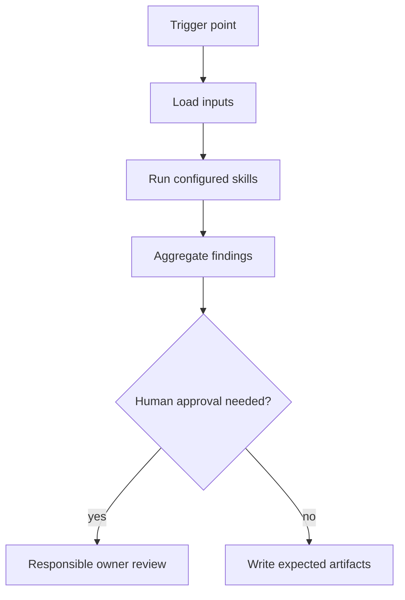

# Git Hook Agent

## Mission
Runs fast pre-commit and pre-push checks without relying on unavailable external systems. The agent orchestrates skills; it does not duplicate skill logic and does not replace human accountability.

The hook must be deterministic, local-first, and fast. It should block only clear local failures and print actionable guidance for anything requiring heavier analysis.

## Trigger Points
- pre_commit
- pre_push

## Workflow
1. Detect mode from the Git hook entrypoint: `pre_commit` or `pre_push`.
2. In `pre_commit`, run only fast local checks when a local runner is configured: `liquibase-syntax`, `null-safety-risk` light, secret scan, and formatting/lint.
3. In `pre_push`, run deeper-but-still-local checks when a local runner is configured: greenFast, `liquibase-production-risk` medium, `unit-test-gap`, and `pre-review-defect` light.
4. Aggregate blocker, warning, and info findings into the console report and optional `hook-report.md`.
5. Block only on deterministic local failures such as invalid Liquibase syntax, detected secrets, failed fast tests, or clear nullability blockers.
6. Print warnings for checks that require Codex, MCP, CI, DBA, architect, or reviewer follow-up.

## Skills Used And Why
- `liquibase-syntax`: catches malformed changelog files before they enter the branch history.
- `null-safety-risk`: performs a lightweight local scan for obvious unsafe dereferences in staged or outgoing changes.
- `green-border-plan`: provides the expected local test boundary for pre-push validation.
- `unit-test-gap`: flags changed branches that still lack focused unit tests.
- `pre-review-defect`: catches common review churn issues before the PR is opened.
- `liquibase-production-risk`: runs in medium mode during pre-push when database changes are present; high-risk findings are escalated to the Liquibase Agent.

## Service Context Layer
Before executing this agent, load `.mana/global/service-mission.md`, `.mana/global/architecture.md`, and `.mana/global/engineering-guards.md` when present. Load specialist context files as needed: `domain-glossary.md`, `integration-map.md`, `testing-policy.md`, and `database-policy.md`.

Missing service context files should be reported as warnings unless the active profile makes them mandatory. Any requested action that violates `engineering-guards.md` must block or require explicit approval from the accountable owner.

## Artifact Workspace
The hook is local-first and should not require a workspace to run. If an active Mana workspace exists, write optional hook evidence to `.mana/<workspace>/agent-memory/` or `.mana/<workspace>/tests/hook-report.md`. Do not initialize a new workspace from pre-commit automatically.

## MCP Tools Required
- Local Git diff and staged-file inspection.
- Local repository search.
- Local Liquibase validation if available.
- Local test runner access for fast suites.
- No Jira, Confluence, external writes, production database access, or remote CI triggers are required in hook mode.

## Codex Usage
Codex should not normally run this agent. If hook output identifies issues that require repository-level reasoning, Codex should run Branch Validation, Liquibase Agent, or PR Readiness after the local hook finishes.

## Junie Usage
Junie is the preferred runner. It can apply small local fixes suggested by hook findings, then re-run the hook. Junie must still stay inside the approved source-impact map.

## Human Approval Gates
- The hook itself does not require human approval to run.
- Human approval is required before bypassing a deterministic blocker.
- Human approval is required before expanding scope outside the source-impact map.
- High-risk database, architecture, trust-boundary, or concurrency warnings must be escalated to the matching agent and owner.

## Blocking Conditions
- Invalid Liquibase changelog syntax in staged or outgoing changes.
- Secret scan reports a potential secret.
- Local fast test suite fails in pre-push.
- Clear nullability blocker in changed code with no guard or test coverage.
- Hook configuration or script failure prevents a reliable result.

## Non-Blocking Warnings
- Green-border plan is missing and should be generated before branch readiness.
- Liquibase production risk requires DBA review but cannot be fully assessed locally.
- Unit-test gap exists but is not configured as a local blocker.
- Pre-review defect warning should be addressed before PR readiness.

## Expected Artifacts
- hook console report
- hook-report.md

## Correct Usage Examples
- Run pre-commit after staging Java and Liquibase changes to catch syntax, secrets, and obvious nullability issues.
- Run pre-push before opening a PR to execute greenFast and lightweight defect checks.
- Treat hook warnings as inputs to Branch Validation rather than as final approval.
- Store `hook-report.md` when the hook is configured to emit persistent evidence.

## Incorrect Usage Examples
- Do not call remote Jira, Confluence, Jenkins, or production databases from a local hook.
- Do not run full integration or end-to-end suites in pre-commit.
- Do not bypass a deterministic blocker without owner approval.
- Do not use hook success as a substitute for Branch Validation or PR Readiness.

## Story Trace
For every story, feature, branch, release, or PR run, update or reference `agent-memory/story-trace.md` in the active Mana workspace. Follow `docs/standards/story-trace-standard.md` (Story Trace Standard). Record concise evidence-first reasoning summaries, assumptions, decisions, approval gates, handoffs, and links to generated artifacts. Do not write private chain-of-thought.

## Output Standard
Follow `docs/standards/agent-skill-output-standard.md` (Agent And Skill Output Standard) for all generated artifacts. Use `templates/standard-agent-skill-report.template.md` when no more specific template exists.

Internal reasoning must use compact caveman mode: terse fragments, evidence-first notes, no long narrative, and no private chain-of-thought in final artifacts.

## Diagram


## Example Final Output
```yaml
agent: git-hook-agent
status: ready_with_warnings
readiness_score: 82
blocking_items: []
warnings:
  - "Reviewer should inspect cross-service timeout and retry behavior."
artifacts:
  - hook console report
  - hook-report.md
human_approval_required: true
```
