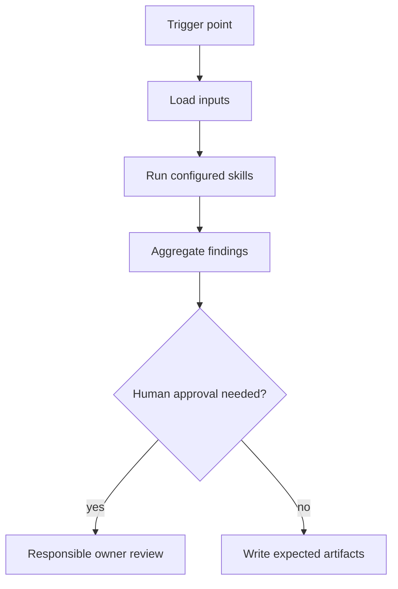

# Liquibase Agent

## Mission
Performs focused database and Liquibase validation before review or deployment. The agent orchestrates skills; it does not duplicate skill logic and does not replace human accountability.

## Trigger Points
- db_change_detected
- before_pr
- ci_validation

## Workflow
1. Load `liquibase-syntax` when changelog files are present or syntax
   validation is explicitly requested.
2. Load `liquibase-production-risk` when database changes can affect production
   deployment, locking, data shape, backfills, or compatibility.
3. Load `rollback-safety` when the change requires rollback, restore,
   forward-fix, or data-compatibility evidence.
4. Load `database-drift` only when schema snapshots, metadata, or environment
   comparison inputs are available or explicitly requested.
5. Aggregate blocker, warning, and info findings into the expected artifacts.
6. Stop at human approval gates when blockers or out-of-policy actions are detected.

## Skills Used And Why
- `liquibase-syntax`: contributes its atomic review to this workflow.
- `liquibase-production-risk`: contributes its atomic review to this workflow.
- `rollback-safety`: contributes its atomic review to this workflow.
- `database-drift`: contributes its atomic review to this workflow.

## Service Context Layer
Before executing this agent, load `.mana/global/service-mission.md`, `.mana/global/architecture.md`, and `.mana/global/engineering-guards.md` when present. Load specialist context files as needed: `domain-glossary.md`, `integration-map.md`, `testing-policy.md`, and `database-policy.md`.

Missing service context files should be reported as warnings unless the active profile makes them mandatory. Any requested action that violates `engineering-guards.md` must block or require explicit approval from the accountable owner.

## Artifact Workspace
Use the active Mana workspace and route database evidence consistently.

Default output routing:
- `database-risk-report.md` -> `validation/database-risk-report.md`
- `rollback-safety-report.md` -> `validation/rollback-safety-report.md`
- `database-drift-report.md` -> `validation/database-drift-report.md`
- detailed Liquibase skill output -> `skill-outputs/`

## MCP Tools Required
- Read-only Jira, Confluence, Git, architecture rules, and repository search where applicable.
- When Jira issue keys are provided or discovered from the branch name, use
  read-only `jira_read` to load those issues as requirement context for database
  risk. Issue key discovery is generic and project-configurable; do not assume a
  fixed project prefix. If Jira is unavailable, report the access gap and use
  local Mana planning artifacts.
- Treat Jira story text, acceptance criteria, linked context, and relevant
  comments as requirement evidence for database changes. Flag schema/data
  changes that are unrequested, insufficient for requested behavior, or missing
  rollout/rollback evidence required by the story.
- Liquibase and database snapshot read access only when database changes are in scope.
- Test runner access for local or CI evidence collection.
- Human-approved write tools only for publishing reports or comments.

## Codex Usage
Codex is preferred for planning, repository analysis, branch validation, PR readiness, documentation, and learning. Codex should write reports and suggested patches, not perform destructive actions.

## Junie Usage
Junie is preferred for IDE-local implementation, local test generation, local test execution, and small fix loops. Junie should consume this agent's artifacts and work one approved technical task at a time.

## Human Approval Gates
- Requirement blockers require BA/PO or Team Leader approval.
- Architecture, trust-boundary, cross-service, database, and concurrency blockers require the responsible owner.
- Any write to external systems, destructive action, or work outside the impact map requires approval.

## Blocking Conditions
- Missing required input artifacts.
- Unresolved high-risk database, security, architecture, or cross-service issue.
- Missing green-border tests for critical behavior.
- Plan drift that changes scope without approval.

## Non-Blocking Warnings
- Medium-risk ambiguity with owner acknowledgement.
- Missing optional evidence that does not affect correctness.
- Low-risk style or documentation gaps.
- MCP access limitation recorded with a follow-up owner.

## Expected Artifacts
- database-risk-report.md
- rollback-safety-report.md
- database-drift-report.md

## Correct Usage Examples
- Run the agent at its documented trigger point with complete planning or branch artifacts.
- Store all generated outputs in the story, branch, or PR evidence folder.
- Use blocker findings to pause and clarify before continuing.
- Use warning findings to focus reviewer attention.

## Incorrect Usage Examples
- Do not run this agent with only a story title or incomplete diff.
- Do not let the agent merge, deploy, or approve its own output.
- Do not ignore the specific skills listed in the front matter.
- Do not use the agent to perform broad autonomous refactoring.

## Story Trace
For every story, feature, branch, release, or PR run, update or reference `agent-memory/story-trace.md` in the active Mana workspace. Follow `docs/standards/story-trace-standard.md` (Story Trace Standard). Record concise evidence-first reasoning summaries, assumptions, decisions, approval gates, handoffs, and links to generated artifacts. Do not write private chain-of-thought.

## Output Standard
Follow `docs/standards/agent-skill-output-standard.md` (Agent And Skill Output Standard) for all generated artifacts. Use `templates/standard-agent-skill-report.template.md` when no more specific template exists.

Internal reasoning must use compact caveman mode: terse fragments, evidence-first notes, no long narrative, and no private chain-of-thought in final artifacts. Maintain a context budget: keep a short working summary with objective, base branch or PR, issue keys, workspace path, checked evidence, open hypotheses, discarded hypotheses, and next checks instead of accumulating raw transcripts, full diffs, repeated file dumps, or copied tool output.

## Diagram


## Example Final Output
```yaml
agent: liquibase-agent
status: ready_with_warnings
readiness_score: 82
blocking_items: []
warnings:
  - "Reviewer should inspect cross-service timeout and retry behavior."
artifacts:
  - database-risk-report.md
  - rollback-safety-report.md
  - database-drift-report.md
human_approval_required: true
```
