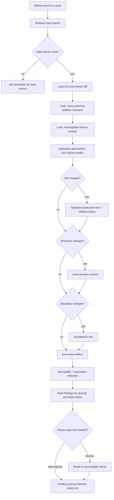

# Example Run: Developer Tutorial on jessica-fletcher

## Input

```yaml
user_role: developer
selected_profile: jessica-fletcher
```

---

## Phase 0 — Discovery (skipped: selected_profile provided)

Active profile from `.mana/active-profile`: none.

---

## Phase 1 — Profile Overview

| Profile | Trigger | Owner Role | Max Duration | What It Does |
|---|---|---|---|---|
| `story-start` | story intake | Developer / TL | 20 min | Produces story context, source impact map, technical breakdown, risk register, and green-border plan from Jira or Markdown input. |
| `story-ready-for-dev` | before dev assignment | Team Leader | 10 min | Verifies that acceptance criteria, technical breakdown, and risk register are clear enough to assign to a developer. |
| `team-planning` | sprint planning | Team Leader | 15 min | Produces execution sequence, owner/dependency map, delivery risks, and review-load plan. |
| `architecture-review` | design gate | Architect | 20 min | Produces ADR, NFR review, service-boundary fit, architecture-drift, trust-boundary, and database-risk evidence. |
| `dev-assist` | during development | Developer | 10 min | Supports the developer while writing code: impact map, known pitfalls, legacy characterization, concurrency risk, what-if analysis, and test gap planning. |
| `pre-commit` | before git commit | Developer | 8 min | Runs fast local checks: liquibase syntax, nullability, unit-test gap, pre-review defect, and produces development summary and knowledge-transfer brief. |
| `pre-push` | before git push | Developer | 10 min | Deeper pre-push checks: flaky test classification, integration test gap, legacy characterization, regression selection, and full quality scan. |
| `jessica-fletcher` | before commit/push | Developer | 15 min | Production pre-mortem: asks why the branch would fail in production and ranks failure modes by evidence and blast radius. |
| `branch-ready` | before PR | Developer / TL | 20 min | Validates branch against approved plan, detects drift, missing tests, unsafe DB changes, and unresolved risks. |
| `pr-ready` | before review | Developer | 15 min | Generates PR description, reviewer focus, test evidence, risk report, development summary, and developer handoff. |
| `requested-pr-review` | reviewer requested | Reviewer / TL | 30 min | Finds PRs where you are a requested reviewer, or analyzes one PR by number, and produces focused review findings. |
| `ci-validation` | CI gate | CI / TL | 30 min | Runs validation in CI: branch validation, Liquibase risk, architecture risk, cross-service contract checks. |
| `am-release-ready` | before release | Application Manager | 25 min | Produces release impact, continuity, rollback, incident-risk, and support/communication evidence. |
| `team-coaching-review` | coaching session | Team Leader | 30 min | Analyzes per-contributor quality patterns on a branch and produces a confidential coaching report with growth opportunities and recommended actions. |
| `tutorial` | onboarding | Any | 15 min | Interactive framework walkthrough — this profile. |
| `mana-help` | any question | Any | 5 min | Answers operational questions, routes to the right profile, skill, or fallback. |

---

## Phase 2 — Deep-Dive: `jessica-fletcher`

### What This Profile Does

Jessica Fletcher runs a **production pre-mortem** before code is committed or
pushed. It asks the question:

> The code introduced in this branch is causing production problems. Find the reasons.

It is named after the detective because it is deliberately skeptical — it
searches for plausible failure modes rather than confirming that the code is
correct.

### Execution Flow



### Skills and Why Each Is Here

| Skill | Why in this profile |
|---|---|
| `production-premortem` | Core skill: generates ranked production failure hypotheses from the diff. |
| `liquibase-production-risk` | Invoked only when DB files changed; catches risky migrations before prod. |
| `rollback-safety` | Paired with Liquibase: checks whether the migration can be safely reversed. |
| `cross-service-contract` | Invoked for API/event/message changes; catches breaking contract drift. |
| `architecture-risk` | Invoked for boundary or pattern changes; flags service-boundary violations. |
| `pre-review-defect` | Code-level defects that would cause review churn or production bugs. |
| `test-quality` | Checks whether the test evidence is strong enough to trust the change. |
| `regression-selection` | Identifies which existing tests cover the changed paths. |

### Inputs You Must Have Ready

| Input | Required | Where to find it |
|---|---|---|
| Main branch | Yes | Explicit user input, `origin/HEAD`, or the only credible primary branch |
| Full local branch diff | Yes | `git diff <main-branch>...HEAD` plus uncommitted working-tree changes |
| Story context | Recommended | `.mana/features/<JIRA-KEY>/context/` or Jira MCP |
| Source impact map | Recommended | `.mana/features/<JIRA-KEY>/planning/01-source-impact-map.md` |
| Green-border plan | Recommended | `.mana/features/<JIRA-KEY>/planning/05-green-border-plan.md` |
| Risk register | Recommended | `.mana/features/<JIRA-KEY>/planning/06-risk-register.md` |
| Service context | Recommended | `.mana/global/service-mission.md`, `architecture.md`, `engineering-guards.md` |
| Test evidence | Recommended | `.mana/features/<JIRA-KEY>/tests/` |

Planning artifacts are optional but improve result quality significantly.
Without them, jessica-fletcher works from the full local branch diff alone.

### Annotated Sample Output

```markdown
# Jessica Fletcher Report
<!-- Standard artifact title as per agent-skill-output-standard.md -->

## Status
<!-- One of: ready / ready_with_warnings / not_ready / blocked / needs_human_decision -->
ready_with_warnings
Owner: Developer
Timestamp: 2026-05-14T09:31Z

## Executive Summary
<!-- 2-3 sentences. Summarizes the most critical finding and recommended action. -->
The payment retry loop introduced in PaymentRetryService may produce duplicate
charges under concurrent execution. One rollback path for the Liquibase migration
is missing. All other findings are warnings or informational.

## Decision Table
| Gate | Status | Owner | Evidence | Action |
|---|---|---|---|---|
| Concurrency safety | blocker | Developer / Architect | Retry loop not idempotent; no distributed lock | Add idempotency key or lock before merge |
| Database rollback | warning | DBA | Migration adds NOT NULL column; no rollback SQL | Add rollback changeset before pushing |
| Test coverage | warning | Developer | Happy path covered; no test for concurrent retry | Add concurrent retry test before PR |
| Cross-service contract | info | Developer | No API signature changes detected | No action required |

## Findings
| Severity | Area | Finding | Evidence | Owner | Recommended Action |
|---|---|---|---|---|---|
| blocker | concurrency | PaymentRetryService.retry() not idempotent | No lock or idempotency check in branch diff | Developer / Architect | Add idempotency key; review with Architect before merge |
| warning | database | Migration V42 missing rollback | liquibase-production-risk: no <rollback> tag | DBA | Add rollback SQL; DBA review required |
| warning | test | No concurrent retry test | regression-selection: only unit happy-path found | Developer | Add test before PR |
| info | architecture | No boundary changes detected | architecture-risk: no cross-service call added | — | None |

## Evidence
<!-- Concrete references. Never vague. -->
- `src/main/java/payments/PaymentRetryService.java:87`: retry loop without lock.
- `db/changelog/V42__add_payment_retry_count.xml`: missing `<rollback>` block.
- `src/test/java/payments/PaymentRetryServiceTest.java`: covers happy path only.

## Diagram
<!-- Mermaid showing the failure path -->
flowchart TD
    Retry[PaymentRetryService.retry()] --> Check{idempotency check?}
    Check -->|missing| Dup[Duplicate charge risk]
    Dup --> Prod[Production incident]

## Open Questions
| Question | Owner | Required By | Blocks |
|---|---|---|---|
| Is a distributed lock acceptable for retry idempotency? | Architect | before merge | Concurrency gate |

## Actions
- [ ] Developer: add idempotency key or distributed lock to retry loop before merge.
- [ ] DBA: add rollback SQL to V42 migration before push.
- [ ] Developer: add concurrent retry test before opening PR.
- [ ] Architect: confirm lock strategy (sync block vs Redis lock) before merge.

## Human Approval
<!-- Explicit: who approves what. -->
- Developer: resolves blocker findings or escalates to Architect.
- Architect: approves concurrency strategy before merge.
- DBA: approves rollback SQL in Liquibase migration.
```

### Human Approval Gates

| Gate | Who Approves | Evidence Required |
|---|---|---|
| Blocker finding | Developer must resolve or escalate | Resolution note or Architect sign-off |
| High-risk DB finding | DBA | Rollback SQL and DBA review record |
| Architecture boundary finding | Architect | ADR or explicit approval in story trace |

---

## Phase 3 — Starter Checklist

```markdown
# Starter Checklist: jessica-fletcher

## Prerequisites
- [ ] Mana framework linked to the project: `scripts/bootstrap-project.sh --project-root .`
- [ ] Workspace initialized: `scripts/mana-workspace.sh init --root . --feature <JIRA-KEY>`
- [ ] Service context populated: `.mana/global/service-mission.md`, `architecture.md`, `engineering-guards.md`

## Recommended (improves result quality)
- [ ] Story context exists: `.mana/features/<JIRA-KEY>/context/story-context.md`
- [ ] Source impact map exists: `.mana/features/<JIRA-KEY>/planning/01-source-impact-map.md`
- [ ] Green-border plan exists: `.mana/features/<JIRA-KEY>/planning/05-green-border-plan.md`
- [ ] Risk register exists: `.mana/features/<JIRA-KEY>/planning/06-risk-register.md`
- [ ] Test evidence collected: `.mana/features/<JIRA-KEY>/tests/`

## Run Command
- [ ] Make local branch changes; staging is not required for Jessica.
- [ ] Run jessica-fletcher: `scripts/run-profile.sh jessica-fletcher --project-root .`
- [ ] Confirm the main branch if Codex or Claude cannot resolve it unambiguously.

Claude Code can run this profile directly from the terminal as an alternative
to Codex. See `docs/examples/end-to-end-claude-flow.md`.

## Post-Run Review
- [ ] Read `jessica-fletcher-report.md` in the active workspace.
- [ ] Act on all blocker findings before pushing.
- [ ] Route warning findings to the appropriate owner (DBA, Architect).
- [ ] Update `agent-memory/story-trace.md` with decisions and approvals.
```
