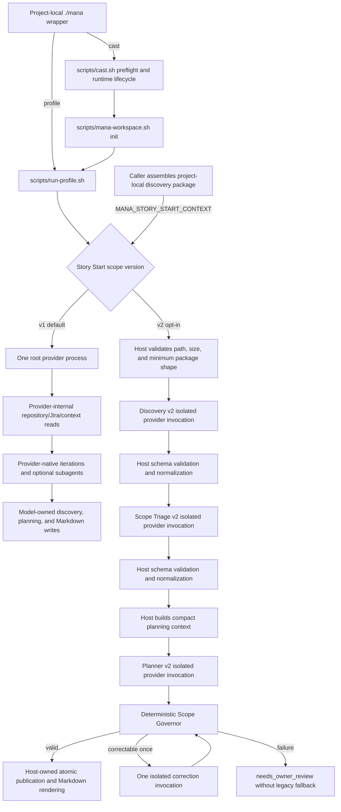

# Analysis Trajectory Guard — TG00 Reconnaissance

## Status And Baseline

`complete` for the TG00 characterization scope. This document describes the
implementation at `868815faf5bd5fa1986ec272c47f789716b5d685`; it does not
enable trajectory telemetry, mission injection, drift detection, checkpoint
calls, re-anchor behavior, or another public runtime path.

Initial repository state before TG00 edits:

- branch: `feature/analysis-trajectory-guard`, created from `develop`;
- HEAD: `868815faf5bd5fa1986ec272c47f789716b5d685`;
- `develop` HEAD at branch creation: the same commit;
- worktree: clean;
- pre-existing uncommitted changes: none.

TG00 adds only this planning document, one synthetic trace set, its offline
integrity test, and registration of that test in the zero-token suite.

## Executive Finding

Mana currently has no host-owned long-running evidence-acquisition loop that
feeds Story Start Scope v2.

The two current Story Start paths are materially different:

1. The default v1 path starts one root provider process with repository, Jira,
   Service Context, optional User Context, and provider-native subagent access.
   Repository reads, tool calls, iterations, delegation, target selection, and
   context expansion happen inside that process. Mana sees the process launch
   and exit, not the internal trajectory. The model writes legacy Markdown
   artifacts directly.
2. The opt-in v2 path requires the caller to supply a project-local
   `mana.story-start.discovery-package/v1` file through
   `MANA_STORY_START_CONTEXT`. Mana validates that already-assembled package,
   then runs three isolated schema-bound synthesis calls: Discovery, Scope
   Triage, and Planner. Despite its name, v2 Discovery does not traverse the
   repository; it normalizes and inventories only the supplied package. The
   host builds the compact planning context between Triage and Planner, runs
   the deterministic Scope Governor, optionally allows one corrective call,
   and publishes versioned artifacts.

Therefore TG02 cannot truthfully claim per-tool-call, per-file-read, per-agent-
iteration, or per-context-expansion telemetry for current v1 providers. A real
guard can operate at existing provider invocation, v2 phase, compact-context,
governor, and publication boundaries. Finer control requires a later phase to
expose an explicit host-visible next-action or iteration boundary; it must not
be inferred from transcripts or implemented as a parallel orchestration
framework.

## Current Pipeline



The unconnected upstream node `X` is intentional: no repository-owned script
constructs the v2 discovery package from a long-running analysis. The public
documentation tells the caller to prepare it, and `run-profile.sh` requires its
path. This is the principal missing boundary for Trajectory Guard.

## Public Entry Points And Concrete Flow

### Wrapper And Cast

- `scripts/bootstrap-project.sh` generates the project-local `./mana` wrapper.
  Its `profile` command executes `scripts/run-profile.sh`; its `cast` command
  executes `scripts/cast.sh`.
- `scripts/cast.sh` validates the selected profile, agent, skills, Service
  Context, and declared effects. After the read-only preflight it initializes
  runtime telemetry, emits profile/skill/model-selection events, initializes
  the active workspace, and delegates execution to `run-profile.sh`.
- Direct `profile` execution reaches `run-profile.sh` without cast lifecycle
  events. Both paths reach the same v2 branch when the version environment
  variable is set.

### Default V1 Story Start

`profiles/story-start.yaml` selects the semantic
`story-implementation-planner` agent and baseline/conditional skills.
`scripts/run-profile.sh` renders one root prompt and uses
`mana_provider_profile_args` from `scripts/lib/provider-dispatch.sh` to start
Codex, Claude, or OpenCode in the target repository. The prompt tells the root
model to:

- load the story/Jira fallback and active workspace;
- read only relevant skills and context;
- perform repository evidence inventory;
- delegate bounded discovery or specialist work when available;
- aggregate outputs into the legacy workspace Markdown paths.

The provider owns the loop. The `mana_explorer` prompt asks for at most three
retrieval cycles and a compact final summary, but those cycles are not emitted
as host events and the summary is not a strict Story Start trajectory contract.
The host can stop or validate only before launch and after process completion.

### Opt-In V2 Story Start

The v2 branch in `scripts/run-profile.sh` runs before generic v1 prompt
construction and before provider-native agent installation. It:

1. resolves `MANA_STORY_START_CONTEXT` inside the target project;
2. rejects missing, unsafe, oversized, or minimally invalid packages;
3. initializes and validates an active `.mana/features/**` or
   `.mana/sessions/**` workspace;
4. maps the selected runner to its resolved root model;
5. invokes `mana_story_start_scope_v2_run_public`;
6. exits after the v2 result, so it never enters the v1 root-agent path.

`scripts/lib/story-start-scope-v2.sh` owns the v2 phase sequence. Every phase
uses a host-created empty, read-only, ephemeral workspace with subagents
disabled. Codex also receives the host-owned JSON Schema through
`--output-schema`. The provider cannot inspect the target repository through
this path; each phase sees only the compact JSON embedded in its prompt.

## Trace Of One Current V2 Run

The deterministic public-path test in
`tests/story-start-scope-v2-integration.sh` supplies
`tests/fixtures/story-start-scope-v2/discovery/compact-package.json` and fake
captured provider outputs. Its control flow matches the production host path:

1. The input file carries `packageVersion`, `storyId`, a normalized summary,
   acceptance criteria, and a bounded note. The fixture contains no repository
   traversal transcript.
2. `run-profile.sh` validates containment and package shape, initializes the
   Story Start workspace, selects the runner root model, and calls the shared
   v2 library.
3. Discovery receives the complete supplied package and returns a strict
   `mana.story-start.discovery-inventory/v2`. The host validates, derives stable
   IDs, canonicalizes ordering, and validates again.
4. Triage receives only the normalized story and Discovery artifact. The host
   validates references and normalizes a strict Scope Triage artifact.
5. The host builds `mana.story-start.planning-context/v2` from Discovery and
   Triage. This is the current compact evidence package supplied to Planner;
   it is host-derived and never published as the upstream acquisition trace.
6. Planner receives only the normalized story, compact planning context, and
   Triage artifact. It does not receive repository access or the raw external
   context package as an independent evidence source.
7. The deterministic governor validates the Discovery/Triage/Plan bundle. A
   first correctable failure may cause exactly one correction invocation using
   only the invalid plan and violation report. A second failure terminates as
   `needs_owner_review`.
8. On success the host renders Markdown and atomically publishes Discovery,
   Triage, Plan, governance report, human report, and finally the run-status
   commit marker. Scope v2 consumes no trajectory ledger because none exists.

This trace proves that the final compact planning package and downstream Scope
v2 boundary are host-visible. It also proves that acquisition before the
caller-created package is absent, not merely undocumented.

## Current Ownership And Interception Boundaries

| Boundary | Observable by Mana | Interceptable by Mana | Available IDs/evidence today | Safe insertion point | Unsupported assumption |
|---|---|---|---|---|---|
| Individual provider-internal tool call | No for v1; v2 synthesis disables tools rather than observing them | No | None; runtime docs explicitly defer tool events | None inside the provider. Enforce only on the supplied envelope or returned handoff | Mana can validate every provider read/search/tool call |
| Root provider invocation | Yes | Yes, before launch and after exit | profile, runner, resolved root model, project root, process exit; cast execution ID only when called through `cast` | `run-profile.sh` plus `mana_provider_profile_args` | A zero exit code proves semantic trajectory quality |
| V2 phase provider invocation | Yes | Yes | phase function, runner, model, schema path, input/output byte bounds, timeout/process status | `mana_story_start_scope_v2_{discover,triage,plan_candidate,govern_with_correction}` | Phase-local provider usage is already emitted as runtime telemetry |
| Provider-native agent iteration | No | No | No iteration ID or structured callback; explorer cycles exist only in model instructions/final prose | A future explicit host-controlled iteration adapter, if introduced without duplicating dispatch | Prompted retrieval-cycle text is a reliable event stream |
| Provider-native agent delegation | Partial: Mana configures roles and limits, but does not observe actual child creation or completion | Partial only before the root launch by enabling/disabling roles; not per delegation | configured agent class/model/effort and max depth/threads; no actual delegation event | Before root invocation, or a future explicit host delegation adapter | Installed agent files prove that a child ran or what it inspected |
| New module/service context expansion in v1 | No | No | No target-scope identity, transition, or evidence link | A future next-action/context-expansion request at a host boundary | Repository paths mentioned in final prose reconstruct exact traversal order |
| External construction of the v2 discovery package | No | No | Only final project-local path, bytes, minimum story fields, and supplied content | The missing upstream collector boundary to be defined in TG06 after TG02–TG05 contracts exist | Mana currently knows who read which source to assemble the package |
| Validation of supplied v2 package | Yes | Yes | canonical path containment, byte count, package version, story ID, normalized story/criteria | `run-profile.sh` and `mana_story_start_scope_v2_validate_public_context` | Minimum package validation proves evidence provenance or completeness |
| Host compact planning-context synthesis | Yes | Yes | validated Discovery/Triage IDs and referenced evidence/provenance | `build-planning-context` in `story-start-scope-v2-normalize.py` | This downstream projection is the missing upstream analysis ledger |
| Final Story Start planning | Partial in v1; yes in v2 | V1 only at process boundary; v2 yes before/after Planner and Governor | v1 Markdown/exit status; v2 strict artifacts, IDs, validation reports | Existing v2 Planner/Governor boundary | V1 Markdown is safe structured next-action data |
| Artifact publication | Partial in v1 because the model writes during its process; yes in v2 | V1 not transactionally; v2 yes and fail-closed | workspace path; v2 schema/artifact IDs and run-status marker | Existing v2 atomic publication functions | A provider failure cannot leave partial legacy Markdown |
| Cast runtime event stream | Yes only for `cast` | Yes at host lifecycle points | session/execution/profile/component IDs, declared skill/model selection, status, compact refs | `runtime_emit` after real events become available | Direct `profile` has the same telemetry, or cast events expose internal activity |

The first enforceable pilot should therefore use phase/provider boundaries and
any explicit next-action boundary that later work can expose. It must report
the current provider-internal rows as unsupported rather than backfilling them
from free-form output.

## Current Model And Reasoning-Effort Routing

### Configuration Precedence

For every provider, `scripts/run-profile.sh` initializes values as:

```text
explicit CLI flag > matching MANA_* environment variable > hard-coded default
```

CLI parsing happens after environment-backed initialization, so the CLI wins.
Managed project-local agent files are rendered from these resolved values when
the v1 provider path enables subagents. OpenCode specialist/explorer/worker
models inherit the resolved OpenCode root model when their specific variables
are empty. That is role-model inheritance, not provider fallback.

There is no automatic Codex → Claude → OpenCode fallback. An unavailable or
failed selected provider fails the run. The v2 pipeline also makes no fallback
to v1 or free-form output.

### Scope V2 Routing Matrix

| Runtime stage | Model actually passed | Reasoning effort actually passed | Evidence and gap |
|---|---|---|---|
| Discovery v2 | Selected runner root model | None | `run-profile.sh` passes one `story_start_model`; Discovery calls `mana_provider_synthesis_args` without its effort argument |
| Scope Triage v2 | Same selected root model | None | No phase-specific model or effort variable |
| Implementation Planner v2 | Same selected root model | None | No phase-specific model or effort variable |
| Targeted plan correction | Same selected root model | None | The one corrective call reuses the Planner model and omits effort |
| Deterministic Scope Governor | No model | Not applicable | Python validator only; zero-token |

Resolved root-model defaults are:

| Provider | Default root model | Override |
|---|---|---|
| Codex | `gpt-5.4-mini` | `MANA_CODEX_MODEL`, then `--codex-model` |
| Claude | `haiku` | `MANA_CLAUDE_MODEL`, then `--claude-model` |
| OpenCode | `opencode/gpt-5.1-codex` | `MANA_OPENCODE_MODEL`, then `--opencode-model` |

`mana_provider_synthesis_args` already accepts a validated optional reasoning
effort and, for Codex only, preserves it through `--ignore-user-config` as
`model_reasoning_effort`. `tests/provider-dispatch.sh` proves this capability.
Story Start v2 does not use the argument. Claude and OpenCode synthesis
dispatch currently pass no reasoning-effort option at all. TG01 must expose
this limitation rather than claim provider parity that the adapters do not
implement.

### Existing Long-Running Agent Routing

| Runner role | Default model | Effort | Runtime visibility |
|---|---|---:|---|
| Codex root orchestrator | `gpt-5.4-mini` | not explicit | Host sees only root invocation |
| Codex explorer | `gpt-5.6-terra` | `medium` | Configured role; actual delegation is opaque |
| Codex full specialist | `gpt-5.6-sol` | `high` | Configured role; actual delegation is opaque |
| Codex worker | `gpt-5.6-terra` | `medium` | Not permitted for analysis-only profiles |
| Claude root `mana-orchestrator` | `haiku` | `low` | Agent front matter; child activity opaque to Mana |
| Claude explorer | `sonnet` | `medium` | Configured role only |
| Claude full specialist | `opus` | `high` | Configured role only |
| Claude worker | `sonnet` | `medium` | Not permitted for analysis-only profiles |
| OpenCode root and roles | `opencode/gpt-5.1-codex` unless role overrides are set | no reasoning-effort field; temperature `0.1` in agent files | Configured role only |

The v2 early branch does not use these explorer/full/worker roles. All three
semantic phases currently run on the selected root model. Thus current routing
does not match the target per-stage policy and TG00 records the gap without
fixing it.

## Existing Host Mechanisms To Reuse

| Need | Existing mechanism | Reuse boundary |
|---|---|---|
| Provider-neutral invocation | `scripts/lib/provider-dispatch.sh` | Extend existing dispatch; do not create another provider launcher |
| Bounded subprocess execution | `scripts/lib/verification-exec.pl` | Keep timeout, output caps, status, signal, and descendant checks |
| Strict Story Start artifacts | `contracts/story-start/scope-v2/` plus the normalizer/governor | Keep trajectory data in additive sidecars; do not change frozen Scope v2 schemas in early phases |
| Stable IDs and canonical JSON | `story-start-scope-v2-normalize.py` and other repository normalizers | Reuse canonical semantic hashing patterns, not timestamps or model IDs |
| One repair then fail closed | v2 Scope Governor correction path | Reuse the bound and owner-review outcome; trajectory correction needs its own schema, not source repair |
| Owner-review publication | v2 run/governance status and deterministic renderer | Align outcome terms and never silently resume unguarded execution |
| Runtime event envelope | `scripts/lib/runtime-events.sh` | Emit only facts observed by the host; never store prompts, source, or arbitrary payloads |
| Workspace routing and atomic publication | `scripts/mana-workspace.sh` and v2 atomic-copy helper | Keep sidecars under the active workspace and the operational stream under `.mana/runtime` |
| Zero-token provider fixtures | captured v2 outputs and fake provider binaries in Story Start tests | New default regressions remain offline and count fake calls |
| Opt-in live semantic harness convention | User Learning live tests and documentation | If TG07 adds live tests, require explicit opt-in, model, effort, call/token bounds, and artifact paths |

Current Story Start v2 has no live-provider harness. SS07 explicitly records
that live Codex, Claude, and OpenCode smoke runs were not configured. TG00 made
no live call and did not create one.

## Fixture Topology

`tests/fixtures/analysis-trajectory-guard/tg00-traces-v1.json` freezes eight
sanitized trace descriptions. It is not a future Mission Contract, Ledger,
checkpoint schema, or runtime event schema. Its steps represent only facts a
host-visible boundary would need to expose; the opaque-provider fixture
contains no invented internal events.

| Case | Frozen distinction |
|---|---|
| `ON_TRACK_SIMPLE` | Every step links to an active criterion/gap, stays in one scope, and adds evidence |
| `ON_TRACK_LEGITIMATE_EXPANSION` | A second component is entered only after a causal dependency is found; the new scope remains linked to a criterion/gap |
| `DRIFT_RELATED_BUG` | A real independent bug is discovered, then later work follows it with no mission link while a story gap remains open |
| `DRIFT_ARCHITECTURE_RABBIT_HOLE` | An open best-effort/durable decision remains unresolved while two full alternatives are investigated without new decision evidence |
| `DRIFT_REPEAT_NO_EVIDENCE` | The same target and equivalent hypothesis repeat twice without adding evidence |
| `STOP_SUFFICIENT_EVIDENCE` | All mission gaps close before optional hardening research is proposed |
| `MANDATORY_CROSS_CUTTING_FINDING` | Expansion into an authorization component remains on-track because a mandatory constraint and criterion require it |
| `OPAQUE_PROVIDER_BOUNDARY` | Only invocation and final handoff are host-visible; internal reads/search/retry are summaries, not events |

`tests/analysis-trajectory-guard-tg00-fixtures.sh` asserts the exact case set,
stable unique IDs, ordered steps, reference integrity, required topology,
sanitization, and absence of later-phase runtime contract fields. It performs
no provider or network call.

## Experiment Hypotheses

No hypothesis below is treated as proven by TG00. TG02 establishes observable
baselines; TG07 supplies comparative and human-reviewed evidence.

| Hypothesis | Evidence needed | Falsification signal |
|---|---|---|
| Passive telemetry can identify repeated/no-evidence exploration without model calls | Host-visible target fingerprints, accepted evidence deltas, and iteration/order IDs show repeated targets plus an increasing no-evidence streak in offline traces and pilot runs | Required target/evidence facts remain provider-internal, or false repetition is high after canonicalization |
| A compact immutable mission plus current ledger and evidence delta is sufficient to re-anchor at observable boundaries | Checkpoint decisions using only that envelope recover the expected mission link and next action as often as a full-context control in A/B review | Compact runs miss necessary causal evidence or require raw/full history to avoid unsafe decisions |
| On-track analysis should not incur a model-call tax | On-track fixtures and pilot runs have `checkpoints_per_run = 0` except an explicitly configured final-synthesis boundary | Counters or elapsed time alone trigger checkpoints on on-track traces |
| Mandatory cross-cutting evidence remains discoverable | Human review of security/authorization/compliance/data-integrity cases shows required evidence retained after guard decisions | Guard rejects the linked cross-cutting expansion or lowers mandatory-evidence recall |
| Scope expansion becomes explicit instead of silently mutating the mission | Every observed new-scope transition has an approved/allowed link or a recorded expansion proposal; silent transitions decrease relative to control | New scope appears in accepted actions/ledger without a goal, constraint, gap, or proposal transition |
| Related real defects remain visible without hijacking acquisition | Defect evidence is retained in the package, while subsequent unrelated investigation is rejected/re-anchored | Guard either suppresses the finding or lets it replace active gaps |
| Open decisions remain open until host-visible evidence records an owner decision | Decision-dependent actions remain conditional and assumption events are detectable | The checkpoint selects an architecture or treats one option as mission scope without a resolved transition |

## Baseline Metrics And Measurement Contract

TG00 defines names and denominators but no pass thresholds. Historical numeric
baselines are unavailable because current runtime events contain no iteration,
target, evidence-delta, actual delegation, checkpoint, token, or owner-feedback
records. Baseline collection begins in TG02 for facts that become genuinely
host-visible; human-reviewed quality baselines belong to TG07.

| Metric | Definition | Required host-visible source | Current availability |
|---|---|---|---|
| `unsupported_next_action_rate` | accepted/proposed next actions with no active AC, mandatory constraint, or open evidence-gap link divided by all observed next-action proposals | structured action ID plus justification refs and acceptance result | Unavailable; no current next-action boundary |
| `scope_expansion_attempts` | count of proposals or attempted transitions from current scope into a previously inactive scope | current/target scope refs and transition reason | Unavailable in v1; external package assembly is opaque |
| `repeated_target_rate` | repeated canonical target observations divided by all target observations after the first eligible observation | privacy-safe target fingerprint, action kind, order | Unavailable; provider traversal is opaque |
| `no_new_evidence_streak` | maximum consecutive observed iterations with zero newly accepted evidence refs | ordered iteration ID and accepted evidence delta | Unavailable; v2 exposes phases, not acquisition iterations |
| `open_decision_assumption_rate` | decision-dependent accepted actions that imply a selection while the referenced decision is open divided by all observed open-decision-dependent actions | decision status, action dependency, selected transition | Unavailable upstream; Scope v2 can detect some plan-level violations only |
| `evidence_per_provider_iteration` | distinct accepted evidence refs added divided by observed provider iterations | phase/iteration ID and evidence delta | Only coarse v2 phase output could be derived; acquisition baseline unavailable |
| `checkpoints_per_run` | validated trajectory checkpoint invocations per execution | execution/checkpoint IDs and reason | Not applicable before TG05; expected zero in TG00–TG04 |
| `tokens_per_run` | provider-reported input plus output tokens summed across bounded invocations | provider usage metadata tied to execution/phase | Unavailable in current Story Start; prompt-byte estimates are not billing tokens |
| `analysis_wall_time` | elapsed time from acquisition start to terminal evidence-package outcome; phase durations may be secondary | monotonic/ISO host timestamps around real boundaries | Cast gives coarse run timestamps; v2 subprocess duration is ephemeral and not published |
| `human_rejected_findings` | findings rejected by a named human review disposition, counted once per stable finding ID | review artifact linked to finding and run IDs | Unavailable; no trajectory feedback relation exists |
| `mandatory_evidence_recall` | human-labeled mandatory evidence items retrieved and retained divided by all mandatory items in the reviewed reference set | blinded reference set and human adjudication | TG07-only human-reviewed measure; cannot be inferred from absence |

Metric records must use stable IDs, classifications, counts, hashes, sanitized
paths, and bounded summaries. They must not persist prompts, credentials, Jira
bodies, source snippets, raw provider output, or customer data.

## False-Stop And False-Reanchor Risks

1. **Mandatory cross-cutting evidence looks lateral.** A target outside the
   obvious component may be required by security, authorization, compliance,
   data integrity, or an acceptance criterion. Goal/constraint causality must
   outrank simple scope distance.
2. **Legitimate dependency expansion resembles drift.** The first component
   may prove that a second owns the decisive contract. A detector that sees
   only “new component” will stop valid analysis.
3. **Repeated target does not always mean repeated work.** A later read can be
   justified by changed evidence, a distinct symbol, or validation of a new
   hypothesis. Canonical target plus evidence/hypothesis identity is needed.
4. **No evidence in one iteration may be useful negative evidence.** A bounded
   absence check can close a gap. “Zero new positive records” alone is not a
   drift verdict.
5. **Open architecture decisions can require bounded option evidence.** A
   checkpoint must preserve decision ownership while allowing the minimum facts
   required to frame alternatives; it must not force immediate stop or select
   the robust option.
6. **Opaque providers can create false precision.** Post-hoc final summaries
   may omit internal steps. Metrics must mark coverage as partial rather than
   treating unreported activity as absent.
7. **Re-anchor calls can themselves distort the mission.** A model-written
   mission restatement cannot replace the host contract. Response validation
   and bounded retries are necessary before enforcement.
8. **Direct profile and cast have different telemetry.** A detector wired only
   to cast would silently lack execution IDs on direct profile runs.

## Target Insertion Map For TG01–TG07

These are file-level targets based on current conventions, not files or runtime
behavior created by TG00. Later phases must re-inspect the current branch before
editing and may refine names while preserving the same established boundaries.

| Phase | Target files | Bounded purpose |
|---|---|---|
| TG01 | `scripts/run-profile.sh`, `scripts/lib/provider-dispatch.sh`, `tests/provider-dispatch.sh`, a focused `tests/analysis-trajectory-model-routing.sh`, and routing documentation under `docs/policies/` | Resolve explicit per-stage model/effort values with CLI/env/default precedence; pass effort only where adapters truly support it; do not add trajectory calls |
| TG02 | `scripts/lib/runtime-events.sh`, a small additive trajectory telemetry sidecar/library under `scripts/lib/`, `docs/workflow/runtime-events.md`, trace fixtures, and a zero-token telemetry test | Emit privacy-safe host-observed provider/phase/action/evidence-delta facts in shadow mode; record unsupported coverage; do not alter control flow |
| TG03 | additive contracts below `contracts/analysis-trajectory-guard/v1/`, a canonical normalizer/state helper under `scripts/lib/`, contract tests, and valid/invalid fixtures | Define immutable Mission Contract and host-owned Trajectory Ledger/reference transitions; no checkpoint provider call |
| TG04 | a deterministic detector/policy helper under `scripts/lib/`, versioned drift-signal fixtures/contracts, and `tests/analysis-trajectory-drift-detector.sh` | Compute explainable signals and shadow recommendations from ledger events; no provider call and no blocking |
| TG05 | the same shared trajectory library, a strict checkpoint outcome schema, `scripts/lib/provider-dispatch.sh`, captured checkpoint fixtures, and bounded governor tests | Add one compact checkpoint call plus at most one structural repair, validate the closed outcome set, and fail closed without a loop |
| TG06 | `scripts/run-profile.sh`, `scripts/lib/story-start-scope-v2.sh`, `profiles/story-start.yaml`, compatibility docs, and focused public integration tests | Wire the opt-in guard at real provider/delegation/context-package/final-synthesis boundaries; keep the compact evidence package as the only downstream Scope v2 input |
| TG07 | `evals/scenarios/analysis-trajectory-guard/`, offline A/B fixtures, an explicit opt-in live harness under `tests/`, pilot reports/checklists under this roadmap directory, and release-gate tests | Compare quality/cost, adjudicate false stops/reanchors and mandatory recall, record model/effort/tokens/artifacts, and decide rollout without silently changing defaults |

No phase should insert a second root orchestrator beside `run-profile.sh` or a
new provider launcher beside `provider-dispatch.sh`. If TG06 needs iterative
control before the current package boundary, it must expose a narrow adapter
through the existing executor and preserve the v1/v2 public invocation style.

## Phase Dependencies And Realistic Pilot Boundaries

- TG01 can route existing v2 phase calls explicitly without claiming that it
  controls v1 provider-internal iterations.
- TG02 can immediately observe invocation, phase, validation, publication, and
  cast lifecycle boundaries. Repeated-target and no-evidence metrics remain
  “not observable” until an actual action/iteration source exists.
- TG03 can create host-owned state independently of provider internals, using
  authoritative story/package inputs and only observed events.
- TG04 can run in shadow mode on the synthetic traces and any later real action
  events. It must not manufacture action events from Markdown.
- TG05 can checkpoint only at boundaries backed by real state. It cannot stop
  an internal v1 tool call already in progress.
- TG06 may first enforce before/after a provider invocation, before a host-
  visible delegation/context expansion, and before final package synthesis. If
  a provider exposes none of those finer callbacks, enforcement remains at the
  invocation/handoff boundary and documentation must say so.
- TG07 must compare shadow recommendations against human labels before
  enforcement becomes a default. TG05 remains gated on TG04 distinguishing
  drift, legitimate exploration, and sufficient-evidence stop cases.

## Explicit Non-Goals Preserved

- No runtime behavior, public CLI behavior, profile default, or provider call
  changed in TG00.
- No Mission Contract, Trajectory Ledger, drift detector, checkpoint response,
  re-anchor prompt, scope-expansion workflow, or enforcement flag was added.
- No Story Start Scope v2 schema or semantic contract was modified.
- No model or reasoning-effort routing gap was fixed.
- No thresholds, rollout decision, production baseline number, or quality claim
  was invented.
- No raw prompt, provider response, Jira body, source snippet, credential,
  customer data, or real ticket/service identifier entered the fixture.
- No provider-internal per-tool-call enforcement is proposed.
- No later TG phase was scaffolded as executable runtime code.

## Expected Compatibility Behavior

Trajectory Guard remains additive and opt-in through TG07. With the feature
disabled:

- the default Story Start version remains v1;
- the current v1 root-provider and legacy Markdown behavior remains unchanged;
- opt-in Scope v2 keeps its current package requirement, three successful
  provider calls, at-most-one correction, deterministic governor, and additive
  publication contract;
- direct `profile` and `cast` retain their current CLI forms;
- frozen Scope v2 schemas and artifact meanings remain unchanged;
- no on-track run pays an extra model call;
- shadow telemetry may describe only observed facts and may not affect control
  flow;
- enforcement failure may never fall back to unguarded execution.

## TG00 Gate Evidence

| Gate requirement | Evidence |
|---|---|
| Real current path and file references documented | Pipeline, public entry-point, v1/v2 flow, and concrete-run sections above |
| Observable and non-observable boundaries explicit | Ownership/interception matrix and opaque-provider fixture |
| Current model/effort routing proven from code/configuration | Routing matrices, precedence section, dispatch capability, and existing agent configurations |
| All required trace topologies exist | Eight cases in `tg00-traces-v1.json`, asserted by the TG00 integrity test |
| Experiment hypotheses and metrics defined | Hypothesis and baseline-measurement sections, with unavailable data stated rather than fabricated |
| File-level TG01–TG07 map exists | Target insertion table and phase-dependency section |
| Relevant tests remain green | Record exact executed commands and results in the phase completion report |
| No runtime behavior changed | Diff remains limited to documentation, synthetic fixture, integrity test, and zero-token suite registration |

## Human Decision For The Next Phase

TG00 makes no product rollout decision. Before TG01, the owner should confirm
that phase-specific routing should apply to the existing isolated v2 stages
even though the missing upstream acquisition boundary remains opaque. This is
not a blocker for TG00 and no TG01 work is included here.
