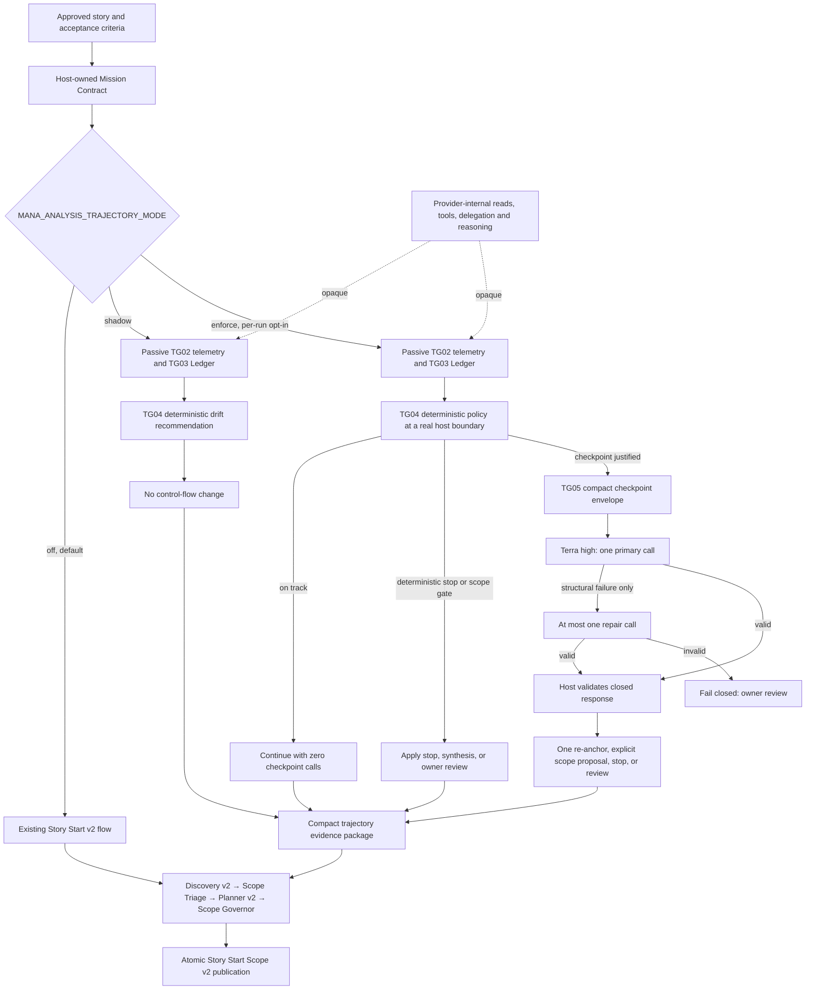

# Analysis Trajectory Guard — final TG07 architecture

The dotted boundary is intentional: Mana does not reconstruct internal tool
activity from prose. Enforcement occurs only at provider invocation,
completion, explicit next-action, and final-synthesis boundaries exposed to
the host. The trajectory package supplies evidence provenance and unresolved
gaps; Story Start Scope v2 alone classifies implementation scope.
