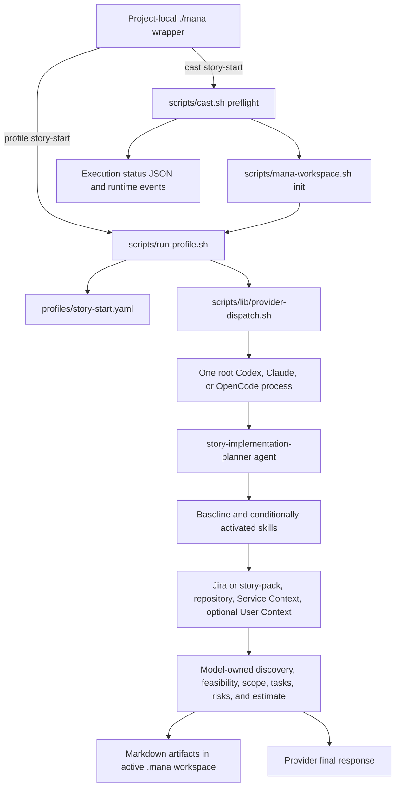
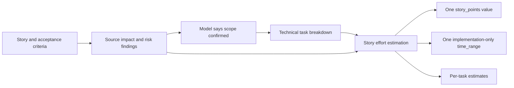
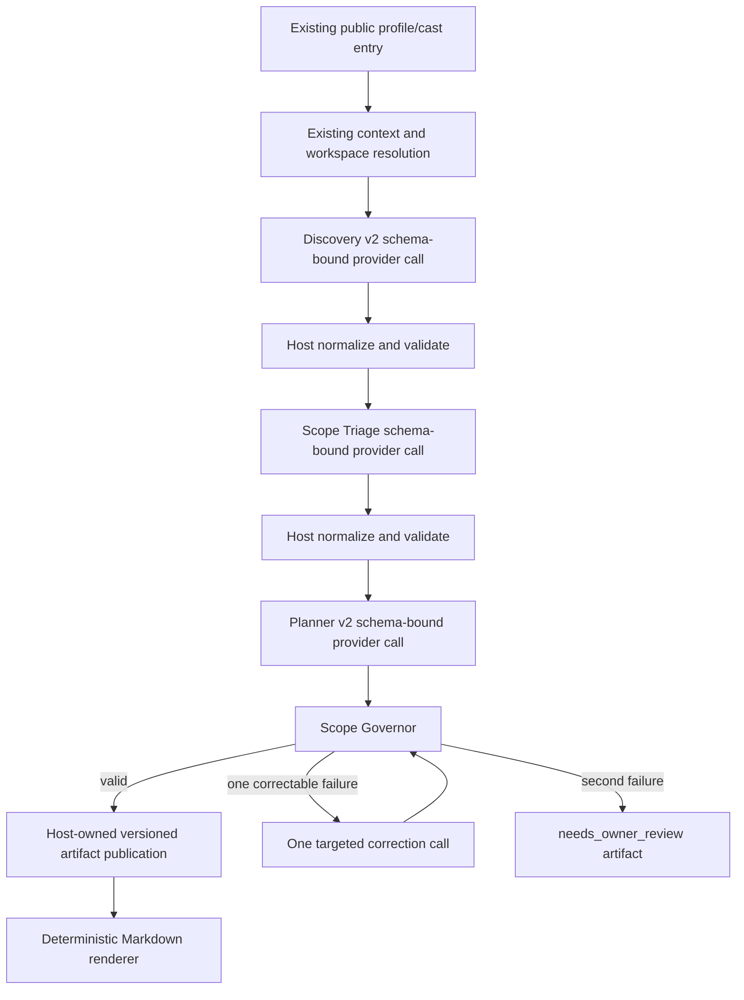

# Story Start Scope v2 — SS00 Reconnaissance

## Status

`complete` for the SS00 characterization scope. This document describes the
current implementation at `b8132918f39e2c90130631899483622fad65aabe`; it does
not define or enable new Story Start behavior.

Initial repository state before SS00 edits:

- branch: `develop`, tracking `origin/develop`;
- HEAD: `b8132918f39e2c90130631899483622fad65aabe`;
- worktree: clean;
- authorized SS00 branch created from that HEAD; the reflog records a later
  rename from `feature/story-start-scope-v2-ss00` to the current
  `feature/story-start-scope-v2`.

## Executive Summary

Current Story Start is one model-owned planning run, not a host-orchestrated
discovery/triage/planning pipeline. The host validates profile metadata and,
when invoked through `mana cast`, Service Context and workspace readiness. It
then starts one root provider process. That model reads the profile, agent,
selected skills, story evidence, repository, and project context; it makes the
semantic scope decisions and writes unversioned Markdown planning artifacts.

Several prompt guardrails already reduce accidental scope growth: technical
tasks must cite a requirement or acceptance criterion, readiness must stay out
of implementation effort, and numeric estimates require confirmed scope with
no blocker. Those invariants are not represented in a strict Story Start data
contract and are not checked by the host. Findings, candidate source areas,
risks, tasks, alternatives, and estimates remain free-form Markdown strings.
Consequently, the current host cannot prove that a pre-existing defect stayed
out of scope, that an open decision stayed open, that alternatives were not
combined, or that one total excludes mutually exclusive work.

SS00 adds only a neutral synthetic fixture and deterministic integrity tests.
It does not add the v2 taxonomy, phase prompts, planner, governor, renderer, or
public integration.

## Current Pipeline

Concrete entry and dispatch references:

- The generated `./mana` wrapper exposes both `profile` and `cast`, then
  dispatches them to `scripts/run-profile.sh` and `scripts/cast.sh`
  (`scripts/bootstrap-project.sh:245-338`).
- `cast` validates the profile, declared skills and agent, and required Service
  Context (`scripts/cast.sh:103-159`), initializes the workspace, then invokes
  `run-profile.sh` (`scripts/cast.sh:265-290`).
- Direct `profile` execution reaches `run-profile.sh` without the `cast`
  preflight. `run-profile.sh` resolves branch-derived Jira keys and provider
  configuration (`scripts/run-profile.sh:315-347`), renders the profile
  (`scripts/run-profile.sh:690-760`), builds a model prompt
  (`scripts/run-profile.sh:926-946`), and invokes exactly one root provider
  process (`scripts/run-profile.sh:949-995`).
- Provider-specific CLI argument construction is centralized in
  `scripts/lib/provider-dispatch.sh:5-67`. Profile execution does not pass a
  Story Start output schema. The existing synthesis path can pass a Codex
  `--output-schema`, but Story Start does not use that path.

## Current Artifact Flow

| Stage | Input | Producer | Output | Host validation |
|---|---|---|---|---|
| Profile selection | profile name, branch, optional Jira keys | wrapper / cast / `run-profile.sh` | selected YAML profile and runner prompt | File existence and metadata in `cast`; direct profile does less preflight |
| Requirement intake | Jira issue, comments, or Markdown story pack | root model following agent instructions | story context and open questions | None beyond provider exit status |
| Repository/context collection | repository search, Git reads, `.mana/global`, optional `.mana/user-context` | model and optional read-only subagents | evidence embedded in Markdown artifacts/summaries | No Story Start evidence schema or reference check |
| Source and risk discovery | normalized requirements plus repository evidence | activated skills | source-impact, risk, contract, or database findings | Prompt conventions only |
| Planning | findings, source map, implementation contract | planner agent plus task/test skills | implementation plan, task breakdown, test plan, risk register | No structured category or cross-artifact validation |
| Estimation | confirmed scope, task breakdown, risks | `story-effort-estimation` skill | one story estimate plus task estimates | Prompt gate only; no arithmetic validator |
| Persistence/rendering | model result | provider/model | Markdown below `.mana/features/**` or `.mana/sessions/**` | Path convention only; content is not validated or deterministically rendered |
| Cast result | runner exit code and lifecycle | `cast.sh` | schema-version-2 execution-status JSON and runtime events | Host-owned, but it is not the Story Start plan artifact |

The agent routes eight named Markdown outputs into the workspace
(`agents/story-implementation-planner/AGENT.md:129-142`). The artifact family is
path-identified under the current artifact taxonomy; arbitrary Markdown claims
are deliberately not authoritative relations
(`docs/standards/mana-artifact-taxonomy.md`, “Cross-Family Relations”).

The nominal agent output schema is not a runtime contract. It has no required
fields or artifact/schema version, allows additional properties, and represents
each artifact as an unconstrained string
(`agents/story-implementation-planner/outputs.schema.json:1-32`). No Story Start
script references that schema.

## Logical Trace Of One Current Run

1. A user runs `./mana profile story-start --codex` or
   `./mana cast story-start`.
2. The selected profile names one semantic agent and eleven candidate skills.
   Four skills are baseline; the remainder depend on model-observed activation
   signals (`profiles/story-start.yaml:22-49`).
3. `run-profile.sh` starts one root provider with repository access and tells it
   to read the profile, selected agent, playbook, context, and only relevant
   skill bodies (`scripts/run-profile.sh:926-945`).
4. The model loads Jira evidence when available, or a Markdown story-pack
   fallback, and checks feasibility (`agents/story-implementation-planner/AGENT.md:63-108`).
5. Baseline requirement and source-impact skills normalize criteria, search the
   repository, and produce findings. High-risk domains may be delegated to
   runtime subagents, but these are model-managed capability calls rather than
   host-defined Story Start phases.
6. When the model decides scope is sufficiently confirmed, it activates task
   breakdown and test planning. When estimation is explicitly requested and no
   blocker remains, it activates estimation
   (`agents/story-implementation-planner/AGENT.md:76-100`).
7. The same model aggregates findings into Markdown artifacts and writes them
   to the active workspace. There is no structured handoff that prevents a
   discovery finding from being reinterpreted as a task during aggregation.
8. A zero provider exit status is treated as run completion. `cast.sh` records
   lifecycle completion but does not parse, schema-validate, cross-check, or
   render the Story Start artifacts.

## Current Model And Host Responsibility Boundary

| Responsibility | Current owner | Evidence |
|---|---|---|
| Resolve profile, provider, branch key hints, and runner arguments | host | `scripts/run-profile.sh:220-390`, `scripts/lib/provider-dispatch.sh` |
| Validate profile/skill/agent existence and core Service Context for cast | host | `scripts/cast.sh:103-159` |
| Initialize feature/session workspace for cast | host | `scripts/cast.sh:265-290`, `scripts/mana-workspace.sh` |
| Record coarse runtime lifecycle and declared skill routing | host | `scripts/cast.sh:246-290`, `scripts/lib/runtime-events.sh` |
| Select conditional planning skills from semantic evidence | model | `profiles/story-start.yaml:36-49`, prompt at `scripts/run-profile.sh:937` |
| Read and normalize story/acceptance criteria | model | planner workflow and requirement skills |
| Search repository and decide relevance | model / model-managed explorer | `source-impact-map` and root prompt |
| Distinguish fact, risk, defect, readiness, mandatory work, and optional work | model prose only | no current Story Start structured categories |
| Preserve open decisions and alternatives | model prose only | no decision or branch schema in current outputs |
| Create tasks and attach evidence | model prompt obligation | planner agent lines 95-99 and task skill lines 70-81 |
| Produce and aggregate estimates | model | `story-effort-estimation` |
| Validate references, category legality, exclusive branches, and arithmetic | nobody | no Story Start host validator exists |
| Render final Story Start content | model | Markdown is written directly; no deterministic Story Start renderer exists |

The output standard requires evidence, findings, approvals, and status, but it
is a Markdown authoring convention rather than a semantic validator
(`docs/standards/output-contract.md` and
`docs/standards/agent-skill-output-standard.md`).

## Current Estimate Flow

Useful safeguards already exist: estimation must be explicitly requested,
scope must be confirmed, blockers must be resolved, and readiness lead time is
excluded (`skills/story-effort-estimation/SKILL.md:60-69,140-155`). The current
skill nevertheless estimates “the story first” as one point value and one time
range. It has no scenario, decision, branch-group, mandatory-delta, or
exclusive-alternative structure. Unknowns, dependencies, legacy complexity,
and risk are estimation factors (`skills/story-effort-estimation/SKILL.md:129-138`),
so any item already admitted into the free-form scope can widen the single
range. No host code recomputes or checks that range.

## Scope-Leakage And Aggregation Points

These are the exact current failure boundaries. Some are missing enforcement,
not explicit instructions to behave incorrectly.

| Failure mode | Concrete location | Current mitigation | Why leakage remains possible |
|---|---|---|---|
| Evidence becomes work | `source-impact-map` searches broadly and emits `probably_modify`, candidates, assumptions, and unrequested candidate scope (`skills/source-impact-map/SKILL.md:65-83`); the planner aggregates findings (`agents/story-implementation-planner/AGENT.md:95-100`); task breakdown consumes source map and risk register and groups work by seam (`skills/technical-task-breakdown/SKILL.md:59-81`) | Every task should cite a requirement/AC, seam, and test | The citation is model-authored prose. No host checks task origin or proves that a cited AC actually requires the work. |
| Pre-existing defect enters the story plan | Source discovery can find unrelated legacy flows; architecture and contract skills emit recommended actions or contract tests (`skills/architecture-risk/SKILL.md:67-76`, `skills/cross-service-contract/SKILL.md:65-73`); all findings are aggregated into the same expected artifact set | Source-impact has inspect/do-not-touch classifications; agent requires scope confirmation | Current inputs/outputs have no pre-existing status, independent-defect disposition, mandatory-cause field, or exclusion category. The host cannot distinguish a reported defect from approved story work. |
| Unresolved decision becomes an assumed architecture | Architecture review “suggests safer patterns”; contract review maps gaps to tests; medium-risk ambiguity is allowed as a warning (`profiles/story-start.yaml:60-63`; agent lines 177-181) | High-risk unresolved issues block and missing requirements should become questions | There is no required open-decision entity, option list, owner state, or rule that decision-dependent tasks must remain conditional. A model can select the robust option while composing the plan. |
| Alternative paths are combined | Current artifacts expose one implementation plan, one task breakdown, one risk register, and one estimate (`agents/story-implementation-planner/AGENT.md:183-191`) | None specific to alternative aggregation | No branch-group or mutual-exclusion representation exists. Alternatives written as ordinary tasks are indistinguishable from cumulative work. |
| A single total estimate is emitted | Estimation produces one story-level point value and time range before optional task estimates (`skills/story-effort-estimation/SKILL.md:140-155`) | Blockers suppress numeric estimates | An open decision represented only as a warning can coexist with “confirmed scope”; the estimator has no scenario model and the host performs no arithmetic or open-decision check. |
| Existing capability is planned again | Configuration and repository evidence flow through free-form source findings into task planning | Implementation contract forbids re-deriving authoritative inputs when supplied | There is no verified-fact entity or deterministic rule preventing an “add” task for an already-present configuration entry when no explicit implementation contract names it. |

## Schemas, Parsers, Validators, Retry, Rendering, And Versioning

### Current Story Start

- **Schemas:** agent input/output JSON schemas exist, but are permissive
  metadata definitions rather than enforced Story Start artifact contracts.
- **Parsers:** profile YAML is read with bounded `awk` helpers in
  `scripts/lib/profile-metadata.sh`. Story Start output has no parser.
- **Host validators:** `cast.sh` validates declarations and Service Context;
  `tests/story-start-deterministic-planning.sh` statically checks a few prompt
  guardrail strings. Neither validates produced plans.
- **Retry/correction:** there is no Story Start output capture, violation
  report, corrective call, or retry. A provider process is invoked once and its
  exit status is propagated. Model-managed subagents are not a corrective
  artifact retry.
- **Markdown renderer:** none. The provider writes Markdown directly according
  to workspace routing and the output-standard convention.
- **JSON renderer:** `cast --json` renders execution status, not story scope.
  It can report success even though no host has inspected plan semantics.
- **Artifact versioning:** the profile, agent, and skills have definition
  versions, and the workspace manifest records a framework version. The eight
  Story Start Markdown artifacts have no embedded artifact/schema version. The
  loose agent output schema also has no version field.

### Existing mechanisms worth reusing

| Need | Existing mechanism | Reuse guidance |
|---|---|---|
| Provider-neutral structured calls | `mana_provider_synthesis_args` in `scripts/lib/provider-dispatch.sh:41-67` supports isolated, read-only calls and Codex output schemas | Extend the shared dispatch boundary; do not create a second provider framework |
| Strict JSON object validation | Duplicate-key rejection and exact-key `jq` validators in `scripts/lib/verification.sh:267-311` and `scripts/lib/repair.sh:14-89` | Use for host structural checks in addition to JSON Schema |
| Stable content identities | Canonical `jq -cS` hashing and stable IDs in `scripts/mana-user-learning.sh:48-63,432-454,526-547` | Derive IDs only from canonical semantic inputs; keep timestamps out of identity |
| Versioned strict contracts | `contracts/mana-inspect/v1/` and strict schemas under `docs/standards/` | Prefer an explicit `contracts/story-start/scope-v2/` family with compatibility notes |
| Owner-review states | `needs_owner_review` in `docs/standards/developer-choice-log-standard.md`; human-decision states in the story trace | Align v2 owner-review terminology instead of inventing an unrelated lifecycle |
| Feature/session artifact routing | `scripts/mana-workspace.sh` and `docs/workflow/mana-workspace.md` | Keep existing public destinations; place structured v2 siblings under the active workspace |
| Zero-token provider fixtures | Stubbed synthesis and malformed-output coverage in `tests/user-learning-synthesis.sh`; fake runner coverage in `tests/codex-subagent-regression.sh` | Capture/synthesize phase outputs offline and assert model-call counts |
| Bounded two-attempt control | Repair loop hard limit and fail-closed results in `scripts/mana-repair-loop.sh` | Reuse the bounded-control idea, not the source-repair implementation; v2 correction needs an artifact-specific one-retry adapter |
| Safe artifact compatibility inventory | `contracts/mana-inspect/v1/` and `scripts/mana-inspect.sh` | Preserve v1 Markdown as readable unknown/legacy content and add declared v2 relations only after validation |

The repository has strong reusable primitives, but there is no existing
Story Start semantic governor or correction loop that can simply be switched
on.

## Current Tests And Fixtures

Before SS00, Story Start-specific coverage consisted of:

- `tests/profile-skill-activation.sh`: checks baseline and conditional skill
  mappings;
- `tests/story-start-deterministic-planning.sh`: checks a small set of prompt
  guardrail strings;
- `tests/codex-subagent-regression.sh`: uses fake provider binaries to verify
  runner arguments and delegation configuration, not Story Start semantics.

There was no deterministic Story Start requirement/repository fixture, no
produced-plan schema test, no end-to-end semantic assertion, and no provider
output correction test.

SS00 adds:

- `tests/fixtures/story-start-scope-v2/regression-topology-v1.json` — neutral,
  synthetic evidence with all nine required semantic conditions;
- `tests/story-start-scope-v2-fixture.sh` — zero-token completeness,
  cross-reference, neutrality, and sanitization assertions;
- both Story Start guardrail tests in `tests/run-zero-token-acceptance.sh`.

The fixture deliberately contains no implementation tasks, effort, scope
classification, expected plan, or future output snapshot. Later phases can
derive their own phase-specific captured outputs without freezing the current
undesirable behavior.

## Migration Risks

1. **Two public paths:** direct `profile` and preflighted `cast` reach the same
   runner differently. V2 must not protect only one path.
2. **Unversioned v1 Markdown:** consumers may depend on filenames and prose.
   V2 needs structured siblings or an adapter, not in-place reinterpretation.
3. **Provider parity:** current profile execution is one free-form root call.
   Multiple schema-bound phases must use the shared provider dispatcher and
   deterministic captured tests across supported providers.
4. **Conditional-skill audit mismatch:** cast inventories and emits selection
   events for every profile skill, while the runtime prompt tells the model to
   activate conditional skills only after evidence. V2 phase telemetry must
   distinguish declared candidates from actually invoked phases.
5. **Success is currently exit-code based:** adding fail-closed artifact
   validation changes what counts as a successful run and needs explicit owner
   review rendering.
6. **No Story Start token accounting:** current runtime events do not record
   provider payloads or token usage. V2 must add bounded phase metrics without
   leaking prompts or source.
7. **Model-written persistence:** a partially written workspace can survive a
   provider failure. Structured v2 publication should occur only after full
   validation, ideally through host-owned atomic writes.
8. **Loose schemas may be mistaken for contracts:** the existing agent schemas
   should remain compatible metadata; v2 strict schemas should be additive.
9. **Bounded repair is the wrong abstraction:** it mutates staged source and
   reruns verification. Importing it wholesale would couple planning correction
   to implementation repair.

## Recommended V2 Insertion Points

- Keep `scripts/run-profile.sh` as the public executor. It should call one
  shared Story Start v2 library when v2 is selected, not launch a parallel
  orchestration framework.
- Reuse `mana_provider_synthesis_args` for the internal schema-bound phase
  calls and compact artifacts between phases.
- Put schema and semantic validation before any final artifact publication.
- Keep the current workspace and Markdown filenames available through explicit
  compatibility behavior; add versioned structured artifacts alongside them.
- Integrate the public default or selector only in SS06. SS01-SS05 remain
  internal/non-default.

## File-Level Implementation Map For SS01–SS07

The paths below are recommendations only; SS00 did not create them.

| Phase | Primary files to add or change | Purpose |
|---|---|---|
| SS01 | `contracts/story-start/scope-v2/SEMANTIC-CONTRACT.md`, strict schemas and fixtures below the same directory, `tests/story-start-scope-v2-schemas.sh` | Add an explicit additive v2 contract; do not alter current agent schemas or runtime |
| SS02 | `skills/story-start-discovery-v2/SKILL.md`, internal phase support in `scripts/lib/story-start-scope-v2.sh`, captured outputs under `tests/fixtures/story-start-scope-v2/discovery/`, zero-token discovery tests | Produce a neutral evidence inventory through existing dispatch/context collection |
| SS03 | `skills/story-start-scope-triage-v2/SKILL.md`, triage fixtures/tests, phase function in the same shared library | Classify every discovery item without planning or repository rereads |
| SS04 | `skills/story-start-implementation-planner-v2/SKILL.md`, planner fixtures/tests, phase function in the shared library | Produce separated plan structures and scenario estimates from triage |
| SS05 | `scripts/lib/story-start-scope-governor.sh`, violation-code contract, positive/negative governor tests, one-retry fake-provider tests | Enforce references, legal inclusion, decision state, and estimate arithmetic host-side |
| SS06 | `scripts/run-profile.sh`, `profiles/story-start.yaml`, a focused host renderer such as `scripts/lib/story-start-scope-render.sh`, compatibility tests and user docs | Wire v2 into the established public path and render validated Markdown without requiring another repository |
| SS07 | end-to-end fixtures/evals below `tests/fixtures/story-start-scope-v2/` and `evals/scenarios/`, release-note draft and human acceptance checklist under `docs/roadmap/story-start-scope-v2/` | Prove the full regression matrix, compatibility, budgets, failure behavior, and release readiness |

This map intentionally keeps contracts together, uses one shared internal
library behind the existing executor, and reserves public behavior changes for
SS06.

## SS00 Gate Evidence

| Gate | Evidence |
|---|---|
| Full current path documented with concrete references | Pipeline, artifact-flow, logical-trace, boundary, and inventory sections above |
| Leakage and estimate aggregation points identified | Scope-leakage table and estimate-flow section above |
| Sanitized deterministic fixture exists | `tests/fixtures/story-start-scope-v2/regression-topology-v1.json` |
| All nine semantic conditions covered | `conditionInventory` plus exact-set assertion in `tests/story-start-scope-v2-fixture.sh` |
| Existing relevant tests remain green | Record exact commands/results in the SS00 completion report after execution |
| No public or runtime behavior changed | Diff is limited to this document, the fixture, its integrity test, and deterministic test-suite registration |

## Human Approval

No product or architecture decision is made by SS00. The open decisions in the
fixture are synthetic test evidence, not recommendations. SS01 must review and
approve the contract before any runtime work begins.
