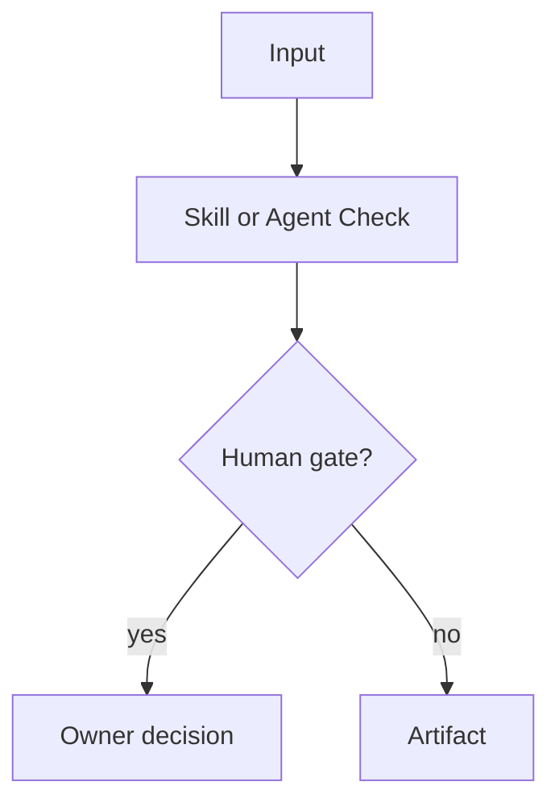
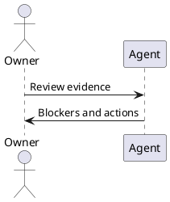

# Agent And Skill Output Standard

Mana agents and skills must produce consistent, reviewable artifacts. Internal
working notes must stay short; published output must stay structured.

## Instruction Priority

When instructions overlap, apply this priority order:

1. Explicit human instruction for the current run.
2. Profile YAML inputs, blocking conditions, and approval requirements.
3. Agent `AGENT.md` mission, workflow, tools, and artifact routing.
4. Agent `playbook.md` execution details.
5. Loaded skill `SKILL.md` logic.
6. Global service context and reusable standards.

Safety, data handling, and human approval rules can only become stricter as the
chain gets more specific. A lower-priority instruction must not weaken a higher
priority approval gate, external-write restriction, or protected-area rule.

## Operating Loop

Use this loop for every profile run:

1. Identify the decision being supported and the accountable human owner.
2. Resolve inputs, workspace, requirement source, branch or PR target, and diff
   base before drawing conclusions.
3. Build a compact evidence inventory: requirement evidence, changed files,
   tests, operational context, and known missing context.
4. Classify risk domains from the evidence inventory.
5. Load only the agent, playbook, primary skill, and specialist skills needed
   for those confirmed domains.
6. Produce findings only when there is a plausible failure path, requirement
   mismatch, approval gap, or missing evidence that affects the decision.
7. End with status, blockers, warnings, evidence, artifacts, and human approval
   needed.

Ask the user only when the missing answer changes the decision or blocks safe
analysis. Combine related questions into one short checkpoint instead of
interrupting repeatedly.

## Progressive Loading Discipline

Mana instructions are designed for staged loading. Do not read every agent,
playbook, skill, Jira payload, PR thread, or large artifact up front.

Use this loading order:

1. Read the selected profile YAML.
2. Read only the selected agent `AGENT.md` and its `playbook.md`.
3. For candidate skills, do a load-light pass first: front matter, title,
   `Purpose`, `When To Use It`, `When Not To Use It`, `Inputs`, `Outputs`,
   `Execution Logic`, and `Decision Rules`.
4. Choose the primary skill needed to start the profile.
5. Deep-load a skill only when it is primary for the decision, its risk domain
   is touched by filtered evidence, or the load-light pass is insufficient to
   make a safe finding.
6. Do not read unrelated agent folders, all skills in a profile, all examples,
   or full reference files unless a concrete hypothesis requires them.

Prefer targeted reads such as section extraction or bounded line ranges over
whole-file dumps. Reading the first 120 lines of a Mana `SKILL.md` is usually
enough for triage because the operational sections are intentionally kept near
the top. If a file does not follow that shape, treat the missing structure as a
maintainability issue and read only the sections needed for the current
decision.

## Internal Reasoning Mode

Use compact "caveman" working notes while analyzing:

- short fragments, not prose;
- facts, risks, evidence, owner, next action;
- no long narrative;
- no repeated restatement of inputs;
- no hidden approval assumptions;
- no publication of private chain-of-thought.

Do not include internal working notes in final artifacts. Convert them into the
standard sections below.

## Context Budget Discipline

Long-running profiles must actively protect the runner context window. Agents
and skills should keep a compact working summary instead of accumulating raw
transcripts, repeated file dumps, full diffs, or copied tool output.

When the analysis grows beyond the immediate decision being made, refresh the
working summary with only:

- active objective and profile;
- base branch, PR, issue keys, and workspace path;
- changed files and risk domains already classified;
- requirement, branch, test, and operational evidence already checked;
- blocker or warning hypotheses still open;
- discarded hypotheses with the evidence that closed them;
- next concrete checks.

The summary must preserve traceability through file paths, line numbers, issue
keys, PR numbers, commands, and artifact paths. It must not replace required
final evidence, decision tables, or approval gates.

Do not paste full raw diffs, long command output, entire Jira payloads, full PR
threads, or complete skill files into notes or reports. Summarize only the
evidence used for a decision and keep exact references to the source.

For story-specific continuity, agents must update or reference the canonical
story trace described in `docs/standards/story-trace-standard.md`:
`agent-memory/story-trace.md` inside the active Mana workspace. This stores
concise evidence-first reasoning summaries and decisions, not private
chain-of-thought.

## Required Output Sections

Every agent or skill output should use these sections in this order unless a
profile explicitly narrows the artifact:

1. `# <Artifact Title>`
2. `## Status`
3. `## Executive Summary`
4. `## Decision Table`
5. `## Findings`
6. `## Evidence`
7. `## Diagram`
8. `## Open Questions`
9. `## Actions`
10. `## Human Approval`

## Status

Use one of:

- `ready`
- `ready_with_warnings`
- `not_ready`
- `blocked`
- `needs_human_decision`

Include owner and timestamp when known.

## Decision Table

Use this Markdown table shape:

| Gate | Status | Owner | Evidence | Action |
|---|---|---|---|---|
| Requirement clarity | warning | Team Leader | AC missing error path | Clarify before implementation |

Gate names should be concrete, for example:

- Requirement clarity
- Architecture
- Service boundary
- Database
- Security
- Test evidence
- Rollback
- Operations
- Review readiness

## Requirement Evidence

When a Jira story, Markdown story-pack, or equivalent requirement source is
available, agents and skills must treat it as evidence, not background. The
output should state which story or requirement source was used and whether the
task was:

- feasibility/planning: verify that the requested behavior is coherent,
  implementable, testable, bounded, and has required owners, dependencies, and
  approvals;
- review/validation/pre-mortem/PR readiness: compare the branch or PR changes
  against the story text and acceptance criteria.

Findings must call out missing requested behavior, unrequested scope,
contradicted acceptance criteria, weak tests that do not prove the story, and
requirement gaps that block responsible delivery. If Jira is unavailable, report
the access gap and identify the fallback source used.

## Findings

Use this table shape:

| Severity | Area | Finding | Evidence | Owner | Recommended Action |
|---|---|---|---|---|---|
| blocker | rollback | Rollback path is unclear | No rollback note for migration | DBA | Add rollback plan |

Severity values:

- `blocker`
- `warning`
- `info`

## Evidence

Use bullets with concrete references:

- `file/path.ext`: reason it matters.
- `test-name`: result and relevance.
- `JIRA-123`: requirement or decision source.

Avoid vague evidence such as "code seems fine".

### Branch Diff Base Resolution

Any agent or skill that consumes `branch_diff`, `code_diff`, `local_branch_diff`,
or compares a branch against a base must resolve and report the comparison base.
Prefer, in order:

1. An explicit user-provided `base_branch`, `main_branch`, PR target, or release
   branch.
2. The upstream default branch such as `origin/HEAD`.
3. A common primary branch name such as `origin/main`, `origin/master`,
   `main`, `master`, `develop`, or `dev`, only when exactly one candidate is
   credible in the repository.

If the base branch is missing, ambiguous, detached, or not present locally,
stop with `needs_human_decision` and ask which branch to compare against. Do
not silently default to `main`. Every report using branch evidence must name
the base branch and diff form used, for example `git diff origin/main...HEAD`.

### Branch Diff Analysis Budget

Agents and skills using branch or code diff evidence must keep analysis scoped
to changed application behavior.

Default budget rules:

- Start with a diff inventory, for example `git diff --name-status <base>...HEAD`
  plus working-tree status, before reading full file contents.
- Exclude framework/bootstrap noise before estimating scope.
- Classify changed files by risk domain, then read only the files needed to
  validate plausible blocker or warning hypotheses.
- Prefer targeted searches from changed symbols, APIs, tables, events, routes,
  config keys, and tests over repository-wide scans.
- Invoke specialist skills only for risk domains touched by the filtered diff.
- Report no more than the highest-signal findings by default: blocker findings
  first, then warnings with concrete branch evidence. Avoid exhaustive low-risk
  commentary.
- If the filtered diff is too large to review responsibly in one pass, stop with
  `needs_human_decision` and ask the user to choose a scope, for example risky
  modules first, production paths only, or a specific story/PR target.

As a default threshold, treat more than 80 filtered changed files, more than
2,000 filtered changed lines, or generated/vendor-like churn as a scope decision
rather than an invitation to inspect the whole repository. Profiles may define a
stricter budget.

### Skill Loading Budget

Agents should not read every skill listed in a profile before they know the
actual scope. Load the agent `AGENT.md` and `playbook.md`, then load only:

- the primary skill needed to start the workflow;
- specialist skills whose risk domain is touched by the filtered inputs;
- supporting skills required by a confirmed blocker, warning, or output
  contract.

For branch/code diff profiles, classify the filtered diff before loading
specialist skills. For example, load database or rollback skills only after DB
changes are present, and load contract skills only after API, event, message, or
integration changes are present.

### Framework And Bootstrap Noise

Do not use Mana framework/bootstrap files as production-risk findings or main
evidence unless the active profile is explicitly reviewing Mana setup,
runner wiring, workspace bootstrap, or profile selection. Exclude them from
`## Findings`, `## Evidence`, risk tables, missing-test tables, and production
failure hypotheses for normal delivery profiles.

Default excluded paths and files:

- `.mana/**`
- `AGENTS.md`
- `CLAUDE.md`
- `mana`
- project ignore/env bootstrap changes whose only purpose is Mana setup, such
  as `.gitignore` entries for `.mana/` or `.mana/jira-mcp.env`

If these files matter operationally, mention them only in a short operational
note or setup warning, not as application behavior evidence. Placeholder service
context files under `.mana/global/` may be reported as a context-quality warning,
but should not be listed as changed production evidence.

## Diagram

Include Mermaid by default when flow, ownership, dependency, or sequence matters:

Use PlantUML only when the target team already prefers it or the requested
artifact requires PUML:

## Open Questions

Use a Markdown table:

| Question | Owner | Required By | Blocks |
|---|---|---|---|
| Which rollback option is approved? | DBA | before release | Database gate |

## Actions

Use a checklist:

- [ ] Owner: action, due point, expected evidence.

## Human Approval

State exactly who must approve what:

- Team Leader: scope, sequencing, story readiness.
- Architect: architecture decisions, NFR trade-offs, service boundary drift.
- Application Manager: release impact, continuity, support, go/no-go readiness.
- DBA/Security/Operations: specialist blockers.

## Style Rules

- Prefer concise bullets over paragraphs.
- Prefer tables for decisions, findings, questions, and actions.
- Use code formatting for file paths, commands, profile names, skills, agents,
  statuses, and IDs.
- Do not invent missing evidence. Mark it as an evidence gap.
- Do not mark human approval as complete unless the input includes explicit approval.
