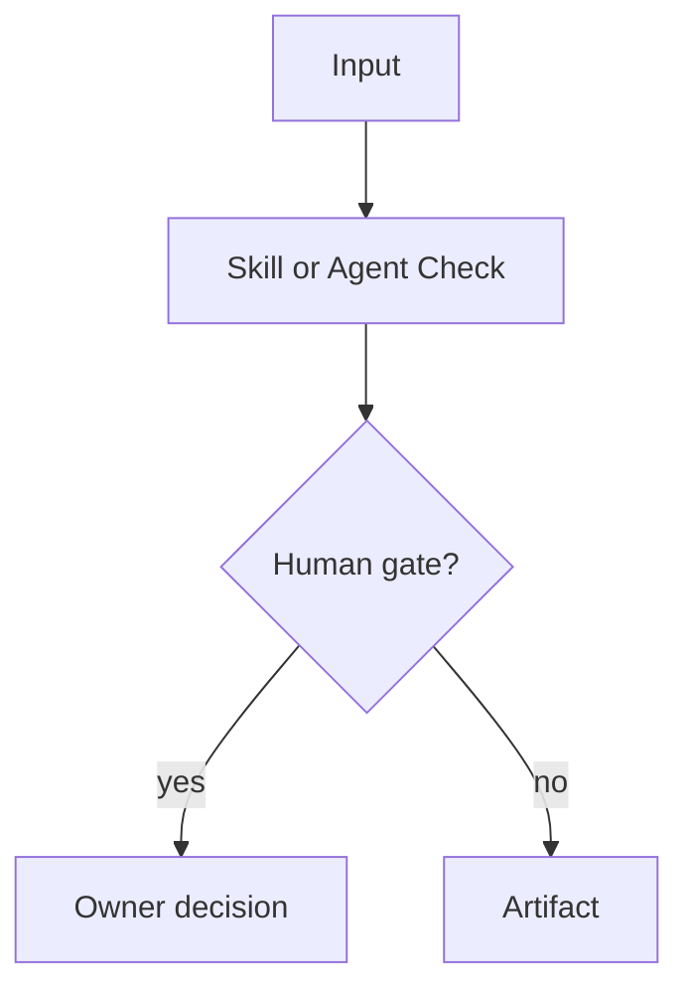
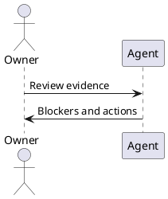

# Agent And Skill Output Standard

Mana agents and skills must produce consistent, reviewable artifacts. Internal
working notes must stay short; published output must stay structured.

## Internal Reasoning Mode

Use compact "caveman" working notes while analyzing:

- short fragments, not prose;
- facts, risks, evidence, owner, next action;
- no long narrative;
- no repeated restatement of inputs;
- no hidden approval assumptions;
- no publication of private chain-of-thought.

Do not include internal working notes in final artifacts. Convert them into the
standard sections below.

For story-specific continuity, agents must update or reference the canonical
story trace described in `docs/standards/story-trace-standard.md`:
`agent-memory/story-trace.md` inside the active Mana workspace. This stores
concise evidence-first reasoning summaries and decisions, not private
chain-of-thought.

## Required Output Sections

Every agent or skill output should use these sections in this order unless a
profile explicitly narrows the artifact:

1. `# <Artifact Title>`
2. `## Status`
3. `## Executive Summary`
4. `## Decision Table`
5. `## Findings`
6. `## Evidence`
7. `## Diagram`
8. `## Open Questions`
9. `## Actions`
10. `## Human Approval`

## Status

Use one of:

- `ready`
- `ready_with_warnings`
- `not_ready`
- `blocked`
- `needs_human_decision`

Include owner and timestamp when known.

## Decision Table

Use this Markdown table shape:

| Gate | Status | Owner | Evidence | Action |
|---|---|---|---|---|
| Requirement clarity | warning | Team Leader | AC missing error path | Clarify before implementation |

Gate names should be concrete, for example:

- Requirement clarity
- Architecture
- Service boundary
- Database
- Security
- Test evidence
- Rollback
- Operations
- Review readiness

## Findings

Use this table shape:

| Severity | Area | Finding | Evidence | Owner | Recommended Action |
|---|---|---|---|---|---|
| blocker | rollback | Rollback path is unclear | No rollback note for migration | DBA | Add rollback plan |

Severity values:

- `blocker`
- `warning`
- `info`

## Evidence

Use bullets with concrete references:

- `file/path.ext`: reason it matters.
- `test-name`: result and relevance.
- `JIRA-123`: requirement or decision source.

Avoid vague evidence such as "code seems fine".

## Diagram

Include Mermaid by default when flow, ownership, dependency, or sequence matters:

Use PlantUML only when the target team already prefers it or the requested
artifact requires PUML:

## Open Questions

Use a Markdown table:

| Question | Owner | Required By | Blocks |
|---|---|---|---|
| Which rollback option is approved? | DBA | before release | Database gate |

## Actions

Use a checklist:

- [ ] Owner: action, due point, expected evidence.

## Human Approval

State exactly who must approve what:

- Team Leader: scope, sequencing, story readiness.
- Architect: architecture decisions, NFR trade-offs, service boundary drift.
- Application Manager: release impact, continuity, support, go/no-go readiness.
- DBA/Security/Operations: specialist blockers.

## Style Rules

- Prefer concise bullets over paragraphs.
- Prefer tables for decisions, findings, questions, and actions.
- Use code formatting for file paths, commands, profile names, skills, agents,
  statuses, and IDs.
- Do not invent missing evidence. Mark it as an evidence gap.
- Do not mark human approval as complete unless the input includes explicit approval.
