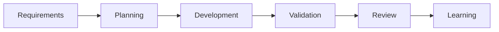

# BA to Development Flow

BA and PO own clarity. Team leaders and architects approve technical direction. Developers own implementation and correctness. AI supports the workflow by surfacing gaps and evidence.

## Operating Principles
- Skills are atomic and reusable.
- Agents orchestrate skills and produce phase artifacts.
- MCP access is governed, audited, redacted, and least-privilege.
- Humans remain accountable for clarity, design, implementation, approval, and correctness.
- AI reduces churn by surfacing gaps early and preserving evidence.

## Practical Use
Use the related profiles and templates to create repeatable artifacts. Fill each artifact with project-specific evidence and route blockers to the accountable owner.
