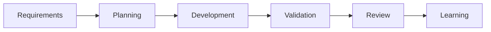

# Branch Validation Flow

Branch validation compares approved planning artifacts with the real branch diff and blocks unresolved drift, missing tests, and high-risk findings.

## Operating Principles
- Skills are atomic and reusable.
- Agents orchestrate skills and produce phase artifacts.
- MCP access is governed, audited, redacted, and least-privilege.
- Humans remain accountable for clarity, design, implementation, approval, and correctness.
- AI reduces churn by surfacing gaps early and preserving evidence.

## Practical Use
Use the related profiles and templates to create repeatable artifacts. Fill each artifact with project-specific evidence and route blockers to the accountable owner.

## Mana Workspace
Branch validation reads planning and test evidence from the active `.mana` workspace and writes `branch-validation-report.md`, `plan-drift-report.md`, `missing-tests-report.md`, `risk-status-report.md`, and `developer-decision-review.md` under `validation/`.
