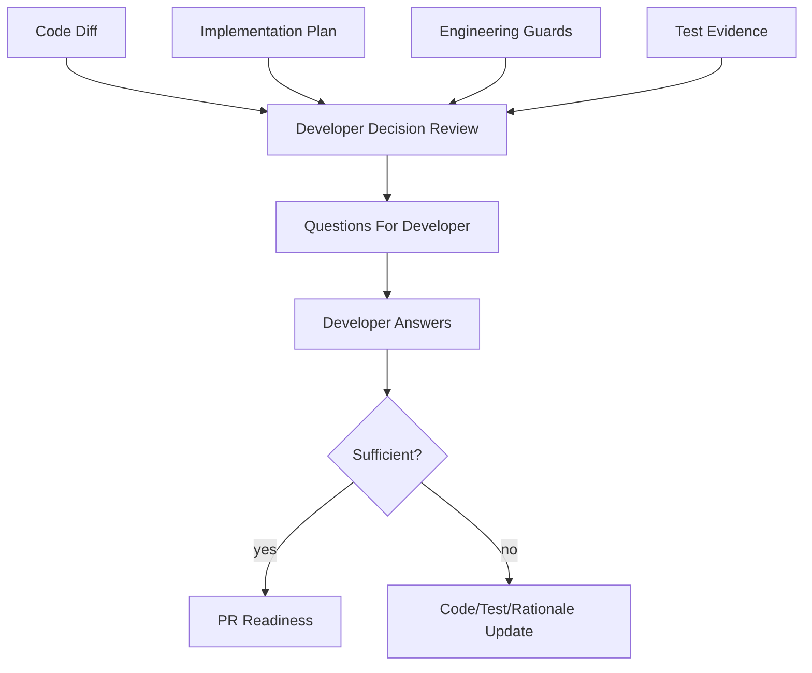

# Developer Decision Review

Developer Decision Review is a focused review step that asks the developer to explain important implementation choices before the PR package is finalized.

It is intentionally different from defect review:

- `pre-review-defect` asks: "What looks wrong?"
- `developer-decision-review` asks: "Why was this choice made, and is the rationale acceptable?"

## When It Runs

- During Branch Validation when plan drift, unplanned files, missing tests, protected areas, or risky decisions are detected.
- During PR Readiness before generating reviewer focus and developer handoff.
- Manually, when a Team Leader wants to challenge non-obvious implementation choices.

## Inputs

- Story context.
- Source impact map.
- Implementation plan.
- Technical task breakdown.
- Code diff.
- Risk register.
- Test evidence.
- Developer handoff.
- Service Context Layer files.

## Outputs

- `developer-decision-review.md`
- `decision-questions.md`
- `unexplained-choices.md`

## Question Quality Rules

Every question must reference at least one concrete evidence item:

- file;
- class;
- method;
- test;
- plan item;
- risk;
- engineering guard;
- architecture rule.

Avoid generic questions. The goal is useful pressure, not noise.

## Example Questions

- Why was `ContractService` extended instead of extracting a new domain service?
- Why was this external call kept synchronous?
- Why is this exception mapped to `BAD_REQUEST` instead of a dependency error?
- Why was this legacy branch modified when the impact map marked it as inspect-only?
- Why is there no integration test for retry exhaustion?
- What guarantees idempotency if the same event is consumed twice?

## Workflow

## Blocking Behavior

Block before PR if:

- a question identifies a likely guard violation;
- scope expanded without approval;
- protected legacy behavior changed without rationale;
- high-risk architecture, database, security, integration, or concurrency choices are unexplained;
- required tests are missing and no approved deferral exists.

