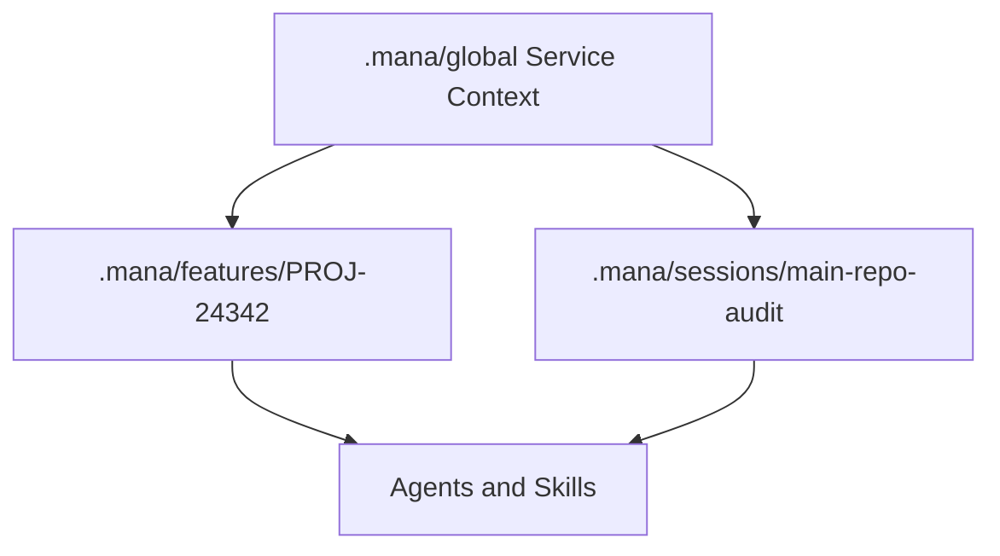

# Service Context Layer

The Service Context Layer is the stable guidance layer stored under `.mana/global/`. It tells Codex, Junie, agents, and skills what the service is for, how it fits into the wider architecture, and which actions are forbidden or require approval.

It is the framework's local "keep the bar straight" mechanism.

## Location

```text
.mana/
  global/
    service-mission.md
    architecture.md
    engineering-guards.md
    domain-glossary.md
    integration-map.md
    testing-policy.md
    database-policy.md
    rules/
    known-pitfalls/
    team-decisions/
```

## Core Files

| File | Purpose |
|---|---|
| `service-mission.md` | Defines what the service does, why it exists, owners, responsibilities, non-goals, and position in the wider architecture. |
| `architecture.md` | Describes runtime architecture, components, boundaries, dependencies, data ownership, flows, and approved patterns. |
| `engineering-guards.md` | Lists absolute constraints, forbidden actions, protected areas, required approval gates, and non-negotiable engineering rules. |

## Specialist Files

| File | Used By |
|---|---|
| `domain-glossary.md` | Requirement intelligence, story consistency, developer handoff. |
| `integration-map.md` | Source impact map, cross-service contract, architecture risk. |
| `testing-policy.md` | Green border, unit/integration gap, regression selection, test quality. |
| `database-policy.md` | Liquibase syntax, production risk, rollback safety, drift checks. |

## Loading Rules

Agents should load the Service Context Layer before executing skills:

1. Always load `service-mission.md`, `architecture.md`, and `engineering-guards.md` when present.
2. Load specialist files by task type:
   - Database change: `database-policy.md`.
   - Cross-service/API/messaging change: `integration-map.md`.
   - Test planning or validation: `testing-policy.md`.
   - Requirement/domain work: `domain-glossary.md`.
3. If a file is missing, continue with a warning unless the profile requires it.
4. If a requested action violates `engineering-guards.md`, block or require explicit human approval.
5. If implementation deviates from service mission or architecture, record the decision in the active workspace `decisions/decision-log.md`.

## Skill Usage

| Skill | Context Files |
|---|---|
| `story-depth` | `service-mission.md`, `domain-glossary.md` |
| `epic-goal-extraction` | `service-mission.md`, `architecture.md` |
| `story-consistency` | `domain-glossary.md`, `service-mission.md` |
| `source-impact-map` | `architecture.md`, `integration-map.md`, `engineering-guards.md` |
| `architecture-risk` | `architecture.md`, `engineering-guards.md`, `integration-map.md` |
| `cross-service-contract` | `integration-map.md`, `engineering-guards.md` |
| `liquibase-production-risk` | `database-policy.md`, `engineering-guards.md` |
| `green-border-plan` | `testing-policy.md`, `service-mission.md`, `engineering-guards.md` |
| `pre-review-defect` | `engineering-guards.md`, `architecture.md`, `testing-policy.md` |
| `developer-handoff` | all relevant context files plus active workspace artifacts |

## Blocking Semantics

`engineering-guards.md` can define explicit severity:

- `BLOCKER`: must not proceed without owner approval.
- `WARNING`: proceed only if documented and visible in the final report.
- `INFO`: keep as guidance.

Examples:

```markdown
## Blockers
- Do not introduce synchronous calls from payment authorization to non-critical downstream services.
- Do not modify shared platform clients without platform owner approval.
- Do not add destructive Liquibase changes without rollback and DBA approval.
```

## Relationship With `.mana` Workspaces

The Service Context Layer is stable and shared across feature workspaces and canonical sessions. Active feature/session artifacts should reference it, not duplicate it.



## Maintenance

- Team Leader and Architect own architecture and guards.
- BA/PO and Team Leader own service mission and domain glossary.
- DBA owns database policy.
- QA/Team Leader own testing policy.
- Integration owners maintain integration map.

Changes to the Service Context Layer should be reviewed like code because they affect future AI decisions.

