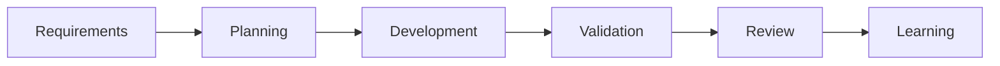

# Story Lifecycle

A story moves from refinement to planning, implementation, local validation, branch validation, PR readiness, merge, and learning.

## Operating Principles
- Skills are atomic and reusable.
- Agents orchestrate skills and produce phase artifacts.
- MCP access is governed, audited, redacted, and least-privilege.
- Humans remain accountable for clarity, design, implementation, approval, and correctness.
- AI reduces churn by surfacing gaps early and preserving evidence.

## Practical Use
Use the related profiles and templates to create repeatable artifacts. Fill each artifact with project-specific evidence and route blockers to the accountable owner.

## Mana Workspace
Every lifecycle phase should use the active `.mana` workspace. Feature branches write artifacts under `.mana/features/<feature-id>/`; canonical branches such as `main`, `master`, `develop`, `release/*`, and `hotfix/*` write session artifacts under `.mana/sessions/<timestamp>-<branch>-<purpose>/`.
