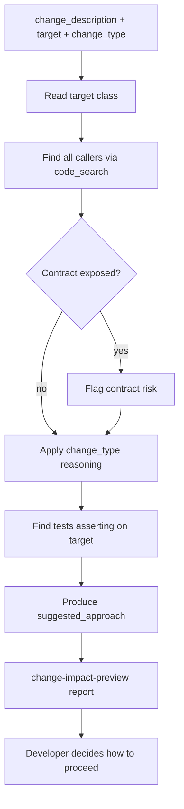

# Change Impact Preview

## Purpose
Answer the developer's question: "what happens if I change this in this way?"
before a single line of new code is written. The skill reads the current
codebase to map callers, contracts, concurrency exposure, and test coverage
of the target code, then reasons about the specific change type to surface
risks and recommend an approach.

This skill is **prospective** — its input is a description of a planned
change, not a diff. It fills the gap between planning (source-impact-map)
and post-implementation review (jessica-fletcher, pre-review-defect).

## When To Use It
- Before starting implementation of a method change, signature refactoring,
  async conversion, or dependency injection.
- When uncertain whether a change will break callers or downstream services.
- When considering a refactoring that touches shared or legacy code.
- As part of the `dev-assist` profile, invoked from Junie during coding.

## When Not To Use It
- Do not use it as a substitute for running the actual tests after coding.
- Do not use it after the code is already written — use `pre-review-defect`
  or `jessica-fletcher` on the diff instead.
- Do not use it for purely additive changes (new method with no callers yet).

## Inputs
- `change_description` — natural language description of the planned change.
  Example: "I want to make the retry() method in PaymentRetryService async
  by returning CompletableFuture instead of void."
- `target_class` — fully qualified or simple class name of the target.
- `target_method` — method name (or field, constructor) being changed.
- `change_type` — one of: `signature`, `behavior`, `async`, `remove`,
  `extract`, `rename`, `add_dependency`, `visibility`.

## Outputs
- `callers_impacted` — list of classes/methods that call the target, with
  file paths and whether the call site must change.
- `contract_risks` — API, event, or DB contract breakage risks introduced
  by the change.
- `concurrency_flags` — concurrency or thread-safety risks specific to the
  change type (e.g., async introduces shared state exposure).
- `tests_to_update` — existing tests that assert on the current behavior and
  will need updating or rewriting.
- `suggested_approach` — ordered recommendation for implementing the change
  safely: what to do first, what to defer, what to validate.

## Execution Logic
1. Read `target_class` and `target_method` in the codebase using
   `code_search`.
2. Find all callers of `target_method` using `code_search` (direct calls,
   interface implementations, reflection patterns).
3. Check for contract exposure: is the method part of a REST controller,
   Kafka listener, Feign client, or public API interface?
4. Apply `change_type`-specific reasoning:
   - `async`: flag all blocking callers, check thread-pool assumptions,
     identify shared mutable state accessed in the method.
   - `signature`: enumerate all call sites that must be updated.
   - `remove`: check for all direct and reflective references.
   - `behavior`: identify tests that assert on the old behavior.
   - `extract`: check for field access and transaction scope.
   - `rename`: enumerate import statements and string references.
   - `add_dependency`: check for circular dependency risks.
   - `visibility`: check for package-private callers or test access.
5. Identify tests in `src/test/` that call the target method directly or
   through integration fixtures.
6. Produce `suggested_approach` as an ordered list of steps, risks first.

## Decision Rules
- `blocker`: change would break a public API contract, a Kafka message schema,
  or a DB-serialized field without a migration plan.
- `warning`: change affects 5 or more callers, or touches a legacy path
  with no test coverage.
- `info`: change is internal-only, callers are few and easily updated.

## Failure Modes
- Reflective or dynamic callers (Spring proxies, CDI injection) may not be
  found by static code search; report as `may_have_hidden_callers`.
- Generated code or Lombok-derived methods may not appear in search results;
  report as `generated_code_excluded`.
- If `target_method` is overloaded, list all overloads found and ask the
  developer to confirm which one is intended.

## Required Human Review
The Developer reviews the output and decides whether to proceed with the
planned change, adopt the suggested approach, or redesign. This skill
produces information, not a decision.

## Service Context Layer
Read `engineering-guards.md` when available to flag changes that touch
protected areas (payments core, idempotency layer, audit trail).

## Interaction With Junie
Junie invokes this skill at the start of a task implementation to orient the
developer before editing files. The output should be shown in the IDE before
Junie opens any file for editing.

## Interaction With Codex
Codex can invoke this skill during planning to verify that a proposed
technical breakdown is safe before assigning it to a developer.

## Correct Usage Examples
- "I want to rename processPayment() to handlePayment() across the service."
- "I want to extract the retry logic from PaymentService into a new
  RetryHandler class."
- "I want to make validateAmount() package-private — is anything outside
  the package calling it?"
- "I want to add a MeterRegistry dependency to PaymentService — any
  circular dependency risk?"

## Incorrect Usage Examples
- Do not use after writing the code — use pre-review-defect instead.
- Do not use for changes to test files only.
- Do not use as a deployment gate — it is a planning aid.

## Output Standard
Follow `docs/standards/agent-skill-output-standard.md` (Agent And Skill Output Standard) for all generated artifacts. Use `templates/standard-agent-skill-report.template.md` when no more specific template exists.

Internal reasoning must use compact caveman mode: terse fragments,
evidence-first notes, no long narrative, and no private chain-of-thought in
final artifacts. Maintain a context budget: keep a short working summary with
objective, base branch or PR, issue keys, workspace path, checked evidence,
open hypotheses, discarded hypotheses, and next checks instead of accumulating
raw transcripts, full diffs, repeated file dumps, or copied tool output.

## Diagram


## Example Output
```yaml
skill: change-impact-preview
status: ready_with_warnings
target: "PaymentRetryService.retry()"
change_type: async
warnings:
  - "may_have_hidden_callers: Spring @Async proxy in RetryConfiguration not found by static search"
callers_impacted:
  - class: "PaymentOrchestrator"
    file: "src/main/java/payments/PaymentOrchestrator.java"
    line: 87
    must_change: true
    note: "Caller expects void; must handle CompletableFuture"
  - class: "PaymentRetryServiceTest"
    file: "src/test/java/payments/PaymentRetryServiceTest.java"
    line: 34
    must_change: true
    note: "Test calls retry() synchronously; must use .get() or block()"
contract_risks:
  - severity: warning
    area: "REST API"
    detail: "PaymentController.retryPayment() calls retry() synchronously; async change may alter HTTP response timing"
concurrency_flags:
  - severity: blocker
    detail: "retry() accesses retryCount field without synchronization; async execution introduces data race"
    recommendation: "Use AtomicInteger for retryCount or confine state to the CompletableFuture chain"
tests_to_update:
  - "PaymentRetryServiceTest.shouldRetryOnFailure — expects synchronous execution"
  - "PaymentRetryServiceTest.shouldStopAfterMaxRetries — asserts on final state synchronously"
suggested_approach:
  - "1. Make retryCount an AtomicInteger before converting the method"
  - "2. Change signature to CompletableFuture<Void>"
  - "3. Update PaymentOrchestrator to chain on the returned future"
  - "4. Rewrite PaymentRetryServiceTest to use CompletableFuture.join() in assertions"
  - "5. Verify PaymentController response timing remains acceptable under async execution"
human_review_required: false
```
