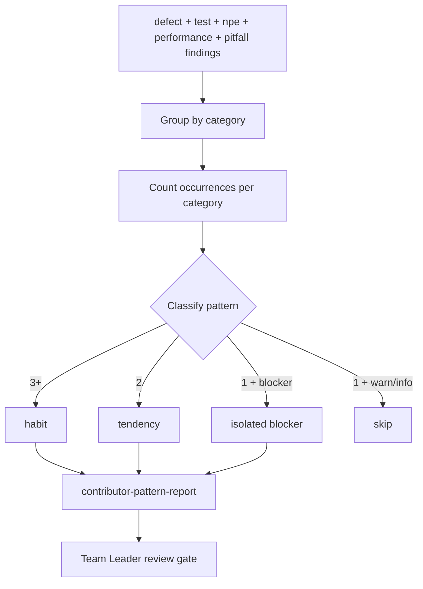

# Contributor Pattern Analysis

## Purpose
Aggregate quality findings from pre-review-defect, test-quality,
npe-nullability, java-performance-smell, and known-pitfalls-extraction into
a per-contributor growth pattern report. The report is intended for Team
Leader use only as a coaching instrument — not for performance evaluation.

This skill identifies **recurring** patterns across multiple commits: the same
type of finding appearing more than once signals a habit or tendency, not an
isolated mistake. Isolated occurrences are reported only when severity is
blocker.

## When To Use It
- After running the full quality skill chain on one contributor's diff.
- When a Team Leader is conducting a branch coaching review session.
- As the aggregation step inside `team-coaching-report-agent`, not standalone.

## When Not To Use It
- Do not use it as a substitute for human feedback or mentoring.
- Do not use it to generate performance metrics (LOC, velocity, commit count).
- Do not use it to rank contributors against each other.
- Do not share the output directly with developers without Team Leader review.

## Inputs
- `contributor_email` — email address of the contributor being analysed.
- `contributor_name` — display name of the contributor.
- `contributor_commits` — list of commits (SHA, subject, date) authored on the branch.
- `defect_findings` — structured output from `pre-review-defect` on this contributor's diff.
- `test_findings` — structured output from `test-quality` on this contributor's diff.
- `npe_findings` — structured output from `npe-nullability` on this contributor's diff.
- `performance_findings` — (optional) output from `java-performance-smell`; include only when diff contains non-test `.java` files.
- `known_pitfalls` — (optional) output from `known-pitfalls-extraction`.

## Outputs
- `contributor_pattern_report` — per-contributor growth pattern report with severity, frequency, concrete examples, and coaching recommendations.

## Execution Logic
1. Group all findings by category: `test_coverage`, `nullability`,
   `defect_quality`, `performance`, `pitfall`.
2. Count occurrences per category across the contributor's commits.
3. Classify each category:
   - `habit`: 3 or more occurrences across commits.
   - `tendency`: exactly 2 occurrences.
   - `isolated`: 1 occurrence — include only if severity is `blocker`.
4. For each identified pattern, select the most representative evidence
   (concrete `file:line` reference, never vague).
5. Produce a coaching recommendation for each pattern: suggest a specific
   action (pair programming session, code review focus, reference material,
   dedicated practice).
6. Use constructive language throughout: "growth opportunity" not "error",
   "tends to" not "always makes the mistake of", "could strengthen" not
   "fails to".
7. Do not include isolated `warning` or `info` findings.
8. Do not produce a score, a rank, or a comparison with other contributors.

## Decision Rules
- `blocker`: unresolved high-risk pattern that, if repeated, would cause
  production incidents or block delivery gates.
- `warning`: recurring pattern that creates review churn, technical debt, or
  quality risk if unaddressed.
- `info`: observation useful for the TL's coaching notes; not actionable
  alone.

## Failure Modes
- Only one commit available: pattern classification is unreliable; report
  as `isolated` and add the warning `low_commit_count`.
- All findings are isolated info findings: produce an empty pattern list
  and note `no_recurring_patterns_found`.
- Input findings are missing or empty: produce an empty pattern report and
  note which inputs were missing.

## Required Human Review
The Team Leader reviews this report before sharing any feedback with the
contributor. This skill output is a coaching aid, not a formal assessment.

## Service Context Layer
Read `engineering-guards.md` and `testing-policy.md` from `.mana/global/`
when available to classify findings against project-specific standards.
Missing context files should be reported as warnings — they degrade
classification accuracy but do not block the skill.

## Interaction With Codex
Codex invokes this skill as part of `team-coaching-report-agent`. It should
not expose the output directly to the contributor without Team Leader
approval and review.

## Interaction With MCP
This skill reads only local framework and workspace files. No external MCP
access is needed or permitted.

## Correct Usage Examples
- Invoked by `team-coaching-report-agent` after running the quality skill
  chain on a single contributor's diff.
- Team Leader runs the coaching review profile on a feature branch and uses
  the output to prepare a 1-to-1 feedback session.

## Incorrect Usage Examples
- Do not run this skill on a single file in isolation.
- Do not use this skill to justify a disciplinary action.
- Do not share the raw output with the contributor without TL review.
- Do not use this skill as a replacement for code review.

## Output Standard
Follow `docs/standards/agent-skill-output-standard.md` (Agent And Skill Output Standard) for all generated artifacts. Use `templates/standard-agent-skill-report.template.md` when no more specific template exists.

Internal reasoning must use compact caveman mode: terse fragments,
evidence-first notes, no long narrative, and no private chain-of-thought in
final artifacts.

## Diagram


## Example Output
```yaml
skill: contributor-pattern-analysis
status: ready
contributor: "marco.rossi@example.com"
patterns_found: 3
warnings:
  - "testing-policy.md not found in .mana/global; classification uses defaults"
patterns:
  - category: test_coverage
    classification: habit
    occurrences: 4
    severity: warning
    summary: "Unit tests cover happy path only; edge cases and error paths absent"
    evidence: "src/test/java/payments/PaymentServiceTest.java:42"
    coaching_recommendation: "Pair programming session focused on boundary-value testing and error-path coverage"
  - category: nullability
    classification: tendency
    occurrences: 2
    severity: warning
    summary: "Optional return values used without null-check guard"
    evidence: "src/main/java/payments/PaymentMapper.java:88"
    coaching_recommendation: "Code review focus on Optional chaining; reference project npe-nullability examples"
  - category: defect_quality
    classification: isolated
    occurrences: 1
    severity: blocker
    summary: "Unchecked exception swallowed in retry loop"
    evidence: "src/main/java/payments/RetryHandler.java:113"
    coaching_recommendation: "1-to-1 session on exception handling strategy before next PR"
outputs:
  - contributor_pattern_report
human_review_required: true
```
