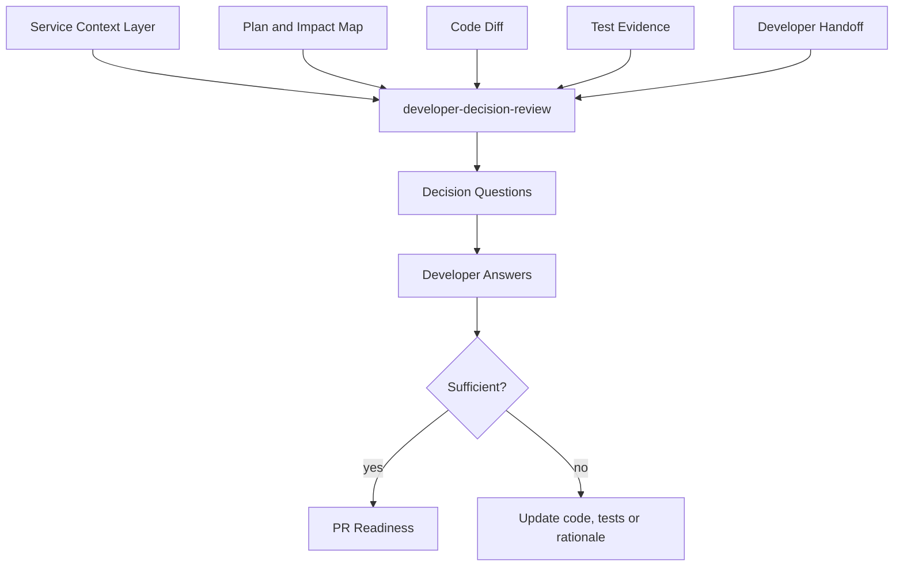

# Developer Decision Review

## Purpose
Challenge implementation choices constructively by asking the developer targeted "why" questions. The skill identifies non-obvious decisions, deviations from the plan, implicit trade-offs, missing rationale, weak test justification, and choices that may conflict with the service mission, architecture, or engineering guards.

This skill is not a defect scanner. It is a decision-quality review that helps reviewers understand intent before approving or requesting changes.

## When To Use It
- After implementation and before opening a PR.
- During Branch Validation when the branch differs from the approved plan.
- During PR Readiness before generating reviewer focus.
- When a developer handoff lacks rationale for important decisions.
- When a change touches architecture, database, integration, concurrency, error handling, retry, idempotency, or legacy behavior.

## When Not To Use It
- Do not use it to interrogate developers about trivial mechanical changes.
- Do not use it as a replacement for human review or technical leadership.
- Do not use it to block work only because an alternative design exists.
- Do not use it without the actual diff, because the questions must be grounded in implemented code.

## Inputs
- story_context
- source_impact_map
- implementation_plan
- technical_task_breakdown
- code_diff
- risk_register
- test_evidence
- developer_handoff
- service_context

## Outputs
- developer_decision_review
- decision_questions
- unexplained_choices
- developer_choice_log_updates

## Execution Logic
1. Load the service context, especially `service-mission.md`, `architecture.md`, and `engineering-guards.md`.
2. Compare the implemented diff with the source impact map, implementation plan, technical task breakdown, risk register, and developer handoff.
3. Identify implementation choices that are non-obvious, risky, plan-deviating, under-tested, or insufficiently explained.
4. Generate focused questions for the developer using a neutral, evidence-based tone.
5. Classify each question by severity: blocker, warning, or clarification.
6. For each question, cite the relevant file, class, method, test, plan item, guard, or risk.
7. Distinguish between questions that must be answered before PR and questions that can be answered during review.
8. Produce a concise decision review document and a checklist of required answers.
9. Update or propose entries for `decisions/developer-choice-log.md` using `docs/standards/developer-choice-log-standard.md` (Developer Choice Log Standard).

## Decision Rules
- `blocker`: a choice appears to violate `engineering-guards.md`, expands scope without approval, changes protected behavior, lacks required test evidence, or creates high-risk architecture/database/security impact.
- `warning`: a choice may be valid but lacks rationale, has weak tests, differs from the plan, or creates maintainability risk.
- `clarification`: the choice is probably acceptable but should be explained for reviewers and future maintainers.
- `info`: useful rationale that should be added to developer handoff or development summary.

## Failure Modes
- The skill may over-question if the implementation plan is stale.
- It may miss decisions hidden in configuration, generated code, runtime wiring, or external systems.
- It can generate low-value questions if the diff is too small or purely mechanical.
- It depends on human answers; unanswered questions must remain visible in the PR package.

## Required Human Review
The implementing developer answers the questions. The Team Leader decides whether answers are sufficient. Architects, DBAs, Security, QA, or Integration owners review questions in their area when severity is blocker or warning.

## Developer Choice Log
When this skill asks, receives, or evaluates developer answers, write or propose updates to `decisions/developer-choice-log.md` in the active Mana workspace. Follow `docs/standards/developer-choice-log-standard.md` (Developer Choice Log Standard). Record the question or choice, developer answer, evidence, confirming owner, status, and follow-up. Do not mark an entry `confirmed` unless the input contains an explicit developer answer or owner acceptance.

## Service Context Layer
Read `.mana/global/service-mission.md`, `.mana/global/architecture.md`, and `.mana/global/engineering-guards.md` before generating questions. Load specialist files as needed: `integration-map.md`, `testing-policy.md`, `database-policy.md`, and `domain-glossary.md`.

Missing context files should be reported as warnings. A violation of `.mana/global/engineering-guards.md` must be treated as a blocker or routed to the accountable owner for explicit approval.

## Interaction With Codex
Codex is the preferred runner because it can compare planning artifacts, branch diff, service context, tests, and handoff material. Codex should generate questions and suggested documentation updates, not edit implementation code automatically.

## Interaction With Junie
Junie may use the questions inside the IDE to inspect code, add missing tests, or update local documentation after the developer answers. Junie must not reinterpret a blocker as approved.

## Interaction With MCP
MCP access should be read-only by default. Jira, Git, Confluence, architecture rules, CI test evidence, Liquibase metadata, and logs may be read. Publishing questions to a PR, Jira, or Confluence requires human approval and audit logging.

## Correct Usage Examples
- Ask why a service call remained synchronous when the architecture guidance prefers asynchronous integration.
- Ask why a legacy branch was modified when the source impact map marked it as `inspect_before_deciding`.
- Ask why an error is mapped to `BAD_REQUEST` instead of a dependency or retryable error.
- Ask what guarantees idempotency if the same event is processed twice.

## Incorrect Usage Examples
- Do not ask generic questions that are not tied to a file, method, test, risk, or plan item.
- Do not use this skill to challenge purely stylistic choices already covered by formatting rules.
- Do not block a PR only because the AI prefers a different design.
- Do not hide unanswered blocker questions from the PR package.

## Output Standard
Follow `docs/standards/agent-skill-output-standard.md` (Agent And Skill Output Standard) for all generated artifacts. Use `templates/standard-agent-skill-report.template.md` when no more specific template exists.

Internal reasoning must use compact caveman mode: terse fragments, evidence-first notes, no long narrative, and no private chain-of-thought in final artifacts. Maintain a context budget: keep a short working summary with objective, base branch or PR, issue keys, workspace path, checked evidence, open hypotheses, discarded hypotheses, and next checks instead of accumulating raw transcripts, full diffs, repeated file dumps, or copied tool output.

## Diagram


## Example Output
```markdown
# Developer Decision Review

## Summary
Status: warning  
Questions requiring answer before PR: 2  
Questions for reviewer focus: 3

## Questions For Developer

| Severity | Area | Question | Evidence | Required Before PR |
|---|---|---|---|---|
| blocker | Architecture | Why was `PaymentClient` called synchronously from `ContractService` instead of using the approved async event flow? | `ContractService.updateContract`, `engineering-guards.md` | yes |
| warning | Tests | Why is there no integration test covering retry exhaustion? | `PaymentClientErrorMapper`, `testing-policy.md` | yes |
| clarification | Legacy | Was `TOKEN` behavior intentionally preserved by these mapper changes? | `ContractMapper`, `ContractMapperTest` | no |

## Required Developer Answers
- Explain the synchronous call decision or change the implementation.
- Add integration test evidence or document owner-approved deferral.

## Suggested Handoff Updates
- Add the idempotency rationale to `pr/developer-handoff.md`.

## Developer Choice Log Updates
| Date | Story | Area | Question Or Choice | Developer Answer | Evidence | Confirmed By | Status | Follow-Up |
|---|---|---|---|---|---|---|---|---|
| 2026-06-21 | ABC-123 | Architecture | Why was `PaymentClient` synchronous? | Pending developer answer | `ContractService.updateContract` | Team Leader | asked | Answer before PR |
```
