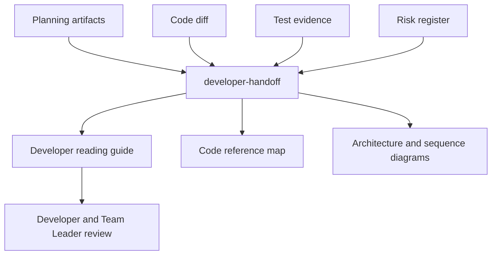
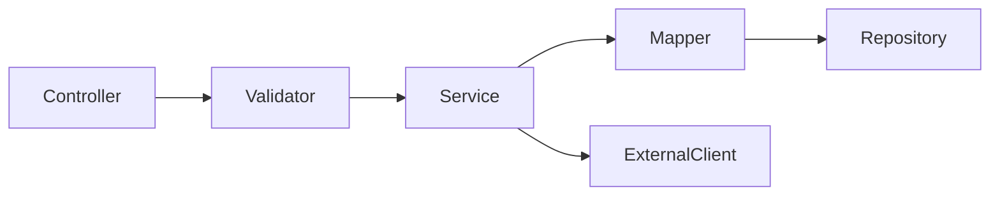

# Developer Handoff

## Purpose
Generate a practical handoff document for developers, reviewers, and maintainers. The document explains what was developed, why the implementation was shaped that way, how to read the change, which code paths matter, and what future developers must know before extending or debugging the feature.

This skill is intentionally separate from `development-summary`. The development summary is a delivery record; the developer handoff is an engineering reading guide with diagrams and code references.

## When To Use It
- Before opening a PR when reviewers need a concise but technical walkthrough.
- When work moves from Codex planning to Junie implementation or from one developer to another.
- After implementing a complex story with multiple services, database changes, mapping logic, retries, or legacy behavior.
- During onboarding, support handover, or team alignment meetings where developers need to understand the implementation quickly.

## When Not To Use It
- Do not use it as a substitute for code review.
- Do not generate it from a story alone; it requires the actual diff or implemented code references.
- Do not include secrets, credentials, raw production data, full proprietary files, or long copied source files.
- Do not let it justify changes outside the approved source-impact map.

## Inputs
- story_context
- implementation_plan
- technical_task_breakdown
- source_impact_map
- code_diff
- test_evidence
- risk_register
- development_summary

## Outputs
- developer_handoff
- code_reference_map
- developer_reading_guide
- developer_choice_log_references

## Required Document Sections
- `What Was Built`: short description of delivered behavior.
- `Why It Was Built This Way`: design rationale, constraints, and alternatives rejected.
- `How To Read The Change`: recommended file reading order.
- `Architecture Diagram`: Mermaid or PlantUML diagram showing components and flow.
- `Code Reference Map`: table of relevant files, classes, methods, and reason to inspect.
- `Important Code Snippets`: short snippets or pseudocode, each linked to a file and purpose.
- `Behavioral Flow`: sequence diagram for request, event, DB, or error flow.
- `Tests To Read First`: test files and scenarios that explain expected behavior.
- `Operational Notes`: logs, feature flags, metrics, timeouts, retries, rollbacks, and known limits.
- `What Was Intentionally Not Changed`: explicit non-goals and protected legacy behavior.
- `Risks And Follow-Ups`: unresolved items, warnings, and owner.

## Execution Logic
1. Load planning artifacts and the final code diff.
2. Identify changed files, touched classes, methods, tests, configuration, and database artifacts.
3. Build a reading order that starts from entry points, then business logic, mapping, persistence/integration, tests, and operational concerns.
4. Extract short code snippets only where they clarify intent. Prefer 5-20 line excerpts or pseudocode; never paste whole files.
5. Generate at least one Mermaid or PlantUML diagram for component flow or sequence flow.
6. Link each important code reference to its reason, related test, and risk if applicable.
7. Call out why the implementation follows the approved plan and where it intentionally deviates.
8. Mark missing code evidence, stale planning artifacts, or unclear rationale as warnings.
9. Reference confirmed implementation choices from `decisions/developer-choice-log.md` when explaining why the code was built this way.

## Decision Rules
- `blocker`: missing code diff, missing source-impact map, or inability to identify implemented files for a non-trivial change.
- `warning`: missing design rationale, missing tests linked to important code paths, or unapproved deviation from the implementation plan.
- `info`: useful reading hints, maintenance notes, or future extension points.

## Failure Modes
- Generated code references can become stale after force-push or rebasing.
- Repository search can miss generated code, runtime wiring, or reflection-based behavior.
- Snippets can oversimplify intent if not checked by the implementing developer.
- Diagrams may be incomplete if cross-service contracts or runtime topology are unavailable.

## Required Human Review
The implementing developer must review the handoff for factual accuracy. The Team Leader reviews design rationale, intentional non-changes, risks, and follow-ups. Architects, DBAs, or security owners review their sections when architecture, database, or trust-boundary topics are included.

## Developer Choice Log
Use `decisions/developer-choice-log.md` as the canonical source for choices confirmed by developers. Follow `docs/standards/developer-choice-log-standard.md` (Developer Choice Log Standard). If the handoff contains rationale that is not yet recorded there, add or propose a log entry with status `answered`, `confirmed`, or `needs_owner_review`.

## Service Context Layer
Reference relevant Service Context Layer files when explaining what was built, why, protected boundaries, and intentional non-changes.

Missing context files should be reported as warnings. A violation of `.mana/global/engineering-guards.md` must be treated as a blocker or routed to the accountable owner for explicit approval.

## Interaction With Codex
Codex is the preferred runner because it can inspect repository-level context, planning artifacts, diff, tests, and documentation. Codex should generate the handoff as Markdown and should not modify production code while producing it.

## Interaction With Junie
Junie should consume the handoff inside the IDE to understand where to continue work, which tests to run, and which files must not be touched without approval. Junie may update the handoff only after local implementation changes are complete and reviewed.

## Interaction With MCP
MCP access should be read-only by default. Jira, Confluence, Git, architecture rules, test results, Liquibase status, and logs may be read through governed MCP servers. Publishing the handoff to PR comments, Jira, or Confluence requires human approval and audit logging.

## Correct Usage Examples
- Generate a handoff after implementing a payment-flow story that touches controller, service, mapper, tests, and Liquibase files.
- Include a Mermaid sequence diagram showing API request, validation, service call, DB update, event publish, and error mapping.
- Add a code reference map linking `ContractMapper`, `ContractService`, and `ContractMapperTest` to the behavior they explain.
- Use the `What Was Intentionally Not Changed` section to protect legacy `TOKEN` behavior and avoid accidental refactoring.

## Incorrect Usage Examples
- Do not paste entire Java classes into the handoff.
- Do not generate a handoff without checking the actual branch diff.
- Do not omit tests or risk references for critical behavior.
- Do not use the handoff to hide unresolved blockers or unapproved scope changes.

## Output Standard
Follow `docs/standards/agent-skill-output-standard.md` (Agent And Skill Output Standard) for all generated artifacts. Use `templates/standard-agent-skill-report.template.md` when no more specific template exists.

Internal reasoning must use compact caveman mode: terse fragments, evidence-first notes, no long narrative, and no private chain-of-thought in final artifacts. Maintain a context budget: keep a short working summary with objective, base branch or PR, issue keys, workspace path, checked evidence, open hypotheses, discarded hypotheses, and next checks instead of accumulating raw transcripts, full diffs, repeated file dumps, or copied tool output.

## Diagram


## Example Output
````markdown
# Developer Handoff: ABC-123 Payment Instrument Support

## What Was Built
Added support for `PAYPAL_BA` mapping and validation while preserving existing `TOKEN` behavior.

## Why It Was Built This Way
The mapper was extended instead of replacing the legacy flow because the source-impact map classified the legacy `TOKEN` path as protected behavior.

## Architecture Diagram


## Code Reference Map
| File | Symbol | Why Read It | Related Test |
|---|---|---|---|
| `src/main/java/.../ContractMapper.java` | `mapInstrument` | New instrument mapping branch. | `ContractMapperTest` |
| `src/main/java/.../ContractValidator.java` | `validateInstrument` | Validation and error behavior. | `ContractValidatorTest` |

## Important Code Snippets
`ContractMapper.mapInstrument`:

```java
// Short excerpt only. Keep snippets focused and review-safe.
case PAYPAL_BA -> mapPaypalBillingAgreement(source);
```

## Tests To Read First
- `ContractMapperTest.shouldMapPaypalBillingAgreement`
- `ContractMapperTest.shouldPreserveLegacyTokenMapping`

## What Was Intentionally Not Changed
- Legacy `TOKEN` behavior.
- Shared external client timeout policy pending architecture approval.
````
