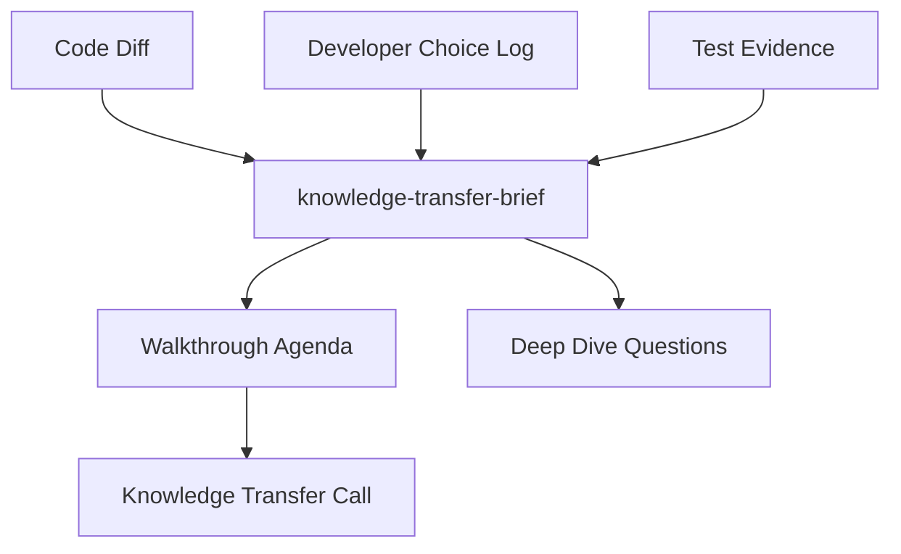

# Knowledge Transfer Brief

## Purpose
Create a developer-facing brief for walkthrough calls and deep-dive sessions. It explains the implementation in a way that supports live discussion: what to inspect first, why choices were made, what risks remain, and which questions need confirmation.

## When To Use It
- Before commit or PR when a developer needs to explain the change in a call.
- When work moves between developers or reviewers need a guided technical walkthrough.
- When implementation choices, intentional non-changes, tests, or production risks need live discussion.

## When Not To Use It
- Do not use it as a substitute for PR review.
- Do not generate it from a story alone; it needs code diff or implementation evidence.
- Do not include secrets, credentials, raw production data, or long copied source files.

## Inputs
- story_context
- implementation_plan
- code_diff
- test_evidence
- developer_choice_log
- development_summary

## Outputs
- knowledge_transfer_brief
- call_walkthrough_agenda
- deep_dive_questions

## Required Document Sections
- `Call Goal`: what the walkthrough must achieve.
- `What Changed`: short implementation overview.
- `Why It Changed This Way`: confirmed rationale and alternatives rejected.
- `Walkthrough Order`: files, tests, and artifacts to inspect in sequence.
- `Architecture Or Flow Diagram`: Mermaid or PlantUML.
- `Discussion Points`: choices, trade-offs, risks, and open questions.
- `Tests And Evidence`: what proves the behavior.
- `Known Limits`: intentional non-changes and deferred work.
- `Follow-Up Actions`: owners and expected evidence.

## Execution Logic
1. Load story context, diff, tests, development summary, and `decisions/developer-choice-log.md`.
2. Extract the smallest useful walkthrough path: entry point, core logic, integration/persistence, tests, and operational concerns.
3. Use confirmed developer choices from the developer choice log when explaining rationale.
4. Mark unconfirmed rationale as `needs_owner_review`.
5. Generate an agenda and deep-dive questions for the call.

## Decision Rules
- `blocker`: missing code diff or no evidence for a critical behavior being discussed.
- `warning`: rationale is not confirmed in the developer choice log, tests are weak, or walkthrough scope is too broad.
- `info`: useful walkthrough hint, diagram, or follow-up.

## Failure Modes
- The brief can become stale after new commits.
- It may miss runtime wiring or external dependencies not visible in the diff.
- It depends on accurate developer answers and test evidence.

## Required Human Review
The implementing developer reviews factual accuracy. The Team Leader reviews walkthrough completeness and unresolved follow-ups.

## Developer Choice Log
Use `decisions/developer-choice-log.md` as the source for confirmed choices. Follow `docs/standards/developer-choice-log-standard.md` (Developer Choice Log Standard). Do not present a choice as confirmed unless it is explicitly recorded or supplied in the input.

## Service Context Layer
Reference `.mana/global/service-mission.md`, `architecture.md`, `engineering-guards.md`, `integration-map.md`, and `testing-policy.md` when relevant.

## Interaction With Codex
Codex should generate the brief from repository-level context, diff, tests, and workspace artifacts. It should not edit production code while producing the brief.

## Interaction With Junie
Junie may consume the brief inside the IDE during local implementation or handover. Junie may update it after local changes are complete and reviewed.

## Interaction With MCP
MCP access is read-only by default. Publishing the brief externally requires human approval.

## Correct Usage Examples
- Generate a brief before a call explaining a risky mapping change.
- Use the call agenda to walk through controller, service, mapper, tests, and rollback notes.
- Mark missing developer rationale as a discussion point, not as confirmed fact.

## Incorrect Usage Examples
- Do not use it to hide unresolved blockers.
- Do not paste whole source files.
- Do not claim owner approval without evidence.

## Output Standard
Follow `docs/standards/agent-skill-output-standard.md` (Agent And Skill Output Standard) for all generated artifacts. Use `templates/standard-agent-skill-report.template.md` when no more specific template exists.

Internal reasoning must use compact caveman mode: terse fragments, evidence-first notes, no long narrative, and no private chain-of-thought in final artifacts. Maintain a context budget: keep a short working summary with objective, base branch or PR, issue keys, workspace path, checked evidence, open hypotheses, discarded hypotheses, and next checks instead of accumulating raw transcripts, full diffs, repeated file dumps, or copied tool output.

## Diagram


## Example Output
```yaml
skill: knowledge-transfer-brief
status: ready_with_warnings
summary: "Walkthrough brief generated; retry rationale still needs developer confirmation."
outputs:
  - knowledge_transfer_brief
  - call_walkthrough_agenda
  - deep_dive_questions
human_review_required: true
```
