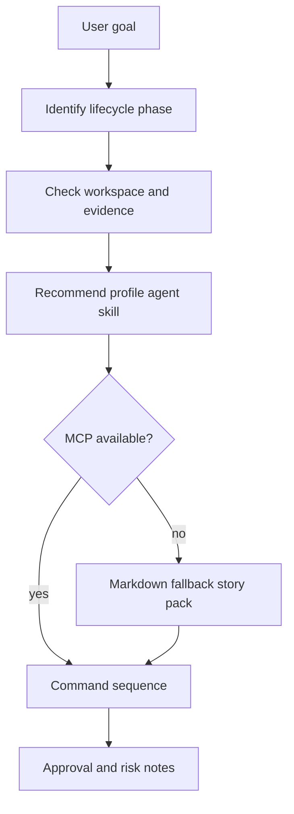

# Mana Usage Help

## Purpose
Guide a user through this framework by recommending the next profile, agent,
skill, workspace command, required inputs, fallback path, and expected outputs.

This skill exists to reduce operational friction. It explains how to use the
framework; it does not replace delivery approval, edit project code, or bypass
governance gates.

## When To Use It
- When a user asks what to run next.
- When the current delivery phase is unclear.
- When Jira MCP, Confluence, CI, or another integration is unavailable.
- When onboarding a new project or developer to `.mana`, profiles, agents,
  skills, templates, or MCP policies.
- Before invoking a larger agent when required artifacts may be missing.

## When Not To Use It
- Do not use it to approve requirement, architecture, database, security, or PR
  readiness decisions.
- Do not use it as a substitute for the specific risk-analysis skills.
- Do not use it to execute destructive actions or external writes.
- Do not invent missing Jira, Confluence, CI, or repository evidence.

## Inputs
- user_goal
- current_phase
- available_artifacts
- repository_state
- mcp_status

## Outputs
- next_step_recommendation
- command_sequence
- required_artifacts
- missing_context
- risk_notes

## Execution Logic
1. Identify the user's lifecycle phase: installation, workspace setup, epic
   intake, story planning, Team Leader planning, story readiness, architecture
   review, implementation, branch validation, requested PR review, AM release
   readiness, PR readiness, CI validation, or learning.
2. Check whether `.mana` workspace artifacts are available or need to be
   initialized.
3. Recommend the smallest relevant profile, agent, and skill set.
4. Prefer Jira MCP read-only inputs when available. In a linked project, use
   `./mana jira-mcp --get-issue <KEY>` to read one story quickly and
   `./mana jira-mcp --check-access --issue <KEY>` only for credential or
   permission diagnostics.
5. Treat Jira story text and acceptance criteria as requirement evidence:
   planning checks feasibility and readiness; review/validation compares branch
   or PR changes against the story.
6. If Jira MCP is unavailable, recommend the Markdown fallback story pack.
7. List concrete commands and expected artifact paths.
8. Flag missing service context, evidence gaps, or approval gates.

## Decision Rules
- `blocker`: the user is about to skip a required approval gate, run write
  operations without approval, or proceed without mandatory requirement input.
- `warning`: Jira/MCP/CI context is unavailable but a documented fallback exists,
  or service context is incomplete.
- `info`: recommended command, profile, agent, skill, or artifact path.

## Failure Modes
- The user's phase may be ambiguous; ask one concise clarification only when the
  next action cannot be inferred safely.
- Repository-local conventions may differ from this framework's defaults.
- MCP availability can change; report assumptions explicitly.

## Required Human Review
The owner role `Developer / Team Leader` reviews workflow recommendations when
they change delivery order, approval gates, or artifact requirements.

## Service Context Layer
Read `.mana/global/service-mission.md`,
`.mana/global/architecture.md`, and
`.mana/global/engineering-guards.md` when the recommendation depends on
service-specific rules.

Missing context files should be reported as warnings. A violation of
`.mana/global/engineering-guards.md` must be treated as a blocker or routed
to the accountable owner for explicit approval.

## Interaction With Codex
Codex should use this skill to answer operational questions, produce next-step
plans, and route users to the right profile, agent, skill, template, or fallback.

## Interaction With Junie
This skill is Codex-first. Junie may consume its output as local workflow
guidance but should not use it to widen implementation scope.

## Interaction With MCP
MCP access must be read-only by default. If Jira MCP is unavailable, use
`templates/epic-story-pack.template.md` as the manual requirement fallback.
When Jira MCP is available, prefer `./mana jira-mcp --get-issue <KEY>` for a
single story read instead of constructing ad hoc REST commands.
For epic/story slicing, prefer
`./mana jira-mcp --fetch-epic-story-pack <KEY>` to cache the epic and sibling
stories as Markdown under `.mana/features/<EPIC-ID>/evidence/jira/`.
Writes, comments, transitions, or publication to external systems require human
approval and audit logging.

## Correct Usage Examples
- Ask which profile to run for an epic with two stories.
- Ask how to check whether stories under an epic are partitioned cleanly.
- Ask what a Team Leader should run before assigning a story.
- Ask what an Architect should run before approving a design or branch.
- Ask what an Application Manager should run before release readiness.
- Ask how to proceed when Jira credentials are missing.
- Ask which `.mana` path should hold story planning artifacts.
- Ask how to prepare a branch for PR readiness.
- Ask how to review PRs where the user is a requested reviewer.
- Ask how to analyze one PR quickly by number.

## Incorrect Usage Examples
- Do not use this skill to approve a PR.
- Do not use this skill to decide that missing acceptance criteria are acceptable.
- Do not use this skill to bypass DBA, Security, Architect, or Team Leader gates.
- Do not use this skill to perform broad autonomous changes.

## Output Standard
Follow `docs/standards/agent-skill-output-standard.md` (Agent And Skill Output Standard) for all generated artifacts. Use `templates/standard-agent-skill-report.template.md` when no more specific template exists.

Internal reasoning must use compact caveman mode: terse fragments, evidence-first notes, no long narrative, and no private chain-of-thought in final artifacts. Maintain a context budget: keep a short working summary with objective, base branch or PR, issue keys, workspace path, checked evidence, open hypotheses, discarded hypotheses, and next checks instead of accumulating raw transcripts, full diffs, repeated file dumps, or copied tool output.

## Diagram


## Example Output
```yaml
skill: mana-usage-help
status: ready
next_step_recommendation: "Initialize the Mana workspace and run story-start for STORY-1."
command_sequence:
  - "scripts/mana-workspace.sh init --root . --feature STORY-1"
  - "./mana jira-mcp --fetch-epic-story-pack STORY-1"
  - "scripts/run-profile.sh story-start"
  - "scripts/run-profile.sh story-ready-for-dev"
required_artifacts:
  - ".mana/global/service-mission.md"
  - ".mana/features/EPIC-1/evidence/jira/epic-story-pack.md"
  - ".mana/features/STORY-1/context/story-context.md"
missing_context:
  - "If Jira MCP is unavailable, use templates/epic-story-pack.template.md."
risk_notes:
  - "Do not proceed with implementation until acceptance criteria gaps are resolved or approved."
human_review_required: false
```
