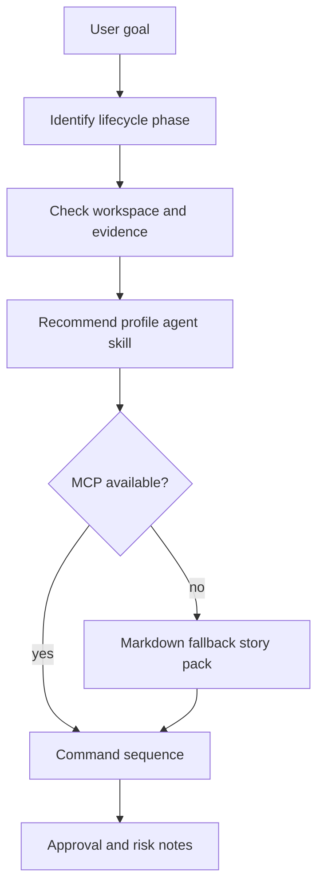

# Mana Usage Help

## Purpose
Guide a user through this framework by recommending the next profile, agent,
skill, workspace command, required inputs, fallback path, and expected outputs.

This skill exists to reduce operational friction. It explains how to use the
framework; it does not replace delivery approval, edit project code, or bypass
governance gates.

## When To Use It
- When a user asks what to run next.
- When the current delivery phase is unclear.
- When Jira MCP, Confluence, CI, or another integration is unavailable.
- When onboarding a new project or developer to `.mana`, profiles, agents,
  skills, templates, context layers, or MCP policies.
- When a user asks how to configure, refresh, diagnose, or safely use optional
  reusable User Context.
- Before invoking a larger agent when required artifacts may be missing.

## When Not To Use It
- Do not use it to approve requirement, architecture, database, security, or PR
  readiness decisions.
- Do not use it as a substitute for the specific risk-analysis skills.
- Do not use it to execute destructive actions or external writes.
- Do not invent missing Jira, Confluence, CI, or repository evidence.

## Inputs
- user_goal
- current_phase
- available_artifacts
- repository_state
- mcp_status

## Outputs
- next_step_recommendation
- command_sequence
- required_artifacts
- missing_context
- risk_notes

## Execution Logic
1. Identify the user's lifecycle phase: installation, workspace setup, epic
   intake, story planning, Team Leader planning, story readiness, architecture
   review, implementation, branch validation, requested PR review, AM release
   readiness, PR readiness, CI validation, or learning.
2. Check whether `.mana` workspace artifacts are available or need to be
   initialized.
3. Keep Mana framework knowledge, User Context, project Service Context,
   feature/session/task context, and repository evidence distinct. For project
   claims, use `repository evidence > project/service context > user context`;
   current human instructions and Mana governance remain authoritative.
4. Recommend the smallest relevant profile, agent, and skill set.
5. Prefer Jira MCP read-only inputs when available. In a linked project, use
   `./mana jira-mcp --get-issue <KEY>` to read one story quickly and
   `./mana jira-mcp --check-access --issue <KEY>` only for credential or
   permission diagnostics.
6. Treat Jira story text and acceptance criteria as requirement evidence:
   planning checks feasibility and readiness; review/validation compares branch
   or PR changes against the story.
7. If Jira MCP is unavailable, recommend the Markdown fallback story pack.
8. List concrete commands and expected artifact paths.
9. Recommend `./mana evidence-index` after local Jira, Sonar, dependency, test,
   validation, or PR evidence is collected.
10. Flag missing service context, evidence gaps, or approval gates.
11. When the user asks about User Context, route setup and security details to
    `docs/workflow/user-context-layer.md`. Explain `mana context status`,
    `refresh`, and `path`; keep the personal source path out of project config,
    and describe `path --source` as deliberate disclosure. Never read or modify
    the external source on the user's behalf as part of a help response.
12. When the user asks about governed tooling, state the execution boundary
    precisely: `mana divination` is a read-only recommendation; `mana cast
    --dry-run` writes nothing; non-dry cast may write Mana-local state and
    runtime telemetry; eval and governance report runs write Mana-local
    artifacts but do not invoke a runner.
13. For a saved recommendation, instruct users to rerun `mana divination
    --json` when `mana cast --from` reports staleness. Do not suggest editing a
    fingerprint file or treating the legacy `profileFingerprint` as sufficient.
14. For learning, explain `candidate → reviewed → rejected|archived`; review
    creates an evidence-preserving artifact and never promotes knowledge.
15. For behavioural evals, distinguish structural assertions from
    fixture-backed assertions. Explain that `must_not_modify` checks the plan,
    not whether a fixture happens to say no mutation occurred.
16. For inspect/read-model questions, recommend `./mana inspect project --json`
    first and then only advertised operations. Explain that inspect is a
    deterministic, read-only producer API; Mana Familiar is a consumer; no
    inspect result grants approval; and `unknown` or stale status is an
    evidence limitation, not a safety finding. Refer to
    `docs/workflow/mana-inspect.md` for exact vocabulary.

## Decision Rules
- `blocker`: the user is about to skip a required approval gate, run write
  operations without approval, or proceed without mandatory requirement input.
- `warning`: Jira/MCP/CI context is unavailable but a documented fallback exists,
  or service context is incomplete.
- `info`: recommended command, profile, agent, skill, or artifact path.

## Failure Modes
- The user's phase may be ambiguous; ask one concise clarification only when the
  next action cannot be inferred safely.
- Repository-local conventions may differ from this framework's defaults.
- MCP availability can change; report assumptions explicitly.

## Required Human Review
The owner role `Developer / Team Leader` reviews workflow recommendations when
they change delivery order, approval gates, or artifact requirements.

## Service Context Layer
Read `.mana/global/service-mission.md`,
`.mana/global/architecture.md`, and
`.mana/global/engineering-guards.md` when the recommendation depends on
service-specific rules.

Missing context files should be reported as warnings. A violation of
`.mana/global/engineering-guards.md` must be treated as a blocker or routed
to the accountable owner for explicit approval.

## User Context Layer
User Context is optional reusable personal guidance, not project-owned Service
Context and not repository truth. Its external directory is user-owned and
read-only from Mana's perspective; Mana exposes only a filtered generated mirror
under `.mana/user-context/`.

When User Context help is requested:

- Use the user-level `MANA_USER_CONTEXT_ROOT` configuration documented in
  `docs/workflow/user-context-layer.md`; do not recommend persisting an absolute
  personal path in tracked project configuration.
- Recommend `mana context status` before diagnosis and `mana context refresh`
  when the mirror is missing or stale.
- Explain that `index.md` and `preferences.md` are optional navigation entry
  points and deeper files are loaded only when relevant.
- State that personal guidance may be stale or inapplicable and cannot override
  repository evidence, project/service constraints, human instructions, or Mana
  governance.
- Do not make User Context a prerequisite. Unconfigured projects continue to
  use Mana normally.

## Interaction With Codex
Codex should use this skill to answer operational questions, produce next-step
plans, and route users to the right profile, agent, skill, template, or fallback.

## Interaction With Junie
This skill is Codex-first. Junie may consume its output as local workflow
guidance but should not use it to widen implementation scope.

## Interaction With MCP
MCP access must be read-only by default. If Jira MCP is unavailable, use
`templates/epic-story-pack.template.md` as the manual requirement fallback.
When Jira MCP is available, prefer `./mana jira-mcp --get-issue <KEY>` for a
single story read instead of constructing ad hoc REST commands.
For epic/story slicing, prefer
`./mana jira-mcp --fetch-epic-story-pack <KEY>` to cache the epic and sibling
stories as Markdown under `.mana/features/<EPIC-ID>/evidence/jira/`.
For local Sonar scanner setup, route users to
`docs/deployment/sonar-scanner-wrapper.md` and
the `./mana sonar --init-config`, `./mana sonar --check`, and
`./mana sonar --analyze` commands. Keep only `SONAR_HOST_URL` and `SONAR_TOKEN`
in the environment; keep scanner project properties under
`.mana/global/sonar-project.properties`.
When the user asks how risky it is to modify a class or file, recommend
`dev-assist` with `sonar-change-risk`; use existing Sonar evidence when present
and combine it with git history, tests, story scope, and engineering guards.
When dependency manifests or lockfiles changed, recommend
`./mana dependency-evidence --collect` to store a local inventory under the
active workspace. This is evidence collection, not a vulnerability scanner.
When multiple evidence sources exist, recommend `./mana evidence-index` so
review and validation agents can read `.mana/<workspace>/evidence/index.md`
first and avoid deep-loading unrelated artifacts.
For branch or PR validation, route acceptance-criteria traceability to
`jira-acceptance-criteria-normalizer`, changed-file routing to
`changed-files-risk-classifier`, guard checks to `architecture-guard-detector`,
and existing Sonar summaries to `sonar-evidence-triage`.
Writes, comments, transitions, or publication to external systems require human
approval and audit logging.

## Correct Usage Examples
- Ask which profile to run for an epic with two stories.
- Ask how to check whether stories under an epic are partitioned cleanly.
- Ask what a Team Leader should run before assigning a story.
- Ask what an Architect should run before approving a design or branch.
- Ask what an Application Manager should run before release readiness.
- Ask how to proceed when Jira credentials are missing.
- Ask which `.mana` path should hold story planning artifacts.
- Ask how to prepare a branch for PR readiness.
- Ask how to review PRs where the user is a requested reviewer.
- Ask how to analyze one PR quickly by number.
- Ask how to configure or run local Sonar scanner evidence for a branch or PR.
- Ask how risky it is to modify a specific class or file.
- Ask how to collect dependency evidence before review.
- Ask how to build an evidence index after collecting Jira, Sonar, dependency,
  test, validation, or PR artifacts.
- Ask how to configure or refresh reusable personal User Context.
- Ask why personal guidance cannot override an existing project constraint.
- Ask why `mana cast --from` says a recommendation is stale.
- Ask whether an eval run changed the target repository.
- Ask how to review or close a learning candidate without promoting it.
- Ask how Mana Familiar should discover project artifacts safely.
- Ask what an inspect `unknown` or stale status means.

## Incorrect Usage Examples
- Do not use this skill to approve a PR.
- Do not use this skill to decide that missing acceptance criteria are acceptable.
- Do not use this skill to bypass DBA, Security, Architect, or Team Leader gates.
- Do not use this skill to perform broad autonomous changes.

## Output Standard
Follow `docs/standards/agent-skill-output-standard.md` (Agent And Skill Output Standard) for all generated artifacts. Use `templates/standard-agent-skill-report.template.md` when no more specific template exists.

Internal reasoning must use compact caveman mode: terse fragments, evidence-first notes, no long narrative, and no private chain-of-thought in final artifacts. Maintain a context budget: keep a short working summary with objective, base branch or PR, issue keys, workspace path, checked evidence, open hypotheses, discarded hypotheses, and next checks instead of accumulating raw transcripts, full diffs, repeated file dumps, or copied tool output.

## Diagram

```mermaid
flowchart TD
    Goal[User goal] --> Phase[Identify lifecycle phase]
    Phase --> Context[Check workspace and evidence]
    Context --> Route[Recommend profile agent skill]
    Route --> Fallback{MCP available?}
    Fallback -->|yes| Commands[Command sequence]
    Fallback -->|no| StoryPack[Markdown fallback story pack]
    StoryPack --> Commands
    Commands --> Gates[Approval and risk notes]
```

## Example Output
```yaml
skill: mana-usage-help
status: ready
next_step_recommendation: "Initialize the Mana workspace and run story-start for STORY-1."
command_sequence:
  - "scripts/mana-workspace.sh init --root . --feature STORY-1"
  - "./mana jira-mcp --fetch-epic-story-pack STORY-1"
  - "scripts/run-profile.sh story-start"
  - "scripts/run-profile.sh story-ready-for-dev"
required_artifacts:
  - ".mana/global/service-mission.md"
  - ".mana/features/EPIC-1/evidence/jira/epic-story-pack.md"
  - ".mana/features/STORY-1/context/story-context.md"
missing_context:
  - "If Jira MCP is unavailable, use templates/epic-story-pack.template.md."
risk_notes:
  - "Do not proceed with implementation until acceptance criteria gaps are resolved or approved."
human_review_required: false
```

## Governed Tooling Support Example

```yaml
skill: mana-usage-help
status: ready
next_step_recommendation: "Regenerate the saved recommendation before casting."
command_sequence:
  - "mana divination \"<delivery intent>\" --json > divination.json"
  - "mana cast --from divination.json --dry-run --json"
mutation_notes:
  - "The divination and dry-run commands do not write target-repository or Mana-local state."
  - "A non-dry cast can write Mana-local workspace/runtime state; inspect its explicit mutation fields."
learning_notes:
  - "Review writes .mana/learning/reviews/<candidate-id>-review.md and changes status to reviewed."
  - "Rejected and archived candidates are terminal for collection."
human_review_required: false
```
