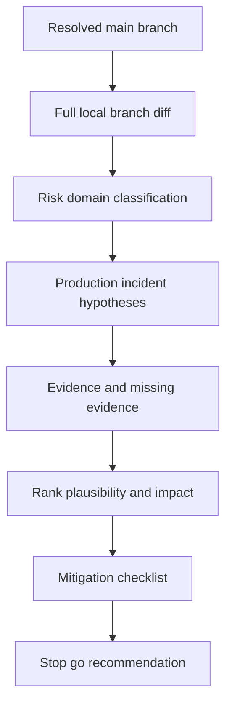

# Production Premortem

## Purpose
Analyze introduced branch changes from the incident question:

> The code introduced in this branch is causing production problems. Find the
> most plausible reasons.

This skill is optimized for Codex repository-level reasoning before commit,
pre-push, branch validation, or PR readiness. It produces ranked hypotheses,
evidence, missing checks, and mitigation options. It does not change code or
approve risk.

## When To Use It
- Before committing or pushing a risky branch.
- When the diff touches payments, persistence, concurrency, security, external
  calls, messaging, scheduling, retries, feature flags, configuration, or
  observability.
- When test evidence exists but production risk still feels unclear.
- When a reviewer asks for "what could break in prod?"
- When Jira MCP is unavailable and a Markdown story pack is being used.

## When Not To Use It
- Do not use it as a substitute for deterministic tests, CI, or owner review.
- Do not use it to justify skipping Branch Validation or PR Readiness.
- Do not use it on an empty diff and treat the result as meaningful.
- Do not infer production facts that are not present in service context,
  architecture docs, logs, or repository evidence.

## Inputs
- main_branch
- local_branch_diff
- branch_diff
- uncommitted_diff
- story_context
- source_impact_map
- green_border_plan
- test_evidence
- service_context
- production_characteristics

## Outputs
- premortem_report
- likely_failure_modes
- production_blast_radius
- missing_detection_signals
- mitigation_checklist

## Execution Logic
1. Build a filtered diff inventory against the resolved main branch before
   reading full files. Include uncommitted working-tree changes when present.
   Do not use staged diff as the analysis boundary.
2. Exclude Mana framework/bootstrap noise from production hypotheses, findings,
   evidence, missing-test lists, and failure modes: `.mana/**`, `AGENTS.md`,
   `CLAUDE.md`, `mana`, and Mana-only `.gitignore` or env ignore changes.
   Mention these only as operational setup notes when relevant.
3. If the filtered diff is larger than roughly 80 changed files or 2,000 changed
   lines, or is dominated by generated/vendor-like churn, stop with
   `needs_human_decision` and ask the user to choose a review scope.
4. Classify touched risk domains from the filtered inventory, then read full
   file contents only where needed to validate plausible blocker or warning
   hypotheses.
5. Compare changed files with story context, impact map, service context, and
   engineering guards.
6. Ask the incident question for each touched domain: "if this caused production
   trouble, what failed first and why?"
7. Rank hypotheses by plausibility, impact, and evidence strength.
8. Identify missing tests, missing observability, unsafe defaults, config drift,
   rollback gaps, and owner approvals.
9. Produce a mitigation checklist with stop/go guidance.

## Failure Mode Catalogue
Review at least these classes when relevant:

- wrong requirement interpretation or partial story implementation
- unplanned file or protected-area change
- transaction boundary, rollback, idempotency, or retry bug
- concurrency, ordering, duplicate processing, or race condition
- nullability, default value, mapping, enum, timezone, precision, or rounding bug
- validation, authorization, trust-boundary, or sensitive-data handling issue
- external API timeout, retry storm, circuit breaker, contract, or error mapping
- database migration, Liquibase rollback, locking, index, drift, or data backfill
- message schema, event compatibility, topic, consumer, or dead-letter behavior
- feature flag, configuration, environment, secret, or deployment ordering issue
- performance regression, N+1 query, memory growth, batch size, or cache behavior
- missing logs, metrics, traces, alerting, or runbook
- inadequate tests, mocked-away behavior, flaky evidence, or missing regression

## Decision Rules
- `blocker`: highly plausible production failure with code evidence, missing
  rollback for risky DB/config changes, guard violation, missing critical tests,
  or unapproved protected-area change.
- `warning`: plausible production failure that needs owner review, extra tests,
  or observability before push/PR.
- `info`: low-risk hypothesis or reviewer note useful for PR context.

## Failure Modes
- If the main branch is ambiguous, the runner must ask the user which base branch
  to compare against before producing findings.
- Missing production topology, traffic, data volume, or incident history can
  understate risk.
- Repository-only analysis cannot prove runtime behavior.
- Diff-only analysis can miss generated code, config outside the repo, or
  environment-specific behavior.
- AI hypotheses must be checked against tests, owners, and runtime evidence.

## Required Human Review
The owner role `Team Leader / Architect / Developer` reviews blocker and warning
findings. Database, security, trust-boundary, architecture, and production
operations blockers require their accountable owners.

## Service Context Layer
Read `.mana/global/service-mission.md`,
`.mana/global/architecture.md`, `.mana/global/engineering-guards.md`,
`.mana/global/integration-map.md`, `.mana/global/testing-policy.md`,
and `.mana/global/database-policy.md` when present.

Missing context files should be reported as warnings. A violation of
`.mana/global/engineering-guards.md` must be treated as a blocker or routed
to the accountable owner for explicit approval.

## Interaction With Codex
Codex is the preferred runner. Codex should inspect branch diffs, read nearby
code, compare against planning artifacts, and produce a written report with
ranked evidence. Codex should not make destructive edits or approve its own
findings.

## Interaction With Junie
Junie may use the output to implement targeted fixes, add missing tests, or add
local observability inside the approved impact map.

## Interaction With MCP
MCP access is read-only by default. Jira and Confluence can provide requirement
and design evidence. Logs or observability tools can provide known failure
patterns when available. Writes, comments, transitions, database execution, or CI
triggers require human approval.

## Correct Usage Examples
- Run on a branch diff before commit and ask for likely production failure modes.
- Run on `git diff <main-branch>...HEAD` plus uncommitted local changes.
- Run after tests pass but before PR to identify missing production safeguards.
- Use the report to add targeted tests or ask for owner approval.

## Incorrect Usage Examples
- Do not treat "no findings" as production safety proof.
- Do not ignore blocker findings because local unit tests passed.
- Do not use this skill to expand scope without approval.
- Do not invent production traffic, data, or topology facts.

## Output Standard
Follow `docs/standards/agent-skill-output-standard.md` (Agent And Skill Output Standard) for all generated artifacts. Use `templates/standard-agent-skill-report.template.md` when no more specific template exists.

Internal reasoning must use compact caveman mode: terse fragments, evidence-first notes, no long narrative, and no private chain-of-thought in final artifacts.

## Diagram


## Example Output
```yaml
skill: production-premortem
status: blocker
summary: "Two plausible production failure modes were found before commit."
likely_failure_modes:
  - severity: blocker
    hypothesis: "Duplicate payment event processing after retry."
    evidence:
      - "Idempotency key no longer includes payment instrument id."
      - "No regression test covers duplicate callback delivery."
    production_symptom: "Double state transition or duplicate downstream event."
    recommended_action: "Restore idempotency key semantics and add duplicate callback test."
  - severity: warning
    hypothesis: "Missing metric for fallback path."
    evidence:
      - "New fallback catches external timeout but only logs debug."
    production_symptom: "Silent conversion drop without alert."
    recommended_action: "Add counter and alertable error log."
missing_detection_signals:
  - "No metric for new error path."
mitigation_checklist:
  - "Run regression test for duplicate callback."
  - "Confirm rollback behavior with Team Leader."
human_review_required: true
```
