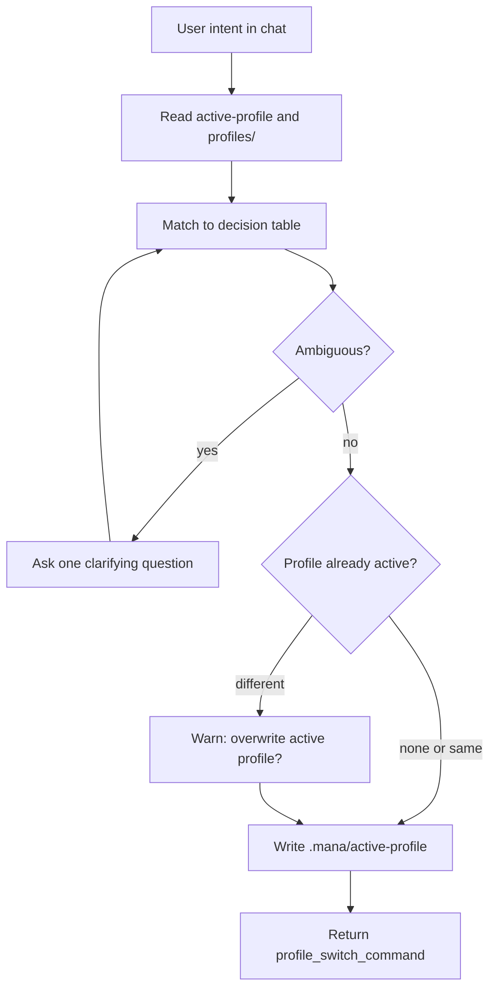

# Profile Selector

## Purpose
Map a user's natural language description of their situation, role, or goal to
the most appropriate Mana profile. Write the profile name to
`.mana/active-profile` to persist the selection. Return the exact command
to run and a brief explanation of what the profile does.

This skill reduces the friction of knowing which profile to invoke. It is
especially useful when a developer or team member is in a chat session and wants
to switch phase without looking up the profile catalogue manually.

## When To Use It
- When a user says "I want to switch to..." or "which profile should I use for..."
- When a user describes their lifecycle phase, role, or goal and asks what to run.
- During onboarding, when the framework is new and profile names are unfamiliar.
- When `mana-help-agent` detects a profile switch intent in the user's message.

## When Not To Use It
- Do not use it to skip required approval gates.
- Do not use it to select profiles that require specialist access the current user
  does not have (e.g., `am-release-ready` for a developer with no AM role).
- Do not use it when a specific profile has already been approved and recorded.
- Do not overwrite `.mana/active-profile` without confirming with the user when a
  profile is already active.

## Inputs
- user_intent
- current_phase
- available_profiles
- active_workspace

## Outputs
- selected_profile
- profile_switch_command
- active_profile_written

## Profile Decision Table

| Situation or Intent | Role | Profile |
|---|---|---|
| Start a story, planning, technical slicing | Developer / TL | `story-start` |
| Story ready for development, TL verification | Team Leader | `story-ready-for-dev` |
| Architecture review, ADR, NFR, service boundary | Architect | `architecture-review` |
| Team planning, sequencing, dependencies, review load | Team Leader | `team-planning` |
| Epic/story partitioning, overlap, sibling-story gaps | BA / PO / Team Leader | `team-planning` or `story-ready-for-dev` plus `./mana jira-mcp --fetch-epic-story-pack <KEY>` |
| Production pre-mortem before commit or push | Developer | `jessica-fletcher` |
| Branch validation before PR | Developer / TL | `branch-ready` |
| PR readiness, PR package, handoff | Developer | `pr-ready` |
| Review PRs where I am requested reviewer | Reviewer / TL | `requested-pr-review` |
| Review one PR by number | Reviewer / TL | `requested-pr-review --pr <number>` |
| Read one Jira story quickly | Developer / TL / Reviewer | `./mana jira-mcp --get-issue <KEY>` |
| Cache epic and sibling stories as Markdown | BA / PO / Team Leader | `./mana jira-mcp --fetch-epic-story-pack <KEY>` |
| Configure local Sonar scanner evidence | Developer / TL | `./mana sonar --init-config` then `./mana sonar --check` |
| Run local Sonar evidence before branch or PR review | Developer / Reviewer / TL | `./mana sonar --analyze` |
| Collect local dependency evidence | Developer / Reviewer / TL | `./mana dependency-evidence --collect` |
| Build compact evidence index | Developer / Reviewer / TL | `./mana evidence-index` |
| Estimate risk before modifying a class | Developer / TL | `dev-assist` with `sonar-change-risk` |
| Compare story acceptance criteria with branch or PR | Developer / Reviewer / TL | `branch-ready`, `pr-ready`, or `requested-pr-review` with `jira-acceptance-criteria-normalizer` |
| Check engineering guard hits in a diff | Architect / TL / Reviewer | `branch-ready`, `pr-ready`, or `requested-pr-review` with `architecture-guard-detector` |
| Release readiness, continuity, rollback | Application Manager | `am-release-ready` |
| CI validation gate | CI / TL | `ci-validation` |
| General framework question, onboarding, next step | Any | `mana-help` |
| Pre-commit local checks | Developer | `pre-commit` |

## Execution Logic
1. Read `.mana/active-profile` if present; report the current active profile.
2. Read the list of available profiles from `profiles/` directory.
3. Match the user's intent to the decision table above.
4. If the intent is ambiguous, ask one concise clarifying question about role or phase.
5. Write the selected profile name to `.mana/active-profile` in the active project root.
6. Return the profile name, the command to run it, and a one-sentence description
   of what the profile does.
7. Warn if the user's role does not match the profile's intended owner.

## Decision Rules
- `blocker`: intent maps to a profile that requires human approval the user does
  not currently have (e.g., DBA or AM gate).
- `warning`: current active profile differs from the selected one; confirm the
  switch with the user before writing.
- `info`: profile selected and command ready.

## Failure Modes
- The user's intent may map to multiple profiles; prefer the most downstream
  phase when ambiguous (e.g., `branch-ready` over `pre-commit` if both apply).
- `.mana/active-profile` may be stale from a previous session; always report
  the existing value before overwriting.
- The profile list in `profiles/` may differ from the decision table if new
  profiles are added; fall back to reading `profiles/*.yaml` directly.

## Required Human Review
The user must confirm the profile switch when a currently active profile exists.
Profile selection does not replace the human owner's accountability for delivery
decisions within the chosen phase.

## Developer Choice Log
When a profile switch is recorded in `.mana/active-profile`, log the choice and
rationale in `decisions/developer-choice-log.md` when an active workspace exists.

## Service Context Layer
Read `.mana/global/engineering-guards.md` to detect whether any guard blocks
execution of the selected profile. Report violations as blockers.

## Interaction With Codex
Codex invokes this skill when the user expresses intent to change phase or
profile during a chat session. The skill writes `.mana/active-profile`; Codex
confirms the write and displays the command.

## Interaction With Junie
Junie may invoke this skill to align local execution with the phase selected
by the developer in the IDE. Junie does not overwrite `.mana/active-profile`
without user confirmation.

## Interaction With MCP
No MCP write operations. Read-only access to local files and `profiles/` is
sufficient. No external system access required.
When routing a request that includes a Jira issue key, prefer profiles or
commands that preserve story evidence. For simple story reads, use
`./mana jira-mcp --get-issue <KEY>`. For planning, review, validation, and
pre-mortem profiles, ensure the selected agent compares story text and
acceptance criteria against the requested feasibility or branch/PR analysis.
When routing review or validation work, recommend `./mana evidence-index` after
Jira, Sonar, dependency, test, validation, or PR artifacts are collected. Use it
to help agents load summaries first and deep-load only relevant evidence.

## Correct Usage Examples
- User says "I'm about to commit and want to run the pre-mortem" → selects `jessica-fletcher`.
- User says "we're in branch validation now" → selects `branch-ready`.
- User says "I need to prepare the PR package" → selects `pr-ready`.
- User says "review the PRs assigned to me" → selects `requested-pr-review`.
- User says "review PR 123" → selects `requested-pr-review` with command
  `scripts/run-profile.sh requested-pr-review --pr 123 --project-root .`.
- User says "read Jira story PROJ-1234" → recommend
  `./mana jira-mcp --get-issue PROJ-1234` in a linked project.
- User says "I collected Sonar and dependency evidence" → recommend
  `./mana evidence-index` before `branch-ready` or `requested-pr-review`.
- User says "I just started this story" → selects `story-start`.
- User says "switch to AM release readiness" → selects `am-release-ready`, warns if user lacks AM role.

## Incorrect Usage Examples
- Do not select a profile and bypass the approval gate it contains.
- Do not write `.mana/active-profile` if the user did not confirm the switch.
- Do not use this skill to decide whether a branch is actually ready for PR.

## Output Standard
Follow `docs/standards/agent-skill-output-standard.md` (Agent And Skill Output Standard) for all generated artifacts. Use `templates/standard-agent-skill-report.template.md` when no more specific template exists.

Internal reasoning must use compact caveman mode: terse fragments, evidence-first notes, no long narrative, and no private chain-of-thought in final artifacts. Maintain a context budget: keep a short working summary with objective, base branch or PR, issue keys, workspace path, checked evidence, open hypotheses, discarded hypotheses, and next checks instead of accumulating raw transcripts, full diffs, repeated file dumps, or copied tool output.

## Diagram


## Example Output
```yaml
skill: profile-selector
status: ready
selected_profile: jessica-fletcher
profile_switch_command: "scripts/run-profile.sh jessica-fletcher --project-root ."
active_profile_written: ".mana/active-profile"
summary: "Switched active profile to jessica-fletcher (production pre-mortem before commit)."
warnings: []
human_review_required: false
```
