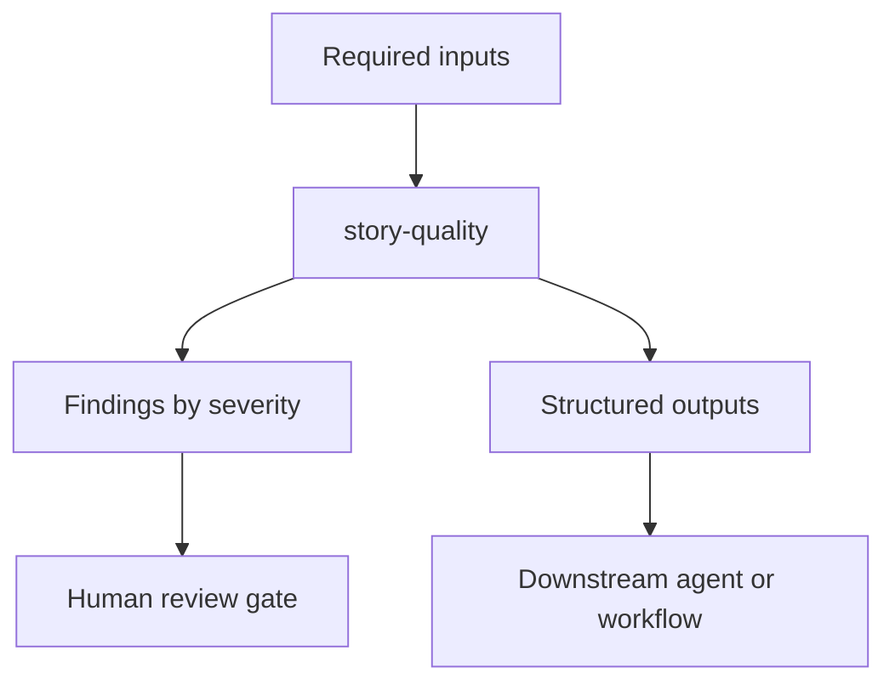

# Story Quality

## Purpose
Evaluate story quality along two dimensions before development starts:

- **Depth:** detect incomplete or uneven analysis across functional goal, data
  requirements, validations, external calls, timeout, retry, error behavior,
  acceptance criteria, and open questions.
- **Consistency:** find conflicting rules, duplicated scope, incompatible
  acceptance criteria, inconsistent terminology, and mismatched assumptions
  across related stories in the same epic.

This skill exists to reduce delivery churn by making a narrow, reusable judgement explicit. It produces structured artifacts and recommendations; it does not perform broad autonomous actions.

## When To Use It
- During the lifecycle phase indicated by the tags and preferred runner.
- When the required inputs are available and the team needs a repeatable review.
- Before a human approval gate where missing evidence would slow the team down.
- When a related agent invokes it as one step in a larger workflow.
- Run the consistency dimension only when sibling stories or an epic context are
  available; otherwise report depth findings and note the missing comparison
  evidence.

## When Not To Use It
- Do not use it as a replacement for the accountable human owner.
- Do not use it for unrelated files, binary artifacts, or systems outside the approved MCP policy.
- Do not use it after the decision point if the finding can no longer influence the design without rework.
- Do not use it to justify unsafe shortcuts against project rules.

## Inputs
- epic
- story
- sibling_stories
- acceptance_criteria
- linked_documentation
- goal_contract

## Outputs
- story_quality_report
- conflicts
- open_questions
- missing_details
- clarification_questions

## Execution Logic
1. Normalize domain terms from the Jira story, acceptance criteria, linked
   context, and fallback story-pack when available.
2. **Depth:** parse the story into requirement domains; rate each domain as
   high, medium, low, or missing; flag asymmetry where one area is detailed but
   another critical area is vague.
3. **Consistency:** when sibling stories are available, compare business rules
   and acceptance criteria for internal consistency and feasibility; detect
   conflicting defaults, enum values, statuses, ownership, missing requested
   behavior, and unrequested scope.
4. Group conflicts and gaps by blocking severity.
5. Generate clarification questions before development starts.

## Decision Rules
- `blocker`: unresolved high-risk issue, missing critical input, unsafe database/security/architecture condition, or untestable requirement that prevents responsible delivery.
- `warning`: incomplete evidence, medium-risk design concern, missing non-critical test, or ambiguity that can be accepted by the owner.
- `info`: observation useful for reviewers, implementation, or future learning.
- Skipping the consistency dimension because sibling stories are unavailable is a `warning`, not silent omission.

## Failure Modes
- Missing or stale input artifacts can produce false negatives.
- Repository search can miss dynamically configured flows or generated code.
- MCP access restrictions can prevent full validation; report the access gap explicitly.
- AI output can be incomplete; human review remains mandatory.

## Required Human Review
The owner role `BA / Team Leader` reviews blocker and warning findings. High-risk security, database, concurrency, or architecture findings require explicit approval before implementation or merge.

## Service Context Layer
Read `service-mission.md` and `domain-glossary.md` to evaluate whether the story matches service purpose, uses domain terms correctly, and to detect terminology drift and contradictory business assumptions.

Missing context files should be reported as warnings. A violation of `.mana/global/engineering-guards.md` must be treated as a blocker or routed to the accountable owner for explicit approval.

## Interaction With Codex
Codex should run this skill for repository-level analysis, planning, validation, documentation, and report generation. Codex should prefer proposed patches and written findings over destructive edits.

## Interaction With Junie
Junie may use the output inside the IDE to implement one approved task at a time, generate local tests, or apply local fixes. Junie must not change files outside the approved impact map without asking.

## Interaction With MCP
MCP access must be least-privilege. Read-only access is preferred. Writes, destructive operations, external comments, database execution, or ticket updates require human approval and audit logging.
When Jira is available, use story text, acceptance criteria, linked context, and
relevant comments as requirement evidence. If Jira is unavailable, report the
gap and use the documented Markdown fallback instead of inferring requirements.

## Correct Usage Examples
- Run during the intended lifecycle phase with the full story, context, and linked artifacts available.
- Use the output as evidence for refinement, planning, review, or local implementation decisions.
- Escalate blocker findings to the named human owner before continuing.
- Store the generated report with the story or branch artifacts so later agents can reuse it.

## Incorrect Usage Examples
- Do not use this skill as an autonomous code-changing tool.
- Do not run it with only a title or vague one-line request and treat the result as complete.
- Do not ignore high-severity findings because the output is advisory.
- Do not use it to bypass team, architecture, DBA, security, or reviewer approval.

## Output Standard
Follow `docs/standards/agent-skill-output-standard.md` (Agent And Skill Output Standard) for all generated artifacts. Use `templates/standard-agent-skill-report.template.md` when no more specific template exists.

Internal reasoning must use compact caveman mode: terse fragments, evidence-first notes, no long narrative, and no private chain-of-thought in final artifacts. Maintain a context budget: keep a short working summary with objective, base branch or PR, issue keys, workspace path, checked evidence, open hypotheses, discarded hypotheses, and next checks instead of accumulating raw transcripts, full diffs, repeated file dumps, or copied tool output.

## Diagram


## Example Output
```yaml
skill: story-quality
status: warning
summary: "Analysis completed with one blocker candidate and two warnings."
findings:
  - severity: warning
    area: "example"
    message: "A required detail or verification point is incomplete."
    recommended_action: "Clarify with the owner and update the related artifact."
outputs:
  - story_quality_report
  - conflicts
  - open_questions
  - missing_details
  - clarification_questions
human_review_required: true
```
