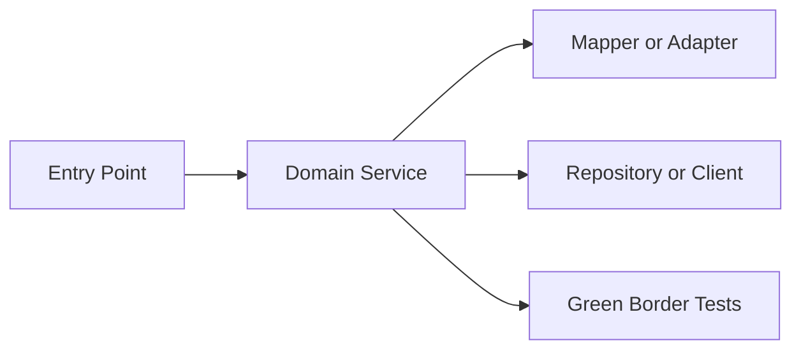
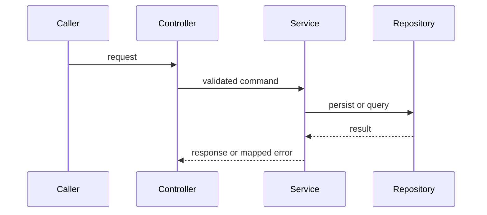

# Developer Handoff

## Story And Branch
- Story: `{{story_id}}`
- Branch: `{{branch_name}}`
- Author: `{{developer}}`
- Reviewer: `{{reviewer}}`

## What Was Built
`{{short_description_of_delivered_behavior}}`

## Why It Was Built This Way
`{{design_rationale_constraints_and_rejected_alternatives}}`

## How To Read The Change
1. `{{entry_point_file}}`
2. `{{business_logic_file}}`
3. `{{mapper_or_adapter_file}}`
4. `{{persistence_or_integration_file}}`
5. `{{tests_to_read}}`

## Architecture Diagram


## Behavioral Flow


## Code Reference Map
| File | Symbol | Why Read It | Related Test | Risk |
|---|---|---|---|---|
| `{{file_path}}` | `{{class_or_method}}` | `{{reason}}` | `{{test_file}}` | `{{risk_or_none}}` |

## Important Code Snippets
`{{file_path}}::{{symbol}}`

```java
// Keep excerpts short. Do not paste full files.
{{short_code_excerpt}}
```

## Tests To Read First
- `{{test_name}}`: `{{scenario_explained}}`

## Operational Notes
- Feature flags: `{{feature_flags}}`
- Logs/metrics: `{{logs_metrics}}`
- Timeout/retry/idempotency: `{{runtime_policy}}`
- Rollback/deployment notes: `{{rollback_notes}}`

## What Was Intentionally Not Changed
- `{{protected_legacy_behavior_or_non_goal}}`

## Risks And Follow-Ups
| Severity | Item | Owner | Due |
|---|---|---|---|
| warning | `{{follow_up}}` | `{{owner}}` | `{{date_or_event}}` |

