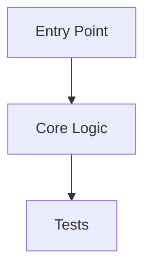

# Knowledge Transfer Brief

## Call Goal

- `{{call_goal}}`

## What Changed

- `{{implementation_overview}}`

## Why It Changed This Way

| Choice | Rationale | Evidence | Status |
|---|---|---|---|
| `{{choice}}` | `{{rationale}}` | `{{evidence}}` | `{{status}}` |

## Walkthrough Order

| Step | File Or Artifact | Why It Matters |
|---|---|---|
| `{{step}}` | `{{path}}` | `{{reason}}` |

## Architecture Or Flow Diagram

## Discussion Points

| Topic | Question | Owner |
|---|---|---|
| `{{topic}}` | `{{question}}` | `{{owner}}` |

## Tests And Evidence

- `{{test_or_artifact}}`: `{{result}}`

## Known Limits

- `{{limit_or_non_goal}}`

## Follow-Up Actions

- [ ] `{{owner}}`: `{{action}}`
