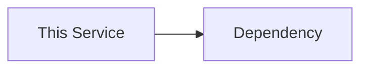

# Service Architecture

## Context
`{{architecture_context}}`

## Component Diagram

## Runtime Flows
- `{{runtime_flow}}`

## Data Ownership
- `{{owned_data}}`

## Boundaries
- Inbound APIs: `{{inbound_apis}}`
- Outbound APIs: `{{outbound_apis}}`
- Events consumed: `{{events_consumed}}`
- Events published: `{{events_published}}`

## Approved Patterns
- `{{approved_pattern}}`

## Known Constraints
- `{{constraint}}`

