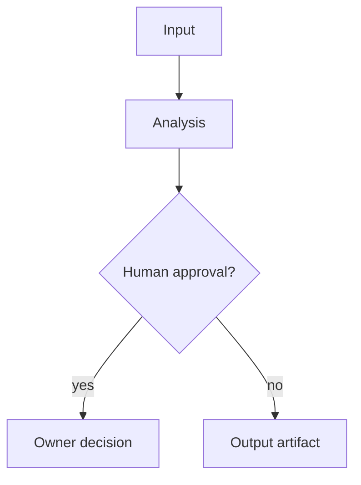

# <Artifact Title>

## Status

- Status: `ready|ready_with_warnings|not_ready|blocked|needs_human_decision`
- Owner: `<role or person>`
- Scope: `<story, branch, release, or decision>`

## Executive Summary

- `<one-line outcome>`
- `<main risk or confidence note>`
- `<required next decision>`

## Decision Table

| Gate | Status | Owner | Evidence | Action |
|---|---|---|---|---|
| `<gate>` | `<status>` | `<owner>` | `<evidence>` | `<action>` |

## Findings

| Severity | Area | Finding | Evidence | Owner | Recommended Action |
|---|---|---|---|---|---|
| `<blocker|warning|info>` | `<area>` | `<finding>` | `<evidence>` | `<owner>` | `<action>` |

## Evidence

- `<artifact or file>`: `<why it matters>`.
- `Diff base`: `<base branch and diff command, when branch/code diff evidence is used>`.

<!-- Exclude Mana framework/bootstrap noise from production evidence:
     .mana/**, AGENTS.md, CLAUDE.md, mana, and Mana-only .gitignore/env setup.
     Mention only as operational setup notes when relevant. -->

## Diagram

## Open Questions

| Question | Owner | Required By | Blocks |
|---|---|---|---|
| `<question>` | `<owner>` | `<phase>` | `<gate>` |

## Actions

- [ ] `<owner>`: `<action>` before `<phase>`.

## Human Approval

- `<owner>`: `<approval needed or not needed>`.
